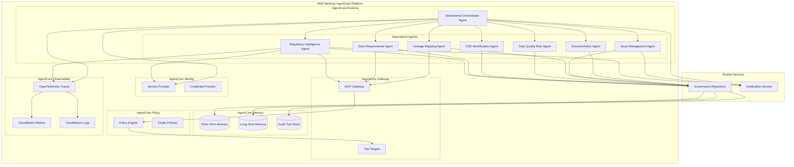
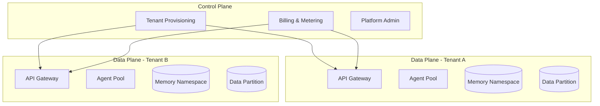

# Design Document: AgentCore Python Refactor

## Overview

This document details the design for refactoring the Agentic AI Data Governance Operating Model from TypeScript to Python using AWS Bedrock AgentCore. The architecture leverages the full AgentCore platform:

- **Runtime** - Serverless execution engine for agent workflows
- **Memory** - Persistent context, session management, and audit trails (STM + LTM)
- **Gateway** - Tool integration with external APIs and legacy systems
- **Policy** - Real-time governance and safety guardrails using Cedar policies
- **Identity** - Authentication and authorization for external service access
- **Observability** - Audit trails, tracing, and monitoring via CloudWatch

## Architecture



## Project Structure

```
governance-saas-platform/
├── README.md
├── docker-compose.yml
├── pulumi/                          # Infrastructure as Code
│   ├── Pulumi.yaml
│   ├── aws/
│   └── azure/
│
├── backend/                         # Python Backend (AgentCore)
│   ├── pyproject.toml
│   ├── requirements.txt
│   ├── .bedrock_agentcore.yaml
│   ├── .env.example
│   │
│   ├── api/                         # FastAPI REST/GraphQL API
│   │   ├── __init__.py
│   │   ├── main.py
│   │   ├── routers/
│   │   │   ├── auth.py
│   │   │   ├── tenants.py
│   │   │   ├── cycles.py
│   │   │   ├── cdes.py
│   │   │   ├── issues.py
│   │   │   ├── approvals.py
│   │   │   └── chat.py
│   │   ├── middleware/
│   │   │   ├── tenant_context.py
│   │   │   ├── auth.py
│   │   │   └── metering.py
│   │   └── websockets/
│   │       ├── chat.py
│   │       └── notifications.py
│   │
│   ├── agents/
│   │   ├── __init__.py
│   │   ├── regulatory_intelligence_agent.py
│   │   ├── data_requirements_agent.py
│   │   ├── cde_identification_agent.py
│   │   ├── data_quality_rule_agent.py
│   │   ├── lineage_mapping_agent.py
│   │   ├── issue_management_agent.py
│   │   ├── documentation_agent.py
│   │   └── governance_orchestrator.py
│   │
│   ├── models/
│   │   ├── __init__.py
│   │   ├── tenant.py              # Multi-tenancy models
│   │   ├── user.py                # User and role models
│   │   ├── regulatory.py
│   │   ├── data_elements.py
│   │   ├── cde.py
│   │   ├── data_quality.py
│   │   ├── lineage.py
│   │   ├── issues.py
│   │   ├── controls.py
│   │   ├── workflow.py
│   │   └── audit.py
│   │
│   ├── repository/
│   │   ├── __init__.py
│   │   ├── base.py
│   │   ├── tenant_aware.py        # Tenant-scoped repository
│   │   ├── in_memory.py
│   │   └── agentcore_memory.py
│   │
│   ├── services/
│   │   ├── __init__.py
│   │   ├── tenant_service.py      # Tenant management
│   │   ├── billing_service.py     # Usage metering
│   │   ├── controls_management.py
│   │   ├── data_quality_standards.py
│   │   ├── dashboard.py
│   │   └── notification.py
│   │
│   ├── cloud/                      # Cloud provider abstractions
│   │   ├── __init__.py
│   │   ├── base.py                # Abstract interfaces
│   │   ├── aws/
│   │   │   ├── runtime.py
│   │   │   ├── memory.py
│   │   │   └── identity.py
│   │   └── azure/
│   │       ├── runtime.py
│   │       ├── memory.py
│   │       └── identity.py
│   │
│   └── tests/
│       ├── __init__.py
│       ├── conftest.py
│       ├── strategies/
│       ├── property/
│       └── unit/
│
├── frontend/                        # React Frontend
│   ├── package.json
│   ├── tsconfig.json
│   ├── vite.config.ts
│   ├── tailwind.config.js
│   │
│   ├── public/
│   │   └── assets/
│   │
│   └── src/
│       ├── main.tsx
│       ├── App.tsx
│       │
│       ├── components/              # Reusable UI components
│       │   ├── ui/                  # Shadcn/UI primitives
│       │   │   ├── button.tsx
│       │   │   ├── card.tsx
│       │   │   ├── dialog.tsx
│       │   │   ├── data-table.tsx
│       │   │   └── ...
│       │   ├── layout/
│       │   │   ├── Sidebar.tsx
│       │   │   ├── Header.tsx
│       │   │   ├── MainLayout.tsx
│       │   │   └── MobileNav.tsx
│       │   ├── charts/
│       │   │   ├── TrendChart.tsx
│       │   │   ├── QualityGauge.tsx
│       │   │   └── IssueHeatmap.tsx
│       │   ├── workflow/
│       │   │   ├── KanbanBoard.tsx
│       │   │   ├── FlowDiagram.tsx
│       │   │   └── TaskCard.tsx
│       │   ├── lineage/
│       │   │   ├── LineageGraph.tsx
│       │   │   ├── LineageNode.tsx
│       │   │   └── ImpactOverlay.tsx
│       │   └── chat/
│       │       ├── ChatPanel.tsx
│       │       ├── MessageBubble.tsx
│       │       └── ToolCallCard.tsx
│       │
│       ├── pages/                   # Route pages
│       │   ├── Dashboard.tsx
│       │   ├── Cycles/
│       │   │   ├── CycleList.tsx
│       │   │   ├── CycleDetail.tsx
│       │   │   └── CycleWorkflow.tsx
│       │   ├── CDEs/
│       │   │   ├── CDEList.tsx
│       │   │   ├── CDEDetail.tsx
│       │   │   └── CDEQuality.tsx
│       │   ├── Issues/
│       │   │   ├── IssueList.tsx
│       │   │   ├── IssueDetail.tsx
│       │   │   └── IssueAnalytics.tsx
│       │   ├── Approvals/
│       │   │   ├── ApprovalInbox.tsx
│       │   │   └── ApprovalDetail.tsx
│       │   ├── Lineage/
│       │   │   └── LineageExplorer.tsx
│       │   ├── Reports/
│       │   │   ├── ReportCatalog.tsx
│       │   │   └── CompliancePackage.tsx
│       │   ├── Settings/
│       │   │   ├── UserManagement.tsx
│       │   │   ├── RoleManagement.tsx
│       │   │   ├── Branding.tsx
│       │   │   └── Notifications.tsx
│       │   └── Onboarding/
│       │       ├── Welcome.tsx
│       │       └── ProductTour.tsx
│       │
│       ├── hooks/                   # Custom React hooks
│       │   ├── useAuth.ts
│       │   ├── useTenant.ts
│       │   ├── useCycles.ts
│       │   ├── useCDEs.ts
│       │   ├── useIssues.ts
│       │   ├── useChat.ts
│       │   └── useNotifications.ts
│       │
│       ├── stores/                  # Zustand stores
│       │   ├── authStore.ts
│       │   ├── uiStore.ts
│       │   └── chatStore.ts
│       │
│       ├── api/                     # API client (React Query)
│       │   ├── client.ts
│       │   ├── queries/
│       │   └── mutations/
│       │
│       ├── types/                   # TypeScript types
│       │   └── index.ts
│       │
│       └── styles/
│           ├── globals.css
│           └── themes/
│               ├── default.css
│               └── tenant-variables.css
│
└── docs/
    ├── api/
    ├── deployment/
    └── user-guide/
```
        └── ... (unit tests for all agents)
```

## Components and Interfaces

### 1. Pydantic Data Models

```python
# models/regulatory.py
from datetime import datetime
from typing import Literal, Optional
from pydantic import BaseModel, Field
from uuid import uuid4

ArtifactStatus = Literal['draft', 'pending_review', 'approved', 'rejected']
Jurisdiction = Literal['US', 'CA']

class DueDateRule(BaseModel):
    days_after_period_end: int
    business_days_only: bool = False

class RegulatoryReport(BaseModel):
    id: str = Field(default_factory=lambda: str(uuid4()))
    name: str
    jurisdiction: Jurisdiction
    regulator: str
    frequency: Literal['daily', 'weekly', 'monthly', 'quarterly', 'annual']
    due_date: DueDateRule
    submission_format: str
    submission_platform: str
    description: str
    template_url: Optional[str] = None
    last_updated: datetime
    responsible_unit: str

class ReportCatalog(BaseModel):
    reports: list[RegulatoryReport] = []
    version: int = 0
    last_scanned: datetime
    status: ArtifactStatus = 'draft'
    approved_by: Optional[str] = None
    approved_at: Optional[datetime] = None

class RegulatoryChange(BaseModel):
    id: str = Field(default_factory=lambda: str(uuid4()))
    report_id: Optional[str] = None
    change_type: Literal['new', 'updated', 'removed']
    description: str
    effective_date: datetime
    detected_at: datetime
    source: str

class ScanResult(BaseModel):
    jurisdiction: Jurisdiction
    scanned_at: datetime
    reports_found: int
    changes_detected: list[RegulatoryChange]

class CatalogUpdate(BaseModel):
    version: int
    added_reports: list[str]
    updated_reports: list[str]
    removed_reports: list[str]
    updated_at: datetime
```

```python
# models/audit.py
from datetime import datetime
from typing import Any, Literal, Optional
from pydantic import BaseModel, Field
from uuid import uuid4

ActorType = Literal['agent', 'human', 'system']

class AuditEntry(BaseModel):
    id: str = Field(default_factory=lambda: str(uuid4()))
    timestamp: datetime = Field(default_factory=datetime.now)
    actor: str
    actor_type: ActorType
    action: str
    entity_type: str
    entity_id: str
    previous_state: Optional[Any] = None
    new_state: Optional[Any] = None
    rationale: Optional[str] = None
```

### 2. Repository Layer

```python
# repository/base.py
from abc import ABC, abstractmethod
from typing import Optional
from models.regulatory import ReportCatalog, RegulatoryReport
from models.cde import CDEInventory, CDE
from models.data_quality import DQRule
from models.lineage import LineageGraph
from models.issues import Issue
from models.controls import ControlMatrix
from models.audit import AuditEntry

class GovernanceRepository(ABC):
    """Abstract base class for governance data persistence"""
    
    # Report Catalog
    @abstractmethod
    def get_report_catalog(self) -> Optional[ReportCatalog]: ...
    
    @abstractmethod
    def set_report_catalog(self, catalog: ReportCatalog) -> None: ...
    
    # CDE Inventory
    @abstractmethod
    def get_cde_inventory(self, report_id: str) -> Optional[CDEInventory]: ...
    
    @abstractmethod
    def set_cde_inventory(self, report_id: str, inventory: CDEInventory) -> None: ...
    
    # DQ Rules
    @abstractmethod
    def get_dq_rules(self, cde_id: str) -> list[DQRule]: ...
    
    @abstractmethod
    def add_dq_rule(self, rule: DQRule) -> None: ...
    
    @abstractmethod
    def update_dq_rule(self, rule: DQRule) -> None: ...
    
    # Lineage
    @abstractmethod
    def get_lineage_graph(self, report_id: str) -> Optional[LineageGraph]: ...
    
    @abstractmethod
    def set_lineage_graph(self, report_id: str, graph: LineageGraph) -> None: ...
    
    # Issues
    @abstractmethod
    def get_issues(self, filters: Optional[dict] = None) -> list[Issue]: ...
    
    @abstractmethod
    def create_issue(self, issue: Issue) -> Issue: ...
    
    @abstractmethod
    def update_issue(self, issue: Issue) -> None: ...
    
    # Controls
    @abstractmethod
    def get_control_matrix(self, report_id: str) -> Optional[ControlMatrix]: ...
    
    @abstractmethod
    def set_control_matrix(self, report_id: str, matrix: ControlMatrix) -> None: ...
    
    # Audit Trail
    @abstractmethod
    def create_audit_entry(self, entry: AuditEntry) -> None: ...
    
    @abstractmethod
    def get_audit_entries(self, filters: Optional[dict] = None) -> list[AuditEntry]: ...
```

```python
# repository/agentcore_memory.py
from datetime import datetime
from typing import Optional
from bedrock_agentcore.memory import MemoryClient
from bedrock_agentcore.memory.integrations.strands.config import AgentCoreMemoryConfig
from repository.base import GovernanceRepository
from models.audit import AuditEntry

class AgentCoreMemoryRepository(GovernanceRepository):
    """Repository implementation using AgentCore Memory for persistence"""
    
    def __init__(
        self,
        memory_id: str,
        session_id: str,
        actor_id: str,
        region_name: str = "us-west-2"
    ):
        self.memory_client = MemoryClient(region_name=region_name)
        self.memory_id = memory_id
        self.session_id = session_id
        self.actor_id = actor_id
        self._local_cache = {}  # In-memory cache for current session
    
    def create_audit_entry(self, entry: AuditEntry) -> None:
        """Store audit entry in AgentCore Memory"""
        self.memory_client.store_event(
            memory_id=self.memory_id,
            session_id=self.session_id,
            actor_id=self.actor_id,
            event_type="audit_entry",
            data=entry.model_dump()
        )
    
    # ... other methods with memory persistence
```

### 3. Agent Tool Definitions

```python
# tools/regulatory_tools.py
from strands import tool
from typing import Optional
from models.regulatory import (
    Jurisdiction, ScanResult, RegulatoryChange, 
    CatalogUpdate, ReportCatalog, RegulatoryReport
)
from repository.base import GovernanceRepository

def create_regulatory_tools(repository: GovernanceRepository):
    """Factory function to create regulatory tools with repository injection"""
    
    @tool
    def scan_regulatory_sources(jurisdictions: list[str]) -> list[dict]:
        """
        Scan regulatory body sources (OSFI, Federal Reserve, OCC, FDIC) for required reports.
        
        Args:
            jurisdictions: List of jurisdictions to scan ('US', 'CA')
            
        Returns:
            List of scan results with detected reports and changes
        """
        results = []
        existing_catalog = repository.get_report_catalog()
        existing_ids = {r.id for r in existing_catalog.reports} if existing_catalog else set()
        
        for jurisdiction in jurisdictions:
            # Scan logic here
            changes = []
            # ... detection logic
            
            results.append(ScanResult(
                jurisdiction=jurisdiction,
                scanned_at=datetime.now(),
                reports_found=len(existing_catalog.reports) if existing_catalog else 0,
                changes_detected=changes
            ).model_dump())
        
        # Create audit entry
        repository.create_audit_entry(AuditEntry(
            actor="RegulatoryIntelligenceAgent",
            actor_type="agent",
            action="scan_regulatory_sources",
            entity_type="ReportCatalog",
            entity_id="singleton",
            new_state={"jurisdictions": jurisdictions, "results_count": len(results)}
        ))
        
        return results
    
    @tool
    def detect_changes(since: str) -> list[dict]:
        """
        Detect changes in regulatory requirements since a given date.
        
        Args:
            since: ISO format date string to check changes from
            
        Returns:
            List of detected regulatory changes
        """
        since_date = datetime.fromisoformat(since)
        # ... detection logic
        return []
    
    @tool
    def update_report_catalog(changes: list[dict]) -> dict:
        """
        Update the report catalog with detected changes.
        Sets status to 'pending_review' for human approval.
        
        Args:
            changes: List of regulatory changes to apply
            
        Returns:
            Catalog update result with version and change counts
        """
        existing = repository.get_report_catalog()
        # ... update logic
        
        new_catalog = ReportCatalog(
            reports=existing.reports if existing else [],
            version=(existing.version + 1) if existing else 1,
            last_scanned=datetime.now(),
            status='pending_review'
        )
        
        repository.set_report_catalog(new_catalog)
        
        return CatalogUpdate(
            version=new_catalog.version,
            added_reports=[],
            updated_reports=[],
            removed_reports=[],
            updated_at=datetime.now()
        ).model_dump()
    
    @tool
    def get_report_catalog() -> dict:
        """
        Get the current regulatory report catalog.
        
        Returns:
            Current report catalog with all reports and metadata
        """
        catalog = repository.get_report_catalog()
        if not catalog:
            return ReportCatalog(
                reports=[],
                version=0,
                last_scanned=datetime.now(),
                status='draft'
            ).model_dump()
        return catalog.model_dump()
    
    @tool
    def approve_catalog(approver: str, rationale: str) -> dict:
        """
        Approve the report catalog after human review.
        
        Args:
            approver: Name/ID of the person approving
            rationale: Reason for approval
            
        Returns:
            Updated catalog with approved status
        """
        catalog = repository.get_report_catalog()
        if not catalog:
            raise ValueError("No catalog exists to approve")
        
        previous_state = catalog.model_dump()
        
        catalog.status = 'approved'
        catalog.approved_by = approver
        catalog.approved_at = datetime.now()
        
        repository.set_report_catalog(catalog)
        
        repository.create_audit_entry(AuditEntry(
            actor=approver,
            actor_type="human",
            action="approve_catalog",
            entity_type="ReportCatalog",
            entity_id="singleton",
            previous_state=previous_state,
            new_state=catalog.model_dump(),
            rationale=rationale
        ))
        
        return catalog.model_dump()
    
    return [
        scan_regulatory_sources,
        detect_changes,
        update_report_catalog,
        get_report_catalog,
        approve_catalog
    ]
```

### 4. Agent Implementation

```python
# agents/regulatory_intelligence_agent.py
import os
from datetime import datetime
from strands import Agent
from bedrock_agentcore.runtime import BedrockAgentCoreApp
from bedrock_agentcore.memory.integrations.strands.config import AgentCoreMemoryConfig
from bedrock_agentcore.memory.integrations.strands.session_manager import AgentCoreMemorySessionManager

from repository.agentcore_memory import AgentCoreMemoryRepository
from tools.regulatory_tools import create_regulatory_tools

app = BedrockAgentCoreApp()

SYSTEM_PROMPT = """You are the Regulatory Intelligence Agent for a financial institution's 
data governance system. Your responsibilities include:

1. Scanning regulatory body sources (OSFI, Federal Reserve, OCC, FDIC) for reporting requirements
2. Detecting new or updated regulatory reporting obligations
3. Maintaining the Regulatory Report Catalog with accurate metadata
4. Notifying compliance officers of changes
5. Supporting human review and approval workflows

Always ensure audit trail entries are created for all actions.
When changes are detected, set catalog status to 'pending_review' for human approval.
"""

@app.entrypoint
def invoke(payload: dict, context):
    """Handler for Regulatory Intelligence Agent invocation"""
    
    # Extract session info
    session_id = payload.get("session_id", f"session_{datetime.now().strftime('%Y%m%d%H%M%S')}")
    actor_id = payload.get("actor_id", "system")
    memory_id = os.environ.get("AGENTCORE_MEMORY_ID")
    
    # Initialize repository with AgentCore Memory
    repository = AgentCoreMemoryRepository(
        memory_id=memory_id,
        session_id=session_id,
        actor_id=actor_id
    )
    
    # Create tools with repository injection
    tools = create_regulatory_tools(repository)
    
    # Configure memory session manager
    memory_config = AgentCoreMemoryConfig(
        memory_id=memory_id,
        session_id=session_id,
        actor_id=actor_id
    )
    
    session_manager = AgentCoreMemorySessionManager(
        agentcore_memory_config=memory_config,
        region_name="us-west-2"
    )
    
    # Create agent
    agent = Agent(
        system_prompt=SYSTEM_PROMPT,
        tools=tools,
        session_manager=session_manager
    )
    
    # Process request
    prompt = payload.get("prompt", "What regulatory reports are in the catalog?")
    result = agent(prompt)
    
    return {
        "result": result.message,
        "session_id": session_id,
        "actor_id": actor_id
    }

if __name__ == "__main__":
    app.run()
```

### 5. Governance Orchestrator

```python
# agents/governance_orchestrator.py
import os
from datetime import datetime
from strands import Agent, tool
from bedrock_agentcore.runtime import BedrockAgentCoreApp
from bedrock_agentcore.memory.integrations.strands.config import AgentCoreMemoryConfig
from bedrock_agentcore.memory.integrations.strands.session_manager import AgentCoreMemorySessionManager

from models.workflow import CycleInstance, HumanTask, CycleStatus, Phase
from repository.agentcore_memory import AgentCoreMemoryRepository

app = BedrockAgentCoreApp()

ORCHESTRATOR_PROMPT = """You are the Governance Orchestrator for a financial institution's 
data governance system. You coordinate all specialized agents through the regulatory 
reporting lifecycle:

1. Start and manage report cycles
2. Sequence agent activities with dependency handling
3. Create and manage human checkpoint tasks
4. Enforce workflow dependencies (tasks cannot proceed until prerequisites complete)
5. Block workflows when critical issues are detected
6. Support retrospective reviews after cycle completion

Agents you coordinate:
- Regulatory Intelligence Agent: Scans regulatory sources, maintains report catalog
- Data Requirements Agent: Parses templates, maps data elements
- CDE Identification Agent: Scores and identifies critical data elements
- Data Quality Rule Agent: Generates and executes validation rules
- Lineage Mapping Agent: Captures data lineage from source to report
- Issue Management Agent: Tracks and resolves data issues
- Documentation Agent: Generates compliance artifacts

Always enforce human checkpoints at critical decision points.
Log all decisions with rationale for audit compliance.
"""

def create_orchestrator_tools(repository: AgentCoreMemoryRepository):
    
    @tool
    def start_report_cycle(report_id: str, period_end: str) -> dict:
        """
        Start a new report cycle for a regulatory report.
        
        Args:
            report_id: ID of the regulatory report
            period_end: Period end date in ISO format
            
        Returns:
            New cycle instance with generated checklist
        """
        cycle = CycleInstance(
            report_id=report_id,
            period_end=datetime.fromisoformat(period_end),
            status='active',
            current_phase='data_gathering',
            checkpoints=[],
            audit_trail=[]
        )
        
        repository.create_audit_entry(AuditEntry(
            actor="GovernanceOrchestrator",
            actor_type="agent",
            action="start_report_cycle",
            entity_type="CycleInstance",
            entity_id=cycle.id,
            new_state=cycle.model_dump()
        ))
        
        return cycle.model_dump()
    
    @tool
    def create_human_task(
        task_type: str,
        title: str,
        description: str,
        assigned_role: str,
        due_date: str
    ) -> dict:
        """
        Create a human task at a workflow checkpoint.
        Pauses workflow until task is completed.
        
        Args:
            task_type: Type of task (catalog_review, cde_approval, etc.)
            title: Task title
            description: Detailed description
            assigned_role: Role responsible for the task
            due_date: Due date in ISO format
            
        Returns:
            Created human task
        """
        task = HumanTask(
            type=task_type,
            title=title,
            description=description,
            assigned_role=assigned_role,
            due_date=datetime.fromisoformat(due_date),
            status='pending'
        )
        
        repository.create_audit_entry(AuditEntry(
            actor="GovernanceOrchestrator",
            actor_type="agent",
            action="create_human_task",
            entity_type="HumanTask",
            entity_id=task.id,
            new_state=task.model_dump()
        ))
        
        return task.model_dump()
    
    @tool
    def complete_human_task(
        task_id: str,
        decision: str,
        rationale: str,
        completed_by: str
    ) -> dict:
        """
        Complete a human task with decision and rationale.
        
        Args:
            task_id: ID of the task to complete
            decision: Decision outcome (approved, rejected, approved_with_changes)
            rationale: Reason for the decision (min 20 characters)
            completed_by: Person completing the task
            
        Returns:
            Updated task with decision logged
        """
        if len(rationale) < 20:
            raise ValueError("Rationale must be at least 20 characters")
        
        # ... task completion logic
        
        repository.create_audit_entry(AuditEntry(
            actor=completed_by,
            actor_type="human",
            action="complete_human_task",
            entity_type="HumanTask",
            entity_id=task_id,
            new_state={"decision": decision, "rationale": rationale},
            rationale=rationale
        ))
        
        return {"task_id": task_id, "status": "completed", "decision": decision}
    
    return [start_report_cycle, create_human_task, complete_human_task]

@app.entrypoint
def invoke(payload: dict, context):
    """Handler for Governance Orchestrator invocation"""
    
    session_id = payload.get("session_id", f"orch_{datetime.now().strftime('%Y%m%d%H%M%S')}")
    actor_id = payload.get("actor_id", "system")
    memory_id = os.environ.get("AGENTCORE_MEMORY_ID")
    
    repository = AgentCoreMemoryRepository(
        memory_id=memory_id,
        session_id=session_id,
        actor_id=actor_id
    )
    
    tools = create_orchestrator_tools(repository)
    
    memory_config = AgentCoreMemoryConfig(
        memory_id=memory_id,
        session_id=session_id,
        actor_id=actor_id
    )
    
    session_manager = AgentCoreMemorySessionManager(
        agentcore_memory_config=memory_config,
        region_name="us-west-2"
    )
    
    agent = Agent(
        system_prompt=ORCHESTRATOR_PROMPT,
        tools=tools,
        session_manager=session_manager
    )
    
    prompt = payload.get("prompt", "What is the current status?")
    result = agent(prompt)
    
    return {
        "result": result.message,
        "session_id": session_id,
        "actor_id": actor_id
    }

if __name__ == "__main__":
    app.run()
```


## AgentCore Configuration

```yaml
# .bedrock_agentcore.yaml
agents:
  RegulatoryIntelligenceAgent:
    entrypoint: agents/regulatory_intelligence_agent.py
    runtime: PYTHON_3_12
    memory:
      mode: STM_AND_LTM
      memory_id: ${REGULATORY_AGENT_MEMORY_ID}
      event_expiry_days: 365
    idle_timeout: 900
    max_lifetime: 28800
    
  DataRequirementsAgent:
    entrypoint: agents/data_requirements_agent.py
    runtime: PYTHON_3_12
    memory:
      mode: STM_AND_LTM
      memory_id: ${DATA_REQ_AGENT_MEMORY_ID}
      event_expiry_days: 365
    idle_timeout: 900
    max_lifetime: 28800
    
  CDEIdentificationAgent:
    entrypoint: agents/cde_identification_agent.py
    runtime: PYTHON_3_12
    memory:
      mode: STM_AND_LTM
      memory_id: ${CDE_AGENT_MEMORY_ID}
      event_expiry_days: 365
    idle_timeout: 900
    max_lifetime: 28800
    
  DataQualityRuleAgent:
    entrypoint: agents/data_quality_rule_agent.py
    runtime: PYTHON_3_12
    memory:
      mode: STM_AND_LTM
      memory_id: ${DQ_AGENT_MEMORY_ID}
      event_expiry_days: 365
    idle_timeout: 900
    max_lifetime: 28800
    
  LineageMappingAgent:
    entrypoint: agents/lineage_mapping_agent.py
    runtime: PYTHON_3_12
    memory:
      mode: STM_AND_LTM
      memory_id: ${LINEAGE_AGENT_MEMORY_ID}
      event_expiry_days: 365
    idle_timeout: 900
    max_lifetime: 28800
    
  IssueManagementAgent:
    entrypoint: agents/issue_management_agent.py
    runtime: PYTHON_3_12
    memory:
      mode: STM_AND_LTM
      memory_id: ${ISSUE_AGENT_MEMORY_ID}
      event_expiry_days: 365
    idle_timeout: 900
    max_lifetime: 28800
    
  DocumentationAgent:
    entrypoint: agents/documentation_agent.py
    runtime: PYTHON_3_12
    memory:
      mode: STM_AND_LTM
      memory_id: ${DOC_AGENT_MEMORY_ID}
      event_expiry_days: 365
    idle_timeout: 900
    max_lifetime: 28800
    
  GovernanceOrchestrator:
    entrypoint: agents/governance_orchestrator.py
    runtime: PYTHON_3_12
    memory:
      mode: STM_AND_LTM
      memory_id: ${ORCHESTRATOR_MEMORY_ID}
      event_expiry_days: 365
    idle_timeout: 900
    max_lifetime: 28800
```

## AgentCore Policy Integration

AgentCore Policy enables fine-grained authorization controls using Cedar policies. This is critical for data governance where agents must respect role-based access controls.

### Policy Engine Configuration

```python
# services/policy_config.py
"""
Cedar policy definitions for governance agent authorization.
"""

GOVERNANCE_POLICIES = """
// Allow compliance officers to approve catalogs
permit(
  principal is AgentCore::OAuthUser,
  action == AgentCore::Action::\"RegulatoryTools__approve_catalog\",
  resource == AgentCore::Gateway::\"${GOVERNANCE_GATEWAY_ARN}\"
)
when {
  principal.hasTag(\"role\") &&
  principal.getTag(\"role\") == \"compliance_officer\"
};

// Allow data stewards to update CDE inventory
permit(
  principal is AgentCore::OAuthUser,
  action == AgentCore::Action::\"CDETools__update_inventory\",
  resource == AgentCore::Gateway::\"${GOVERNANCE_GATEWAY_ARN}\"
)
when {
  principal.hasTag(\"role\") &&
  principal.getTag(\"role\") in [\"data_steward\", \"data_owner\"]
};

// Restrict critical issue escalation to managers
permit(
  principal is AgentCore::OAuthUser,
  action == AgentCore::Action::\"IssueTools__escalate_issue\",
  resource == AgentCore::Gateway::\"${GOVERNANCE_GATEWAY_ARN}\"
)
when {
  principal.hasTag(\"role\") &&
  principal.getTag(\"role\") in [\"manager\", \"senior_manager\", \"director\"]
};

// Forbid direct approval without review
forbid(
  principal,
  action == AgentCore::Action::\"RegulatoryTools__approve_catalog\",
  resource
)
when {
  context.input.current_status != \"pending_review\"
};
"""
```

### Gateway with Policy Enforcement

```bash
# Create policy engine
agentcore policy create-engine \
  --name governance-policy-engine \
  --enforcement-mode ENFORCE

# Add Cedar policies
agentcore policy add-policy \
  --engine governance-policy-engine \
  --policy-file governance_policies.cedar

# Create gateway with policy enforcement
agentcore gateway create \
  --name governance-gateway \
  --policy-engine governance-policy-engine
```

## AgentCore Identity Integration

AgentCore Identity provides secure authentication for agents accessing external services and enables user-specific authorization.

### Identity Configuration

```python
# services/identity_config.py
"""
Identity configuration for governance agents.
"""
from bedrock_agentcore.identity import requires_access_token

# Decorator for tools requiring user authentication
@requires_access_token(
    provider_name="GovernanceIdentityProvider",
    scopes=["openid", "governance:read", "governance:write"],
    auth_flow="USER_FEDERATION",
    on_auth_url=handle_auth_url
)
async def approve_with_user_context(*, access_token: str, catalog_id: str, rationale: str):
    """
    Approve catalog with authenticated user context.
    The access_token contains user identity for audit trail.
    """
    import jwt
    user_claims = jwt.decode(access_token, options={"verify_signature": False})
    
    # Use authenticated user for audit
    return await approve_catalog(
        catalog_id=catalog_id,
        approver=user_claims.get("username"),
        rationale=rationale
    )
```

### Credential Provider Setup

```bash
# Create OAuth2 credential provider for governance system
aws bedrock-agentcore-control create-oauth2-credential-provider \
  --name "GovernanceIdentityProvider" \
  --credential-provider-vendor "CustomOauth2" \
  --oauth2-provider-config-input '{
    "customOauth2ProviderConfig": {
      "oauthDiscovery": {
        "discoveryUrl": "'$ISSUER_URL'"
      },
      "clientId": "'$CLIENT_ID'",
      "clientSecret": "'$CLIENT_SECRET'"
    }
  }'
```

## AgentCore Observability Integration

AgentCore Observability provides tracing, metrics, and logging for monitoring agent performance and debugging issues.

### Observability Configuration

```python
# services/observability_config.py
"""
OpenTelemetry configuration for governance agents.
"""
import os

# Environment variables for observability
OBSERVABILITY_ENV = {
    "AGENT_OBSERVABILITY_ENABLED": "true",
    "OTEL_PYTHON_DISTRO": "aws_distro",
    "OTEL_PYTHON_CONFIGURATOR": "aws_configurator",
    "OTEL_EXPORTER_OTLP_PROTOCOL": "http/protobuf",
    "OTEL_RESOURCE_ATTRIBUTES": "service.name=governance-agents"
}

# Custom span attributes for governance context
def add_governance_span_attributes(span, context: dict):
    """Add governance-specific attributes to spans."""
    span.set_attribute("governance.report_id", context.get("report_id", ""))
    span.set_attribute("governance.cycle_id", context.get("cycle_id", ""))
    span.set_attribute("governance.phase", context.get("phase", ""))
    span.set_attribute("governance.actor", context.get("actor", ""))
    span.set_attribute("governance.actor_type", context.get("actor_type", ""))
```

### Agent with Observability

```python
# agents/regulatory_intelligence_agent.py (updated)
from opentelemetry import trace, baggage, context
from strands import Agent
from bedrock_agentcore.runtime import BedrockAgentCoreApp

app = BedrockAgentCoreApp()
tracer = trace.get_tracer("governance.regulatory_agent")

@app.entrypoint
def invoke(payload: dict, ctx):
    """Handler with observability instrumentation."""
    session_id = payload.get("session_id")
    
    # Set session context for trace correlation
    ctx = baggage.set_baggage("session.id", session_id)
    
    with tracer.start_as_current_span("regulatory_agent_invoke") as span:
        span.set_attribute("governance.session_id", session_id)
        span.set_attribute("governance.actor_id", payload.get("actor_id"))
        
        # Agent execution is auto-instrumented by strands-agents[otel]
        result = agent(payload.get("prompt"))
        
        span.set_attribute("governance.result_status", "success")
        return result
```

### CloudWatch Dashboard

```bash
# View traces in GenAI Observability dashboard
# Navigate to: CloudWatch > GenAI Observability > Bedrock AgentCore

# Key metrics to monitor:
# - Session count per agent
# - Average latency per tool call
# - Token usage per invocation
# - Error rates by agent type
# - Policy evaluation decisions (allow/deny)
```

## AgentCore Gateway Integration

AgentCore Gateway provides MCP-compatible tool access and integrates with Policy for authorization.

### Gateway Configuration

```python
# services/gateway_config.py
"""
Gateway configuration for external tool access.
"""

# Gateway targets for governance tools
GATEWAY_TARGETS = {
    "regulatory_sources": {
        "type": "lambda",
        "function_arn": "${REGULATORY_SCANNER_LAMBDA_ARN}",
        "description": "Scan regulatory body websites for updates"
    },
    "lineage_tool": {
        "type": "openapi",
        "spec_url": "${LINEAGE_TOOL_OPENAPI_URL}",
        "description": "Import lineage from external lineage tools"
    },
    "notification_service": {
        "type": "lambda", 
        "function_arn": "${NOTIFICATION_LAMBDA_ARN}",
        "description": "Send notifications to stakeholders"
    }
}
```

### Gateway CLI Commands

```bash
# Create governance gateway
agentcore gateway create \
  --name governance-gateway \
  --policy-engine governance-policy-engine

# Add Lambda target for regulatory scanning
agentcore gateway add-target \
  --gateway governance-gateway \
  --name regulatory-scanner \
  --type lambda \
  --function-arn ${REGULATORY_SCANNER_LAMBDA_ARN}

# Add OpenAPI target for lineage tool
agentcore gateway add-target \
  --gateway governance-gateway \
  --name lineage-tool \
  --type openapi \
  --spec-url ${LINEAGE_TOOL_OPENAPI_URL}

# List available tools
agentcore gateway list-tools --gateway governance-gateway
```

## Multi-Tenant SaaS Architecture

### Tenant Isolation Model



### Tenant Context Middleware

```python
# api/middleware/tenant_context.py
from fastapi import Request, HTTPException
from contextvars import ContextVar

tenant_context: ContextVar[str] = ContextVar('tenant_id')

async def tenant_middleware(request: Request, call_next):
    """Extract and validate tenant context from JWT."""
    token = request.headers.get("Authorization", "").replace("Bearer ", "")
    claims = decode_jwt(token)
    
    tenant_id = claims.get("tenant_id")
    if not tenant_id:
        raise HTTPException(401, "Missing tenant context")
    
    tenant_context.set(tenant_id)
    
    # Add tenant to all database queries automatically
    response = await call_next(request)
    return response
```

### Tenant-Aware Repository

```python
# repository/tenant_aware.py
from repository.base import GovernanceRepository
from api.middleware.tenant_context import tenant_context

class TenantAwareRepository(GovernanceRepository):
    """Repository that automatically scopes all operations to current tenant."""
    
    def _get_tenant_key(self, key: str) -> str:
        """Prefix key with tenant ID for isolation."""
        return f"{tenant_context.get()}:{key}"
    
    def get_report_catalog(self) -> Optional[ReportCatalog]:
        key = self._get_tenant_key("report_catalog")
        return self._storage.get(key)
    
    def get_issues(self, filters: Optional[dict] = None) -> list[Issue]:
        tenant_id = tenant_context.get()
        # All queries automatically filtered by tenant
        return [i for i in self._issues if i.tenant_id == tenant_id]
```

## Cloud-Agnostic Abstractions

### Provider Interface

```python
# cloud/base.py
from abc import ABC, abstractmethod
from typing import Protocol

class AgentRuntimeProvider(Protocol):
    """Abstract interface for agent runtime."""
    
    @abstractmethod
    async def invoke_agent(self, agent_name: str, payload: dict) -> dict: ...
    
    @abstractmethod
    async def deploy_agent(self, config: AgentConfig) -> str: ...

class MemoryStoreProvider(Protocol):
    """Abstract interface for memory storage."""
    
    @abstractmethod
    async def store_event(self, namespace: str, event: dict) -> None: ...
    
    @abstractmethod
    async def query_events(self, namespace: str, filters: dict) -> list[dict]: ...

class IdentityProvider(Protocol):
    """Abstract interface for identity management."""
    
    @abstractmethod
    async def validate_token(self, token: str) -> dict: ...
    
    @abstractmethod
    async def get_user_claims(self, user_id: str) -> dict: ...
```

### AWS Implementation

```python
# cloud/aws/runtime.py
from bedrock_agentcore.runtime import BedrockAgentCoreApp
from cloud.base import AgentRuntimeProvider

class AWSAgentRuntime(AgentRuntimeProvider):
    """AWS Bedrock AgentCore implementation."""
    
    async def invoke_agent(self, agent_name: str, payload: dict) -> dict:
        # Use AgentCore Runtime
        return await self.agentcore_client.invoke(agent_name, payload)
```

### Azure Implementation

```python
# cloud/azure/runtime.py
from azure.containerapp import ContainerAppClient
from cloud.base import AgentRuntimeProvider

class AzureAgentRuntime(AgentRuntimeProvider):
    """Azure Container Apps implementation."""
    
    async def invoke_agent(self, agent_name: str, payload: dict) -> dict:
        # Use Azure Container Apps with Azure OpenAI
        return await self.container_client.invoke(agent_name, payload)
```

## Frontend Architecture

### Technology Stack

- **Framework**: React 18 with TypeScript
- **Build Tool**: Vite
- **Styling**: Tailwind CSS + Shadcn/UI components
- **State Management**: Zustand (client) + React Query (server)
- **Charts**: Recharts / Tremor
- **Graphs**: React Flow (lineage visualization)
- **Real-time**: WebSocket for chat and notifications

### Component Architecture

```typescript
// components/layout/MainLayout.tsx
import { Sidebar } from './Sidebar';
import { Header } from './Header';
import { ChatPanel } from '../chat/ChatPanel';
import { NotificationCenter } from '../notifications/NotificationCenter';

export function MainLayout({ children }: { children: React.ReactNode }) {
  const { sidebarOpen, chatOpen } = useUIStore();
  
  return (
    <div className="flex h-screen bg-background">
      <Sidebar collapsed={!sidebarOpen} />
      <div className="flex-1 flex flex-col overflow-hidden">
        <Header />
        <main className="flex-1 overflow-auto p-6">
          {children}
        </main>
      </div>
      {chatOpen && <ChatPanel />}
      <NotificationCenter />
    </div>
  );
}
```

### Dashboard Component

```typescript
// pages/Dashboard.tsx
import { useQuery } from '@tanstack/react-query';
import { Card, CardContent, CardHeader, CardTitle } from '@/components/ui/card';
import { QualityGauge } from '@/components/charts/QualityGauge';
import { TrendChart } from '@/components/charts/TrendChart';
import { IssueHeatmap } from '@/components/charts/IssueHeatmap';
import { CycleProgress } from '@/components/workflow/CycleProgress';

export function Dashboard() {
  const { data: metrics } = useQuery(['dashboard-metrics'], fetchDashboardMetrics);
  const { data: cycles } = useQuery(['active-cycles'], fetchActiveCycles);
  
  return (
    <div className="space-y-6">
      {/* KPI Cards */}
      <div className="grid grid-cols-1 md:grid-cols-2 lg:grid-cols-4 gap-4">
        <Card>
          <CardHeader className="pb-2">
            <CardTitle className="text-sm font-medium text-muted-foreground">
              Overall Compliance Score
            </CardTitle>
          </CardHeader>
          <CardContent>
            <QualityGauge value={metrics?.complianceScore} />
          </CardContent>
        </Card>
        
        <Card>
          <CardHeader className="pb-2">
            <CardTitle className="text-sm font-medium text-muted-foreground">
              Active Cycles
            </CardTitle>
          </CardHeader>
          <CardContent>
            <div className="text-3xl font-bold">{metrics?.activeCycles}</div>
            <p className="text-xs text-muted-foreground">
              {metrics?.cyclesOnTrack} on track, {metrics?.cyclesAtRisk} at risk
            </p>
          </CardContent>
        </Card>
        
        <Card>
          <CardHeader className="pb-2">
            <CardTitle className="text-sm font-medium text-muted-foreground">
              Open Issues
            </CardTitle>
          </CardHeader>
          <CardContent>
            <div className="text-3xl font-bold">{metrics?.openIssues}</div>
            <div className="flex gap-2 mt-1">
              <span className="text-xs px-2 py-0.5 bg-red-100 text-red-700 rounded">
                {metrics?.criticalIssues} critical
              </span>
              <span className="text-xs px-2 py-0.5 bg-yellow-100 text-yellow-700 rounded">
                {metrics?.highIssues} high
              </span>
            </div>
          </CardContent>
        </Card>
        
        <Card>
          <CardHeader className="pb-2">
            <CardTitle className="text-sm font-medium text-muted-foreground">
              Pending Approvals
            </CardTitle>
          </CardHeader>
          <CardContent>
            <div className="text-3xl font-bold">{metrics?.pendingApprovals}</div>
            <p className="text-xs text-muted-foreground">
              {metrics?.overdueApprovals} overdue
            </p>
          </CardContent>
        </Card>
      </div>
      
      {/* Charts Row */}
      <div className="grid grid-cols-1 lg:grid-cols-2 gap-6">
        <Card>
          <CardHeader>
            <CardTitle>CDE Quality Trends</CardTitle>
          </CardHeader>
          <CardContent>
            <TrendChart data={metrics?.qualityTrends} />
          </CardContent>
        </Card>
        
        <Card>
          <CardHeader>
            <CardTitle>Issues by Severity & Domain</CardTitle>
          </CardHeader>
          <CardContent>
            <IssueHeatmap data={metrics?.issueDistribution} />
          </CardContent>
        </Card>
      </div>
      
      {/* Active Cycles */}
      <Card>
        <CardHeader>
          <CardTitle>Active Report Cycles</CardTitle>
        </CardHeader>
        <CardContent>
          <div className="space-y-4">
            {cycles?.map(cycle => (
              <CycleProgress key={cycle.id} cycle={cycle} />
            ))}
          </div>
        </CardContent>
      </Card>
    </div>
  );
}
```

### Workflow Kanban Board

```typescript
// components/workflow/KanbanBoard.tsx
import { DragDropContext, Droppable, Draggable } from '@hello-pangea/dnd';
import { TaskCard } from './TaskCard';

const PHASES = ['data_gathering', 'validation', 'review', 'approval', 'submission'];

export function KanbanBoard({ cycleId }: { cycleId: string }) {
  const { data: tasks, mutate: updateTask } = useTasks(cycleId);
  
  const handleDragEnd = (result: DropResult) => {
    if (!result.destination) return;
    
    const taskId = result.draggableId;
    const newPhase = result.destination.droppableId;
    
    updateTask({ taskId, phase: newPhase });
  };
  
  return (
    <DragDropContext onDragEnd={handleDragEnd}>
      <div className="flex gap-4 overflow-x-auto pb-4">
        {PHASES.map(phase => (
          <Droppable key={phase} droppableId={phase}>
            {(provided, snapshot) => (
              <div
                ref={provided.innerRef}
                {...provided.droppableProps}
                className={cn(
                  "flex-shrink-0 w-80 bg-muted/50 rounded-lg p-4",
                  snapshot.isDraggingOver && "bg-muted"
                )}
              >
                <h3 className="font-semibold mb-4 capitalize">
                  {phase.replace('_', ' ')}
                </h3>
                <div className="space-y-3">
                  {tasks?.filter(t => t.phase === phase).map((task, index) => (
                    <Draggable key={task.id} draggableId={task.id} index={index}>
                      {(provided) => (
                        <div
                          ref={provided.innerRef}
                          {...provided.draggableProps}
                          {...provided.dragHandleProps}
                        >
                          <TaskCard task={task} />
                        </div>
                      )}
                    </Draggable>
                  ))}
                  {provided.placeholder}
                </div>
              </div>
            )}
          </Droppable>
        ))}
      </div>
    </DragDropContext>
  );
}
```

### Lineage Graph Visualization

```typescript
// components/lineage/LineageGraph.tsx
import ReactFlow, {
  Node,
  Edge,
  Background,
  Controls,
  MiniMap,
  useNodesState,
  useEdgesState,
} from 'reactflow';
import { LineageNode } from './LineageNode';

const nodeTypes = {
  source_table: LineageNode,
  transformation: LineageNode,
  staging_table: LineageNode,
  report_field: LineageNode,
};

export function LineageGraph({ graphData, onNodeSelect }: LineageGraphProps) {
  const [nodes, setNodes, onNodesChange] = useNodesState(graphData.nodes);
  const [edges, setEdges, onEdgesChange] = useEdgesState(graphData.edges);
  const [selectedNode, setSelectedNode] = useState<string | null>(null);
  
  const handleNodeClick = (event: React.MouseEvent, node: Node) => {
    setSelectedNode(node.id);
    onNodeSelect?.(node);
    
    // Highlight upstream/downstream
    const impacted = findImpactedNodes(node.id, edges);
    setNodes(nodes.map(n => ({
      ...n,
      data: { ...n.data, highlighted: impacted.includes(n.id) }
    })));
  };
  
  return (
    <div className="h-[600px] border rounded-lg">
      <ReactFlow
        nodes={nodes}
        edges={edges}
        nodeTypes={nodeTypes}
        onNodesChange={onNodesChange}
        onEdgesChange={onEdgesChange}
        onNodeClick={handleNodeClick}
        fitView
      >
        <Background />
        <Controls />
        <MiniMap />
      </ReactFlow>
    </div>
  );
}
```

### AI Chat Interface

```typescript
// components/chat/ChatPanel.tsx
import { useChat } from '@/hooks/useChat';
import { MessageBubble } from './MessageBubble';
import { ToolCallCard } from './ToolCallCard';
import { QuickActions } from './QuickActions';

export function ChatPanel() {
  const { messages, sendMessage, isLoading } = useChat();
  const [input, setInput] = useState('');
  
  const handleSend = () => {
    if (!input.trim()) return;
    sendMessage(input);
    setInput('');
  };
  
  return (
    <div className="w-96 border-l flex flex-col bg-background">
      <div className="p-4 border-b">
        <h2 className="font-semibold">Governance Assistant</h2>
        <p className="text-sm text-muted-foreground">
          Ask questions or request actions
        </p>
      </div>
      
      <div className="flex-1 overflow-auto p-4 space-y-4">
        {messages.map((msg, i) => (
          <div key={i}>
            <MessageBubble message={msg} />
            {msg.toolCalls?.map((call, j) => (
              <ToolCallCard key={j} toolCall={call} />
            ))}
          </div>
        ))}
        {isLoading && (
          <div className="flex items-center gap-2 text-muted-foreground">
            <Loader2 className="h-4 w-4 animate-spin" />
            <span>Thinking...</span>
          </div>
        )}
      </div>
      
      <QuickActions onSelect={sendMessage} />
      
      <div className="p-4 border-t">
        <div className="flex gap-2">
          <Input
            value={input}
            onChange={(e) => setInput(e.target.value)}
            onKeyDown={(e) => e.key === 'Enter' && handleSend()}
            placeholder="Ask about governance..."
          />
          <Button onClick={handleSend} disabled={isLoading}>
            <Send className="h-4 w-4" />
          </Button>
        </div>
      </div>
    </div>
  );
}
```

### Approval Workflow UI

```typescript
// pages/Approvals/ApprovalDetail.tsx
import { DiffViewer } from '@/components/diff/DiffViewer';
import { ApprovalHistory } from '@/components/approvals/ApprovalHistory';

export function ApprovalDetail({ approvalId }: { approvalId: string }) {
  const { data: approval } = useQuery(['approval', approvalId], () => 
    fetchApproval(approvalId)
  );
  const { mutate: submitDecision, isLoading } = useMutation(submitApprovalDecision);
  
  const [decision, setDecision] = useState<'approved' | 'rejected' | 'changes_requested'>();
  const [rationale, setRationale] = useState('');
  
  const handleSubmit = () => {
    if (!decision || rationale.length < 20) return;
    submitDecision({ approvalId, decision, rationale });
  };
  
  return (
    <div className="max-w-4xl mx-auto space-y-6">
      <Card>
        <CardHeader>
          <div className="flex justify-between items-start">
            <div>
              <CardTitle>{approval?.title}</CardTitle>
              <p className="text-sm text-muted-foreground">
                Submitted by {approval?.requester} on {formatDate(approval?.submittedAt)}
              </p>
            </div>
            <Badge variant={approval?.urgency === 'high' ? 'destructive' : 'secondary'}>
              {approval?.urgency} priority
            </Badge>
          </div>
        </CardHeader>
        <CardContent>
          <Tabs defaultValue="changes">
            <TabsList>
              <TabsTrigger value="changes">Changes</TabsTrigger>
              <TabsTrigger value="full">Full Document</TabsTrigger>
              <TabsTrigger value="history">History</TabsTrigger>
            </TabsList>
            
            <TabsContent value="changes">
              <DiffViewer
                oldValue={approval?.previousState}
                newValue={approval?.newState}
              />
            </TabsContent>
            
            <TabsContent value="full">
              <ArtifactPreview artifact={approval?.artifact} />
            </TabsContent>
            
            <TabsContent value="history">
              <ApprovalHistory approvalId={approvalId} />
            </TabsContent>
          </Tabs>
        </CardContent>
      </Card>
      
      <Card>
        <CardHeader>
          <CardTitle>Your Decision</CardTitle>
        </CardHeader>
        <CardContent className="space-y-4">
          <RadioGroup value={decision} onValueChange={setDecision}>
            <div className="flex items-center space-x-2">
              <RadioGroupItem value="approved" id="approved" />
              <Label htmlFor="approved" className="flex items-center gap-2">
                <CheckCircle className="h-4 w-4 text-green-500" />
                Approve
              </Label>
            </div>
            <div className="flex items-center space-x-2">
              <RadioGroupItem value="changes_requested" id="changes" />
              <Label htmlFor="changes" className="flex items-center gap-2">
                <Edit className="h-4 w-4 text-yellow-500" />
                Request Changes
              </Label>
            </div>
            <div className="flex items-center space-x-2">
              <RadioGroupItem value="rejected" id="rejected" />
              <Label htmlFor="rejected" className="flex items-center gap-2">
                <XCircle className="h-4 w-4 text-red-500" />
                Reject
              </Label>
            </div>
          </RadioGroup>
          
          <div>
            <Label htmlFor="rationale">Rationale (minimum 20 characters)</Label>
            <Textarea
              id="rationale"
              value={rationale}
              onChange={(e) => setRationale(e.target.value)}
              placeholder="Explain your decision..."
              className="mt-1"
            />
            <p className="text-xs text-muted-foreground mt-1">
              {rationale.length}/20 characters minimum
            </p>
          </div>
          
          <Button 
            onClick={handleSubmit} 
            disabled={!decision || rationale.length < 20 || isLoading}
            className="w-full"
          >
            {isLoading ? 'Submitting...' : 'Submit Decision'}
          </Button>
        </CardContent>
      </Card>
    </div>
  );
}
```

### Tenant Branding System

```typescript
// hooks/useTenantBranding.ts
export function useTenantBranding() {
  const { tenant } = useTenant();
  
  useEffect(() => {
    if (!tenant?.branding) return;
    
    const root = document.documentElement;
    const { primaryColor, secondaryColor, logoUrl } = tenant.branding;
    
    // Apply CSS custom properties
    root.style.setProperty('--primary', primaryColor);
    root.style.setProperty('--secondary', secondaryColor);
    
    // Update favicon
    const favicon = document.querySelector('link[rel="icon"]');
    if (favicon && tenant.branding.faviconUrl) {
      favicon.setAttribute('href', tenant.branding.faviconUrl);
    }
  }, [tenant?.branding]);
  
  return tenant?.branding;
}
```

## Correctness Properties

*A property is a characteristic or behavior that should hold true across all valid executions of a system-essentially, a formal statement about what the system should do. Properties serve as the bridge between human-readable specifications and machine-verifiable correctness guarantees.*

All 25 correctness properties from the original TypeScript implementation are preserved:

### Property 1: Artifact Review State Invariant
*For any* governance artifact (Report Catalog, Requirements Document, CDE Inventory, Compliance Package), the artifact's status must transition through 'pending_review' before reaching 'approved' status.
**Validates: Requirements 1.3, 3.5, 4.4, 10.3**

### Property 2: Audit Trail Completeness
*For any* state-changing action in the system, an audit entry must be created containing timestamp, actor, actor_type, action, entity_type, entity_id, and outcome.
**Validates: Requirements 1.4, 2.4, 6.2, 11.6, 12.3**

### Property 3: Workflow Dependency Enforcement
*For any* workflow with task dependencies, a dependent task cannot transition to 'in_progress' or 'completed' while prerequisites remain incomplete.
**Validates: Requirements 2.2, 12.1**

### Property 4: Attestation Gate Invariant
*For any* report cycle requiring management attestation, the cycle cannot reach 'submission_ready' while attestation task is not 'completed' with 'approved' outcome.
**Validates: Requirements 2.3**

### Property 5: Data Element Extraction Completeness
*For any* regulatory template processed, every data element must appear in output with all required fields populated.
**Validates: Requirements 3.1**

### Property 6: Data Gap Detection Accuracy
*For any* data element with no matching catalog entry, the element must be flagged as a data gap.
**Validates: Requirements 3.3**

### Property 7: Reconciliation Consistency
*For any* existing artifact ingested, reconciliation must correctly categorize items as matched, added, removed, or modified.
**Validates: Requirements 3.4, 4.3, 5.4, 6.3**

### Property 8: CDE Scoring Determinism
*For any* data element with identical characteristics, the CDE agent must produce identical criticality scores.
**Validates: Requirements 4.1**

### Property 9: CDE Threshold Inclusion
*For any* data element with score at or above threshold, the element must be included in CDE Inventory with rationale.
**Validates: Requirements 4.2**

### Property 10: CDE Ownership Validation
*For any* CDE with status 'approved', the data_owner field must be non-null. CDEs without owners must have status 'pending_approval'.
**Validates: Requirements 4.5**

### Property 11: DQ Rule Dimension Coverage
*For any* CDE added to inventory, rules must be generated for each applicable dimension.
**Validates: Requirements 5.1**

### Property 12: DQ Rule Field Completeness
*For any* generated DQ rule, all required fields must be populated.
**Validates: Requirements 5.3**

### Property 13: Control Categorization Validity
*For any* control, the type must be one of: organizational, process, access, change_management.
**Validates: Requirements 6.1**

### Property 14: Compensating Control Tracking
*For any* control with status 'compensating', expiration_date must be non-null and linked to an open issue.
**Validates: Requirements 6.4**

### Property 15: Lineage Graph Connectivity
*For any* CDE with documented lineage, a connected path must exist from source to report field.
**Validates: Requirements 7.1**

### Property 16: Lineage Business Enrichment
*For any* lineage node with matching glossary entry, the business_term field must be populated.
**Validates: Requirements 7.2**

### Property 17: Change Impact Completeness
*For any* source change, impact analysis must identify all affected CDEs and reports.
**Validates: Requirements 7.5**

### Property 18: Issue Auto-Creation from Rule Failures
*For any* DQ rule failure with severity 'critical' or 'high', an issue must be auto-created.
**Validates: Requirements 9.1**

### Property 19: Issue Domain-Based Assignment
*For any* auto-created issue, assignee must be set to CDE owner or domain steward.
**Validates: Requirements 9.2**

### Property 20: Critical Issue Escalation
*For any* issue with severity 'critical', escalation must occur within configured threshold.
**Validates: Requirements 9.4**

### Property 21: Issue Resolution Confirmation Gate
*For any* issue transitioning to 'closed', verified_by must differ from implemented_by.
**Validates: Requirements 9.5**

### Property 22: Issue Metrics Accuracy
*For any* set of issues, calculated metrics must accurately reflect actual data.
**Validates: Requirements 9.6**

### Property 23: Dashboard Quality Score Consistency
*For any* CDE on dashboard, quality scores must match most recent rule execution results.
**Validates: Requirements 11.1**

### Property 24: Human Checkpoint Pause Behavior
*For any* workflow step configured as human checkpoint, workflow must pause and create HumanTask.
**Validates: Requirements 12.2**

### Property 25: Critical Issue Workflow Blocking
*For any* active cycle, if critical issue impacts the report, cycle must pause until resolved.
**Validates: Requirements 12.4**

## Testing Strategy

### Property-Based Testing with Hypothesis

```python
# tests/strategies/regulatory_strategies.py
from hypothesis import strategies as st
from models.regulatory import (
    RegulatoryReport, ReportCatalog, RegulatoryChange,
    DueDateRule, Jurisdiction
)

@st.composite
def due_date_rule_strategy(draw):
    return DueDateRule(
        days_after_period_end=draw(st.integers(min_value=1, max_value=90)),
        business_days_only=draw(st.booleans())
    )

@st.composite
def regulatory_report_strategy(draw):
    return RegulatoryReport(
        id=draw(st.uuids().map(str)),
        name=draw(st.text(min_size=1, max_size=100)),
        jurisdiction=draw(st.sampled_from(['US', 'CA'])),
        regulator=draw(st.sampled_from(['OSFI', 'Federal Reserve', 'OCC', 'FDIC'])),
        frequency=draw(st.sampled_from(['daily', 'weekly', 'monthly', 'quarterly', 'annual'])),
        due_date=draw(due_date_rule_strategy()),
        submission_format=draw(st.sampled_from(['XML', 'XBRL', 'CSV', 'PDF'])),
        submission_platform=draw(st.text(min_size=1, max_size=50)),
        description=draw(st.text(min_size=10, max_size=500)),
        last_updated=draw(st.datetimes()),
        responsible_unit=draw(st.text(min_size=1, max_size=50))
    )

@st.composite
def report_catalog_strategy(draw):
    return ReportCatalog(
        reports=draw(st.lists(regulatory_report_strategy(), min_size=0, max_size=20)),
        version=draw(st.integers(min_value=0, max_value=1000)),
        last_scanned=draw(st.datetimes()),
        status=draw(st.sampled_from(['draft', 'pending_review', 'approved', 'rejected']))
    )
```

```python
# tests/property/test_artifact_review_state.py
"""
**Feature: agentcore-python-refactor, Property 1: Artifact Review State Invariant**

For any governance artifact, status must transition through 'pending_review' 
before reaching 'approved' status.
"""
from hypothesis import given, settings
from hypothesis import strategies as st
from tests.strategies.regulatory_strategies import report_catalog_strategy
from repository.in_memory import InMemoryGovernanceRepository

@settings(max_examples=100)
@given(catalog=report_catalog_strategy())
def test_artifact_cannot_skip_pending_review(catalog):
    """
    **Validates: Requirements 1.3, 3.5, 4.4, 10.3**
    
    Property: Artifacts must go through pending_review before approved
    """
    repository = InMemoryGovernanceRepository()
    
    # Set initial catalog with draft status
    catalog.status = 'draft'
    repository.set_report_catalog(catalog)
    
    # Attempt to approve directly should fail or go through pending_review
    retrieved = repository.get_report_catalog()
    
    if retrieved.status == 'approved':
        # Check audit trail shows it went through pending_review
        audit_entries = repository.get_audit_entries(
            filters={'entity_type': 'ReportCatalog'}
        )
        statuses = [e.new_state.get('status') for e in audit_entries if e.new_state]
        
        # Must have pending_review before approved
        if 'approved' in statuses:
            approved_idx = statuses.index('approved')
            assert 'pending_review' in statuses[:approved_idx], \
                "Artifact reached 'approved' without going through 'pending_review'"
```

```python
# tests/property/test_audit_trail.py
"""
**Feature: agentcore-python-refactor, Property 2: Audit Trail Completeness**

For any state-changing action, an audit entry must be created with required fields.
"""
from hypothesis import given, settings
from hypothesis import strategies as st
from tests.strategies.regulatory_strategies import regulatory_report_strategy
from repository.in_memory import InMemoryGovernanceRepository
from tools.regulatory_tools import create_regulatory_tools

@settings(max_examples=100)
@given(report=regulatory_report_strategy())
def test_audit_entry_created_for_catalog_changes(report):
    """
    **Validates: Requirements 1.4, 2.4, 6.2, 11.6, 12.3**
    
    Property: All state changes create audit entries with required fields
    """
    repository = InMemoryGovernanceRepository()
    tools = create_regulatory_tools(repository)
    
    # Get initial audit count
    initial_entries = repository.get_audit_entries()
    initial_count = len(initial_entries)
    
    # Perform action that should create audit entry
    tools[0](['US'])  # scan_regulatory_sources
    
    # Verify audit entry was created
    entries = repository.get_audit_entries()
    assert len(entries) > initial_count, "No audit entry created for action"
    
    # Verify required fields
    latest = entries[-1]
    assert latest.timestamp is not None
    assert latest.actor is not None
    assert latest.actor_type in ['agent', 'human', 'system']
    assert latest.action is not None
    assert latest.entity_type is not None
    assert latest.entity_id is not None
```

## Error Handling

```python
# Common error handling pattern for all agents
from typing import Any
from pydantic import ValidationError

class AgentError(Exception):
    """Base exception for agent errors"""
    pass

class ValidationFailedError(AgentError):
    """Raised when input validation fails"""
    pass

class WorkflowBlockedError(AgentError):
    """Raised when workflow is blocked by dependencies or issues"""
    pass

class AuditRequiredError(AgentError):
    """Raised when audit trail creation fails"""
    pass

def handle_tool_error(func):
    """Decorator for consistent error handling in tools"""
    def wrapper(*args, **kwargs):
        try:
            return func(*args, **kwargs)
        except ValidationError as e:
            raise ValidationFailedError(f"Validation failed: {e}")
        except Exception as e:
            # Log error and re-raise
            raise AgentError(f"Tool execution failed: {e}")
    return wrapper
```

## Deployment Commands

```bash
# Install CLI
pip install bedrock-agentcore-starter-toolkit

# Create memory resources (one-time setup)
agentcore memory create regulatory_agent_memory --wait
agentcore memory create data_req_agent_memory --wait
agentcore memory create cde_agent_memory --wait
agentcore memory create dq_agent_memory --wait
agentcore memory create lineage_agent_memory --wait
agentcore memory create issue_agent_memory --wait
agentcore memory create doc_agent_memory --wait
agentcore memory create orchestrator_memory --wait

# Configure agents
agentcore configure --entrypoint agents/regulatory_intelligence_agent.py --name RegulatoryIntelligenceAgent --non-interactive
agentcore configure --entrypoint agents/governance_orchestrator.py --name GovernanceOrchestrator --non-interactive

# Deploy all agents
agentcore launch --agent RegulatoryIntelligenceAgent
agentcore launch --agent DataRequirementsAgent
agentcore launch --agent CDEIdentificationAgent
agentcore launch --agent DataQualityRuleAgent
agentcore launch --agent LineageMappingAgent
agentcore launch --agent IssueManagementAgent
agentcore launch --agent DocumentationAgent
agentcore launch --agent GovernanceOrchestrator

# Test deployment
agentcore invoke '{"prompt": "Scan regulatory sources for US and CA"}' --agent RegulatoryIntelligenceAgent
```
