# UI/UX Workflows Document

## Introduction

This document defines the detailed user workflows for the Agentic AI Data Governance Operating Model UI. Each workflow describes the step-by-step user journey through key governance processes, including screen sequences, decision points, and integration with AI agents.

---

## Workflow 1: Regulatory Report Catalog Review and Approval

### Overview
This workflow describes how a Compliance Officer reviews and approves the AI-generated regulatory report catalog.

### Actors
- Primary: Compliance Officer
- Secondary: Regulatory Intelligence Agent (AI)

### Trigger
Regulatory Intelligence Agent completes a scan of regulatory sources and generates catalog updates.

### Preconditions
- User has Compliance Officer role
- AI agent has completed regulatory source scan
- Pending catalog changes exist

### Workflow Steps

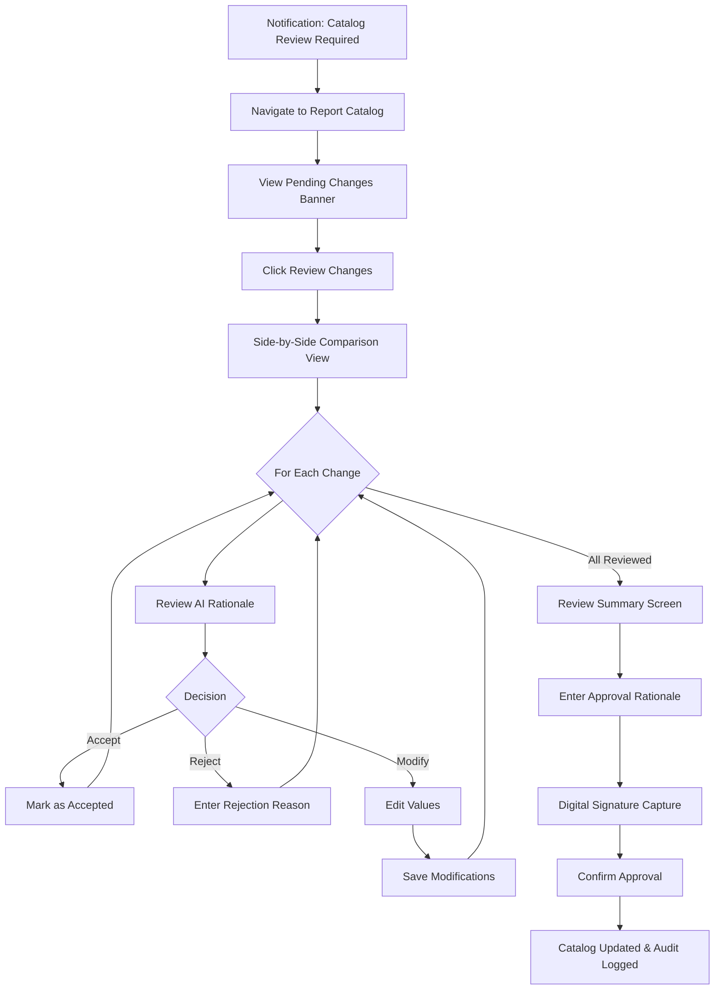

### Screen Sequence

#### Screen 1.1: Report Catalog List View
- Display data grid with all reports
- Show "Pending Review" banner with change count
- Highlight rows with pending changes
- Provide "Review Changes" action button

#### Screen 1.2: Change Review Interface
- Split-screen layout: Current (left) vs. Proposed (right)
- Field-by-field comparison with diff highlighting
- AI confidence score and rationale panel
- Accept/Reject/Modify buttons per field
- Progress indicator showing reviewed/total changes

#### Screen 1.3: Approval Summary
- List of all accepted changes
- List of all rejected changes with reasons
- List of all modifications made
- Approval rationale text input (required)
- Digital signature component

#### Screen 1.4: Confirmation Modal
- Summary of changes to be applied
- Warning about downstream impacts
- Final confirm/cancel buttons

### Post-Conditions
- Catalog version incremented
- Audit trail entries created for all decisions
- Notifications sent to affected stakeholders
- Downstream workflows triggered (if applicable)

### Error Handling
- If session expires during review: Auto-save draft state, prompt re-authentication
- If concurrent edit detected: Display conflict resolution interface
- If signature capture fails: Provide retry option with alternative verification

---

## Workflow 2: Data Requirements Document Validation

### Overview
This workflow describes how a Data Steward validates AI-generated data requirements and source mappings.

### Actors
- Primary: Data Steward
- Secondary: Data Requirements Agent (AI)

### Trigger
Data Requirements Agent completes parsing of regulatory template and generates mappings.

### Preconditions
- User has Data Steward role
- AI agent has completed template parsing
- Data requirements document is in "Pending Review" status

### Workflow Steps

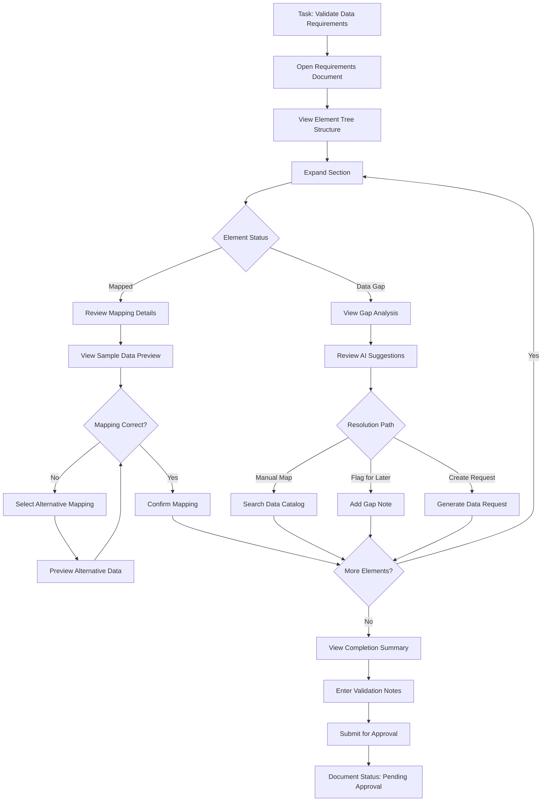

### Screen Sequence

#### Screen 2.1: Requirements Document Overview
- Hierarchical tree view of report sections
- Progress bar showing validation completion
- Filter controls: Status (All/Mapped/Gaps/Validated)
- Bulk action toolbar

#### Screen 2.2: Element Detail Drawer
- Full regulatory definition display
- Data type and format specifications
- Calculation logic (if applicable)
- Current mapping details with confidence score
- Alternative mappings ranked by confidence
- Sample data preview panel

#### Screen 2.3: Data Gap Resolution
- Gap reason explanation
- AI-suggested resolution paths
- Data catalog search interface
- Manual mapping form
- Gap note/comment input
- Data request generation form

#### Screen 2.4: Validation Summary
- Mapped elements count and list
- Validated elements count and list
- Remaining gaps count and list
- Validation notes input
- Submit for approval button

### Post-Conditions
- Document status updated to "Pending Approval"
- All mapping decisions logged to audit trail
- Data gap issues created (if flagged)
- Approval task created for designated approver

---

## Workflow 3: CDE Inventory Review and Ownership Assignment

### Overview
This workflow describes how a Data Governance Lead reviews AI-identified CDEs and assigns data owners.

### Actors
- Primary: Data Governance Lead
- Secondary: CDE Identification Agent (AI)
- Tertiary: Business Stakeholders (for ownership assignment)

### Trigger
CDE Identification Agent completes criticality scoring and generates inventory recommendations.

### Preconditions
- User has Data Governance Lead role
- AI agent has completed CDE identification
- New CDEs pending review exist

### Workflow Steps

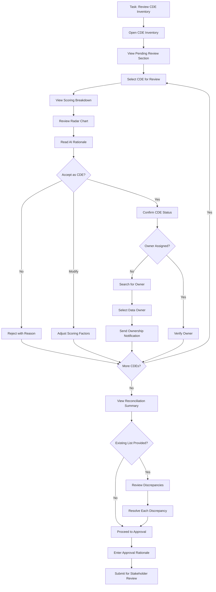

### Screen Sequence

#### Screen 3.1: CDE Inventory Dashboard
- Summary cards: Total CDEs, Pending Review, Without Owners
- Data grid with sorting and filtering
- "Pending Review" section highlighted
- Bulk action toolbar for batch operations

#### Screen 3.2: CDE Detail View
- Overview tab: Name, definition, status, owner
- Scoring tab: Radar chart with four factors
- AI rationale panel with confidence score
- Accept/Reject/Modify action buttons
- Owner assignment search and select

#### Screen 3.3: Owner Assignment Interface
- Organization hierarchy browser
- User search with role filtering
- Selected owner preview with contact info
- Notification message customization
- Confirm assignment button

#### Screen 3.4: Reconciliation View (if existing list provided)
- Three-column layout: Existing Only | Matched | AI-Identified Only
- Match confidence indicators
- Bulk reconciliation actions
- Discrepancy resolution controls

#### Screen 3.5: Approval Submission
- Summary of reviewed CDEs
- List of ownership assignments made
- Approval rationale input
- Stakeholder selection for review routing

### Post-Conditions
- CDE statuses updated (Approved/Rejected)
- Ownership assignments recorded
- Notification emails sent to new owners
- Stakeholder review tasks created
- Audit trail updated

---

## Workflow 4: Data Quality Rule Configuration

### Overview
This workflow describes how a Data Steward reviews and configures AI-generated data quality rules.

### Actors
- Primary: Data Steward
- Secondary: Data Quality Rule Agent (AI)

### Trigger
Data Quality Rule Agent generates rules for newly approved CDEs.

### Preconditions
- User has Data Steward role
- CDE has been approved
- AI-generated rules are pending review

### Workflow Steps

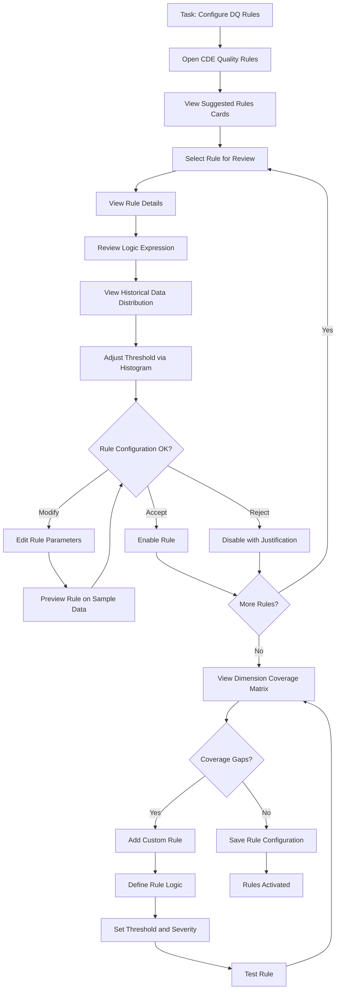

### Screen Sequence

#### Screen 4.1: CDE Rules Overview
- CDE header with key metadata
- Rule cards in grid layout
- Dimension coverage indicator
- "Add Custom Rule" button
- Bulk enable/disable controls

#### Screen 4.2: Rule Editor
- Rule name and description fields
- Dimension dropdown selector
- Logic expression editor with syntax highlighting
- Threshold configuration with histogram overlay
- Severity dropdown (Critical/High/Medium/Low)
- Owner assignment
- Test rule button

#### Screen 4.3: Threshold Adjustment Interface
- Interactive histogram of historical values
- Draggable threshold line
- Real-time impact preview (% records failing)
- Suggested threshold from AI
- Reset to default option

#### Screen 4.4: Rule Test Results
- Sample data preview
- Pass/fail indicators per record
- Aggregate statistics
- Adjust and retest option

#### Screen 4.5: Dimension Coverage Matrix
- Heatmap: CDEs vs. Dimensions
- Color coding: Red (no rules), Yellow (1 rule), Green (2+ rules)
- Click to drill into specific CDE/dimension
- Gap identification highlights

### Post-Conditions
- Rules saved and activated
- Initial rule execution scheduled
- Audit trail updated with all configurations
- Dashboard metrics updated

---

## Workflow 5: Issue Lifecycle Management

### Overview
This workflow describes the complete lifecycle of a data quality issue from detection to closure.

### Actors
- Primary: Data Steward (Assignee)
- Secondary: Issue Management Agent (AI)
- Tertiary: Verifier (different from resolver)

### Trigger
Data quality rule execution fails beyond configured threshold.

### Preconditions
- DQ rules are active and executing
- Rule failure detected
- Issue auto-creation enabled

### Workflow Steps

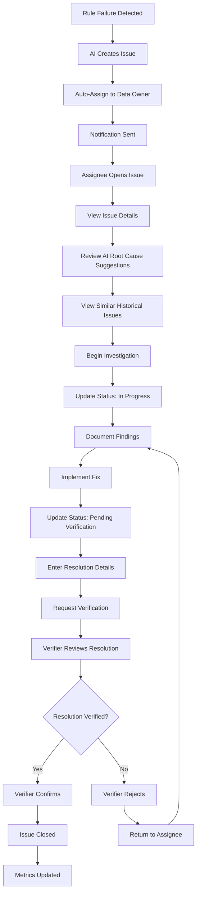

### Screen Sequence

#### Screen 5.1: Issue Notification
- Toast notification with issue summary
- Click to navigate to issue
- Severity indicator
- Quick acknowledge action

#### Screen 5.2: Issue Kanban Board
- Columns: Open, In Progress, Pending Verification, Closed
- Issue cards with key metadata
- Drag-and-drop status changes
- Filter by severity, assignee, report

#### Screen 5.3: Issue Detail Drawer
- Header: Title, Severity badge, Status, Assignee
- Details tab: Description, Source, Impacted Reports/CDEs
- Root Cause tab: AI suggestions with confidence scores
- Similar Issues tab: Historical matches with resolutions
- Activity Log tab: Timeline of all actions
- Resolution tab: Fix details and verification status

#### Screen 5.4: Root Cause Analysis Panel
- AI-suggested causes ranked by confidence
- Supporting evidence for each suggestion
- Accept/Reject actions per suggestion
- Manual root cause entry option
- Link to related documentation

#### Screen 5.5: Resolution Entry Form
- Resolution type dropdown (Data Correction/Process Change/System Fix/Exception)
- Description text area
- Evidence attachment upload
- Compensating control selection (if applicable)
- Request verification button

#### Screen 5.6: Verification Interface
- Resolution summary display
- Verification checklist
- Evidence review panel
- Confirm/Reject buttons
- Rejection reason input (if rejecting)

### Post-Conditions
- Issue status updated to Closed
- Resolution logged with verifier details
- Metrics recalculated
- Audit trail complete
- Related compensating controls updated (if applicable)

### Escalation Path
- If issue severity is Critical: Immediate escalation notification to senior management
- If issue age exceeds SLA: Automatic escalation to manager
- If multiple rejections: Escalate to Data Governance Lead

---

## Workflow 6: Compliance Package Review and Approval

### Overview
This workflow describes how a Regulatory Reporting Manager reviews and approves the compliance documentation package before submission.

### Actors
- Primary: Regulatory Reporting Manager
- Secondary: Documentation Agent (AI)
- Tertiary: CFO/Senior Executive (for attestation)

### Trigger
Documentation Agent completes generation of all compliance artifacts for a report cycle.

### Preconditions
- Report cycle is in final review phase
- All required artifacts have been generated
- No blocking critical issues exist

### Workflow Steps

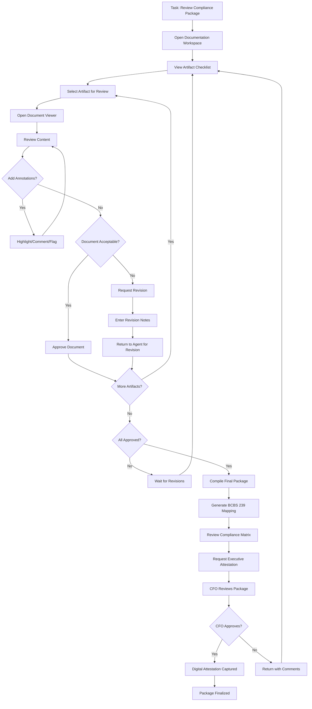

### Screen Sequence

#### Screen 6.1: Documentation Workspace
- Report cycle header with status
- Artifact checklist with status indicators
- Progress bar showing approval completion
- "Compile Package" button (enabled when all approved)

#### Screen 6.2: Document Viewer
- Embedded PDF/HTML viewer
- Annotation toolbar (highlight, comment, flag)
- Side panel with document metadata
- Generation source references
- Approve/Request Revision buttons

#### Screen 6.3: Annotation Interface
- Highlight tool with color options
- Comment bubble with text input
- Flag markers for attention items
- Annotation list panel
- Export annotations option

#### Screen 6.4: Revision Request Form
- Document identification
- Specific sections requiring revision
- Detailed revision notes
- Priority indicator
- Submit to agent button

#### Screen 6.5: BCBS 239 Compliance Matrix
- Principles listed with requirements
- Evidence reference links
- Compliance status indicators (Compliant/Partial/Non-Compliant)
- Gap identification highlights
- Export to PDF option

#### Screen 6.6: Executive Attestation Interface
- Formal attestation statement display
- Package summary with key metrics
- Acknowledgment checkboxes
- Digital signature capture
- Timestamp and identity verification

### Post-Conditions
- Package status set to "Finalized"
- All documents locked from further edits
- Attestation recorded with digital signature
- Audit trail complete
- Package ready for regulatory submission

---

## Workflow 7: Lineage Impact Analysis

### Overview
This workflow describes how a Data Architect investigates the impact of a source system change using lineage visualization.

### Actors
- Primary: Data Architect
- Secondary: Lineage Mapping Agent (AI)
- Tertiary: Data Stewards (notified of impacts)

### Trigger
Source system change detected or manually reported.

### Preconditions
- Lineage graph exists for affected source
- User has Data Architect role
- Change details are known

### Workflow Steps

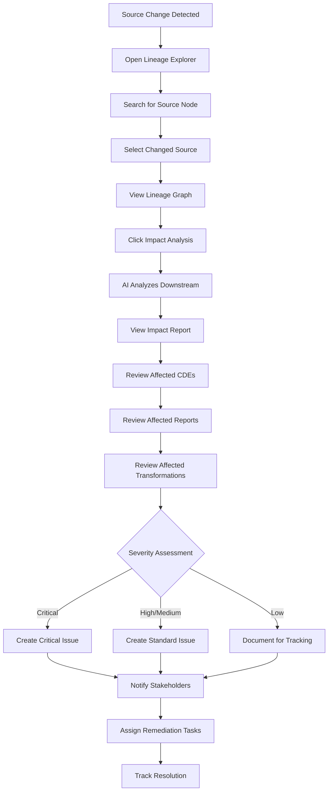

### Screen Sequence

#### Screen 7.1: Lineage Explorer
- Search bar for node lookup
- Recent changes panel
- Bookmarked lineages
- Full graph overview (minimap)

#### Screen 7.2: Lineage Graph Visualization
- Interactive directed graph
- Color-coded nodes by type
- Zoom/pan controls
- Fit-to-screen button
- Export options

#### Screen 7.3: Node Detail Panel
- Node metadata display
- Technical details
- Business term mapping
- Linked controls and policies
- "Analyze Impact" button

#### Screen 7.4: Impact Analysis Report
- Summary statistics: Affected CDEs, Reports, Transformations
- Severity assessment with AI rationale
- Detailed lists with drill-down links
- Risk indicators
- Recommended actions

#### Screen 7.5: Stakeholder Notification
- Auto-populated recipient list (affected data stewards)
- Impact summary message
- Customization options
- Send notification button

#### Screen 7.6: Remediation Task Creation
- Task type selection
- Assignment to appropriate roles
- Due date setting
- Link to impact analysis
- Create and track button

### Post-Conditions
- Impact analysis documented
- Issues created as appropriate
- Stakeholders notified
- Remediation tasks assigned
- Audit trail updated

---

## Workflow 8: Control Evidence Logging

### Overview
This workflow describes how control owners log evidence of control execution.

### Actors
- Primary: Control Owner
- Secondary: Risk Manager (reviewer)

### Trigger
Scheduled control execution or manual control activity.

### Preconditions
- Control is active in the Controls Matrix
- User is assigned as Control Owner
- Control execution has occurred

### Workflow Steps

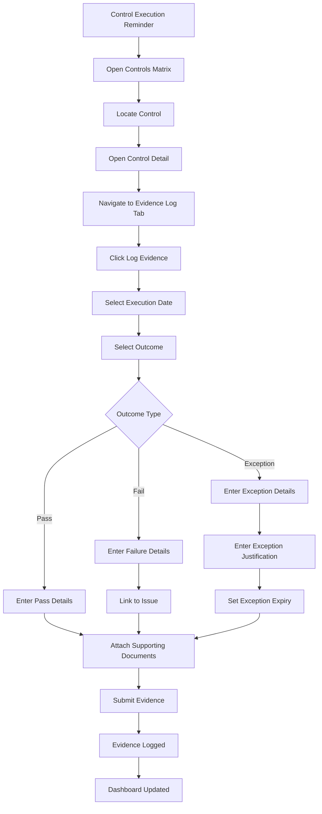

### Screen Sequence

#### Screen 8.1: Controls Matrix
- Data grid with all controls
- Status indicators (Pass/Fail/Pending)
- "Log Evidence" quick action
- Filter by owner, status, type

#### Screen 8.2: Control Detail Panel
- Control definition and metadata
- Linked CDEs and processes
- Evidence log timeline
- Effectiveness review history

#### Screen 8.3: Evidence Entry Form
- Execution date picker
- Outcome selector (Pass/Fail/Exception)
- Details text area
- Issue linker (for failures)
- Exception justification (for exceptions)
- Expiry date (for exceptions)
- Document attachment upload
- Submit button

#### Screen 8.4: Evidence Confirmation
- Summary of logged evidence
- Confirmation message
- Link to view in timeline
- Option to log another

### Post-Conditions
- Evidence recorded in control log
- Control status updated
- Dashboard metrics refreshed
- Audit trail updated
- Notifications sent (if failure/exception)

---

## Workflow 9: Report Cycle Initiation and Planning

### Overview
This workflow describes how a Regulatory Reporting Manager initiates a new report cycle and reviews the generated submission plan.

### Actors
- Primary: Regulatory Reporting Manager
- Secondary: Workflow Orchestrator Agent (AI)

### Trigger
Approaching report period end date or manual cycle initiation.

### Preconditions
- Report exists in catalog
- User has Regulatory Reporting Manager role
- Previous cycle (if any) is closed

### Workflow Steps

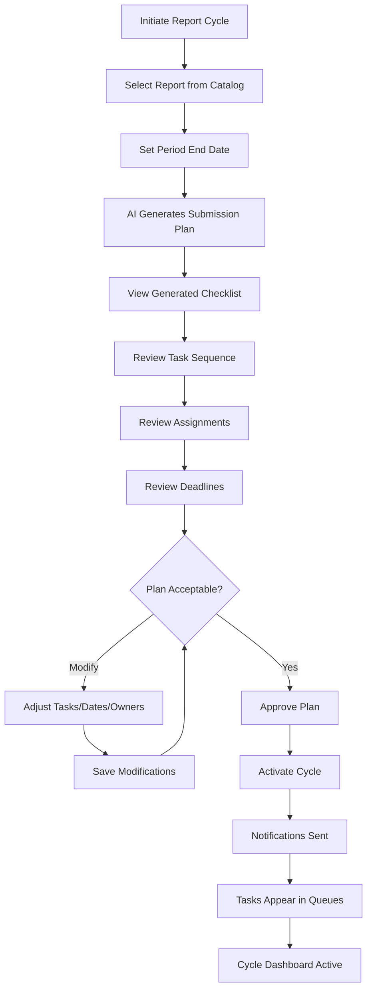

### Screen Sequence

#### Screen 9.1: Cycle Initiation
- Report selector dropdown
- Period end date picker
- Previous cycle summary (if exists)
- "Generate Plan" button

#### Screen 9.2: Submission Plan Review
- Gantt chart view of tasks
- Task list with dependencies
- Assignment matrix
- Deadline timeline
- Critical path highlighting

#### Screen 9.3: Task Editor
- Task details form
- Owner assignment
- Due date adjustment
- Dependency configuration
- Save changes button

#### Screen 9.4: Plan Approval
- Plan summary statistics
- Key milestones highlighted
- Approval confirmation
- Activate cycle button

#### Screen 9.5: Cycle Dashboard
- Progress overview
- Current phase indicator
- Upcoming tasks
- Blocking issues
- Deadline countdown

### Post-Conditions
- Cycle created and active
- All tasks scheduled
- Notifications sent to assignees
- Cycle dashboard available
- Audit trail initiated

---

## Workflow 10: Human Checkpoint Approval (Generic)

### Overview
This workflow describes the generic pattern for human checkpoint approvals throughout the system.

### Actors
- Primary: Designated Approver (role-based)
- Secondary: AI Agent (requestor)

### Trigger
Workflow reaches configured human checkpoint.

### Preconditions
- Workflow is active
- Checkpoint is configured
- User has appropriate approval authority

### Workflow Steps

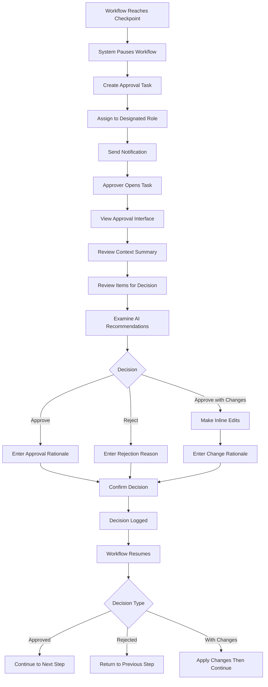

### Screen Sequence

#### Screen 10.1: Task Notification
- Notification with task summary
- Priority indicator
- Due date
- Quick navigate action

#### Screen 10.2: Approval Interface (Full Screen)
- Header: Task type, Source workflow, Due date
- Context panel: Summary of what led to this checkpoint
- Review panel: Items requiring decision
- AI indicator: Clear marking of AI-generated content
- Decision panel: Approve/Reject/Approve with Changes

#### Screen 10.3: Review Panel Details
- Expandable sections for each item
- AI confidence scores displayed
- Supporting evidence links
- Comparison views (before/after if applicable)

#### Screen 10.4: Decision Entry
- Decision type selector
- Rationale text input (required, min 20 chars)
- Inline editor (for "with changes" option)
- Change tracking display

#### Screen 10.5: Confirmation Modal
- Decision summary
- Downstream impact preview
- Final confirm/cancel buttons
- Checkbox acknowledgments (if required)

### Post-Conditions
- Decision recorded with full audit trail
- Workflow status updated
- Appropriate path executed
- Notifications sent to relevant parties
- Metrics updated

---

## Workflow 11: Dashboard Drill-Down Investigation

### Overview
This workflow describes how a CDO investigates a data quality issue discovered through the executive dashboard.

### Actors
- Primary: Chief Data Officer
- Secondary: Data Steward (for detailed investigation)

### Trigger
CDO notices anomaly or threshold breach on dashboard.

### Preconditions
- User has CDO role
- Dashboard is displaying current metrics
- Anomaly or breach is visible

### Workflow Steps

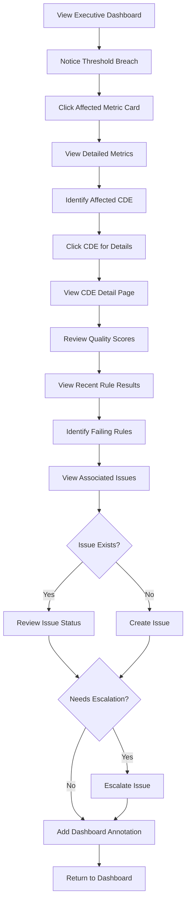

### Screen Sequence

#### Screen 11.1: Executive Dashboard
- Summary cards with KPIs
- Threshold breach highlighting
- Click-through enabled on all metrics
- Trend indicators

#### Screen 11.2: Detailed Metrics View
- Expanded view of selected metric
- Breakdown by CDE
- Historical trend chart
- Contributing factors

#### Screen 11.3: CDE Detail Page
- CDE overview and metadata
- Quality score breakdown
- Rule execution history
- Lineage diagram thumbnail
- Associated issues list

#### Screen 11.4: Rule Results Panel
- Recent execution results
- Pass/fail indicators
- Failed record counts
- Trend over time

#### Screen 11.5: Issue Creation/Review
- Issue details form (if creating)
- Issue status and history (if existing)
- Escalation controls
- Assignment information

#### Screen 11.6: Annotation Interface
- Metric identification
- Annotation text input
- Visibility settings
- Save annotation button

### Post-Conditions
- Investigation documented via annotations
- Issues created or escalated as needed
- Audit trail of dashboard interactions
- Follow-up tasks assigned if necessary

---

## Workflow 12: Deadline Escalation Handling

### Overview
This workflow describes how the system handles approaching and missed deadlines with escalating notifications.

### Actors
- Primary: Task Assignee
- Secondary: Manager (escalation target)
- Tertiary: Senior Management (final escalation)

### Trigger
Task deadline approaches configured threshold.

### Preconditions
- Task exists with due date
- Escalation thresholds configured
- Notification preferences set

### Workflow Steps

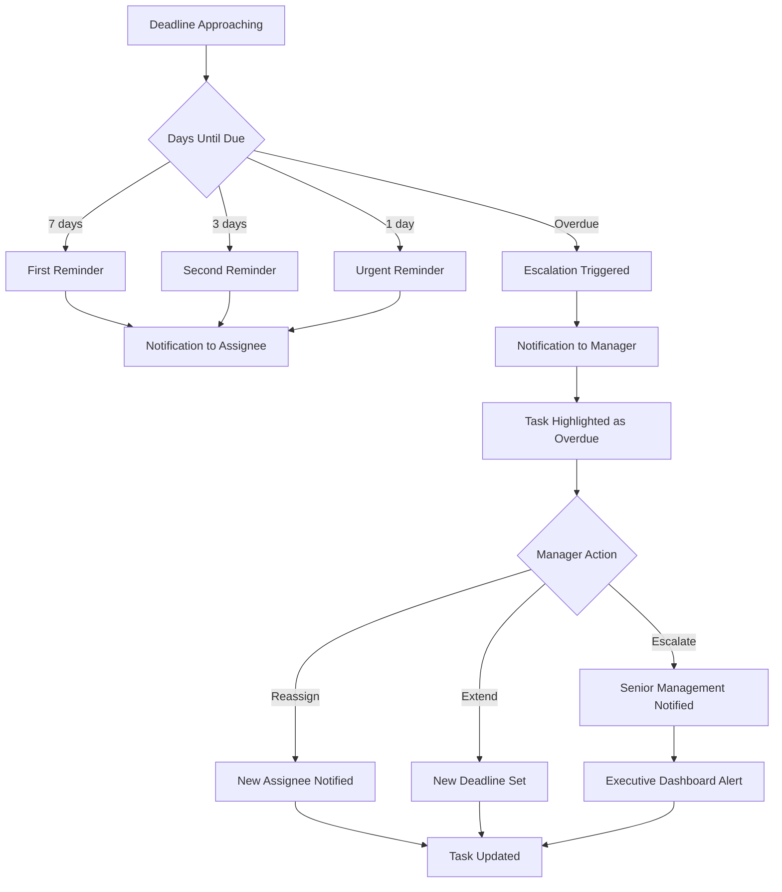

### Screen Sequence

#### Screen 12.1: Reminder Notification
- Task summary
- Days until/past due
- Quick action buttons
- Navigate to task link

#### Screen 12.2: Task Queue (Overdue Highlighted)
- Overdue tasks in red
- Days overdue indicator
- Escalation status badge
- Quick reassign action

#### Screen 12.3: Manager Escalation View
- List of escalated tasks
- Assignee information
- Task history
- Action buttons: Reassign, Extend, Escalate Further

#### Screen 12.4: Deadline Extension Form
- Current deadline display
- New deadline picker
- Extension reason (required)
- Approval workflow (if required)
- Submit button

#### Screen 12.5: Executive Alert Banner
- Critical overdue items
- Impact summary
- Direct links to items
- Acknowledge button

### Post-Conditions
- Appropriate notifications sent
- Task status updated
- Escalation logged
- Metrics updated
- Audit trail complete

---

## Workflow 13: Retrospective Review

### Overview
This workflow describes how the team conducts a retrospective review after a report cycle completes.

### Actors
- Primary: Data Governance Lead
- Secondary: All cycle participants

### Trigger
Report cycle reaches "Completed" status.

### Preconditions
- Report cycle is complete
- Submission confirmed
- User has Data Governance Lead role

### Workflow Steps

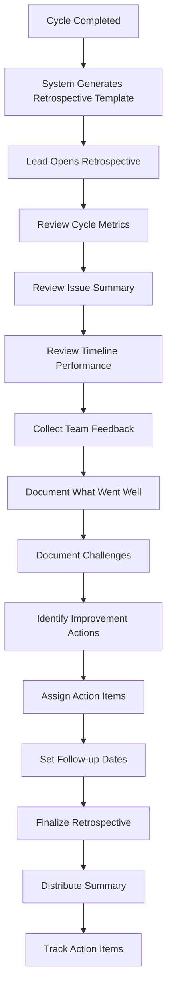

### Screen Sequence

#### Screen 13.1: Retrospective Dashboard
- Cycle summary statistics
- Timeline visualization (planned vs. actual)
- Issue metrics
- Participant list

#### Screen 13.2: Metrics Review
- Quality scores achieved
- Deadline adherence
- Issue resolution times
- Control pass rates

#### Screen 13.3: Feedback Collection
- "What went well" input section
- "Challenges faced" input section
- Anonymous feedback option
- Team member contributions

#### Screen 13.4: Action Item Creation
- Improvement suggestion input
- Owner assignment
- Due date setting
- Priority selection
- Link to related issues

#### Screen 13.5: Retrospective Summary
- Compiled feedback
- Action items list
- Distribution list
- Finalize and send button

### Post-Conditions
- Retrospective documented
- Action items created and assigned
- Summary distributed to participants
- Improvements tracked for next cycle
- Audit trail complete

---

## Appendix A: Screen Inventory

| Screen ID | Screen Name | Primary Workflow | User Roles |
|-----------|-------------|------------------|------------|
| S-001 | Application Shell | All | All |
| S-002 | Executive Dashboard | WF-11 | CDO, Executive |
| S-003 | Report Catalog List | WF-1 | Compliance Officer |
| S-004 | Catalog Change Review | WF-1 | Compliance Officer |
| S-005 | Data Requirements Tree | WF-2 | Data Steward |
| S-006 | Element Detail Drawer | WF-2 | Data Steward |
| S-007 | CDE Inventory Grid | WF-3 | Data Governance Lead |
| S-008 | CDE Detail View | WF-3 | Data Governance Lead |
| S-009 | DQ Rules Overview | WF-4 | Data Steward |
| S-010 | Rule Editor | WF-4 | Data Steward |
| S-011 | Controls Matrix | WF-8 | Risk Manager |
| S-012 | Control Detail Panel | WF-8 | Risk Manager |
| S-013 | Lineage Graph | WF-7 | Data Architect |
| S-014 | Impact Analysis Report | WF-7 | Data Architect |
| S-015 | Issue Kanban Board | WF-5 | Data Steward |
| S-016 | Issue Detail Drawer | WF-5 | Data Steward |
| S-017 | Documentation Workspace | WF-6 | Regulatory Reporting Manager |
| S-018 | Document Viewer | WF-6 | Regulatory Reporting Manager |
| S-019 | Task Queue | WF-10 | All |
| S-020 | Approval Interface | WF-10 | Approvers |
| S-021 | Audit Trail Viewer | All | Compliance Officer, Admin |
| S-022 | Administration Dashboard | N/A | Admin |
| S-023 | Notification Center | All | All |
| S-024 | Cycle Dashboard | WF-9 | Regulatory Reporting Manager |
| S-025 | Retrospective Dashboard | WF-13 | Data Governance Lead |

---

## Appendix B: Role-Screen Access Matrix

| Screen | CDO | Compliance Officer | Data Steward | Data Governance Lead | Risk Manager | Data Architect | Regulatory Reporting Manager | Admin |
|--------|-----|-------------------|--------------|---------------------|--------------|----------------|------------------------------|-------|
| Executive Dashboard | ✓ | View | View | View | View | View | View | ✓ |
| Report Catalog | View | ✓ | View | View | View | View | ✓ | ✓ |
| Data Requirements | View | View | ✓ | ✓ | View | View | View | ✓ |
| CDE Inventory | View | View | View | ✓ | View | View | View | ✓ |
| DQ Rules | View | View | ✓ | ✓ | View | View | View | ✓ |
| Controls Matrix | View | View | View | View | ✓ | View | View | ✓ |
| Lineage Explorer | View | View | View | View | View | ✓ | View | ✓ |
| Issue Management | View | View | ✓ | ✓ | View | View | View | ✓ |
| Documentation | View | View | View | View | View | View | ✓ | ✓ |
| Audit Trail | View | ✓ | View | View | View | View | View | ✓ |
| Administration | - | - | - | - | - | - | - | ✓ |

Legend: ✓ = Full Access, View = Read-Only, - = No Access

---

## Appendix C: Notification Types

| Notification Type | Trigger | Channels | Recipients |
|-------------------|---------|----------|------------|
| Task Assignment | New task created | In-App, Email | Assignee |
| Deadline Reminder (7d) | 7 days before due | In-App, Email | Assignee |
| Deadline Reminder (3d) | 3 days before due | In-App, Email | Assignee |
| Deadline Reminder (1d) | 1 day before due | In-App, Email | Assignee |
| Overdue Escalation | Task past due | In-App, Email | Assignee, Manager |
| Critical Issue | Critical issue created | In-App, Email, SMS | Data Owner, Senior Management |
| Threshold Breach | DQ score below threshold | In-App, Email | Data Steward, CDO |
| Approval Required | Checkpoint reached | In-App, Email | Designated Approver |
| Catalog Update | New regulatory changes | In-App, Email | Compliance Officers |
| Cycle Status Change | Cycle phase transition | In-App, Email | Cycle Participants |
| Issue Assignment | Issue assigned | In-App, Email | Assignee |
| Issue Resolution | Issue closed | In-App | Reporter, Stakeholders |
| Control Failure | Control execution fails | In-App, Email | Control Owner, Risk Manager |
