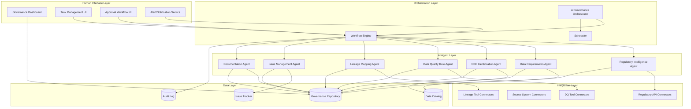

# Design Document: Agentic AI Data Governance Operating Model

## Overview

The Agentic AI Data Governance System is a multi-agent platform that automates end-to-end data governance for regulatory reporting in US and Canadian financial institutions. The system orchestrates specialized AI agents to handle regulatory intelligence, data requirements mapping, CDE identification, quality rule generation, lineage mapping, issue management, and documentation—while maintaining human-in-the-loop controls at critical decision points.

The architecture follows an event-driven, microservices pattern where each agent operates independently but is coordinated by a central orchestrator. All agents share a common data layer (governance repository) and communicate through an event bus for loose coupling and scalability.

## Architecture



### Key Architectural Decisions

1. **Event-Driven Agent Communication**: Agents publish events to a message bus when completing tasks, allowing loose coupling and enabling parallel processing where dependencies allow.

2. **Centralized Governance Repository**: All governance artifacts (catalogs, CDEs, rules, lineage) are stored in a single repository with versioning, enabling consistency and audit trails.

3. **Workflow Engine for HITL**: A BPM-style workflow engine manages human checkpoints, task assignments, and approval routing.

4. **Plugin Architecture for Integrations**: Source systems, lineage tools, and DQ tools connect via standardized adapters, allowing flexibility in technology choices.

## Components and Interfaces

### 1. AI Governance Orchestrator

The central coordinator that manages the reporting lifecycle and agent sequencing.

```typescript
interface GovernanceOrchestrator {
  // Lifecycle management
  startReportCycle(reportId: string, periodEnd: Date): Promise<CycleInstance>;
  pauseCycle(cycleId: string, reason: string): Promise<void>;
  resumeCycle(cycleId: string): Promise<void>;
  
  // Agent coordination
  triggerAgent(agentType: AgentType, context: AgentContext): Promise<AgentResult>;
  getAgentStatus(agentType: AgentType, cycleId: string): Promise<AgentStatus>;
  
  // HITL management
  createHumanTask(task: HumanTask): Promise<TaskId>;
  completeHumanTask(taskId: TaskId, decision: Decision, rationale: string): Promise<void>;
  escalateTask(taskId: TaskId, escalationLevel: number): Promise<void>;
}

interface CycleInstance {
  id: string;
  reportId: string;
  periodEnd: Date;
  status: CycleStatus;
  currentPhase: Phase;
  checkpoints: Checkpoint[];
  auditTrail: AuditEntry[];
}

type CycleStatus = 'active' | 'paused' | 'completed' | 'failed';
type Phase = 'data_gathering' | 'validation' | 'review' | 'approval' | 'submission';
```

### 2. Regulatory Intelligence Agent

Monitors regulatory sources and maintains the report catalog.

```typescript
interface RegulatoryIntelligenceAgent {
  // Scanning
  scanRegulatorySources(jurisdictions: Jurisdiction[]): Promise<ScanResult>;
  detectChanges(since: Date): Promise<RegulatoryChange[]>;
  
  // Catalog management
  updateReportCatalog(changes: RegulatoryChange[]): Promise<CatalogUpdate>;
  getReportCatalog(): Promise<ReportCatalog>;
  
  // Notifications
  notifyStakeholders(change: RegulatoryChange): Promise<void>;
}

interface RegulatoryReport {
  id: string;
  name: string;
  jurisdiction: 'US' | 'CA';
  regulator: string;
  frequency: 'daily' | 'weekly' | 'monthly' | 'quarterly' | 'annual';
  dueDate: DueDateRule;
  submissionFormat: string;
  submissionPlatform: string;
  description: string;
  templateUrl?: string;
  lastUpdated: Date;
  responsibleUnit: string;
}

interface ReportCatalog {
  reports: RegulatoryReport[];
  version: number;
  lastScanned: Date;
  approvedBy?: string;
  approvedAt?: Date;
}
```

### 3. Data Requirements Agent

Parses regulatory templates and maps data elements to internal sources.

```typescript
interface DataRequirementsAgent {
  // Parsing
  parseRegulatoryTemplate(templateUrl: string): Promise<DataElement[]>;
  
  // Mapping
  mapToInternalSources(elements: DataElement[], catalog: DataCatalog): Promise<DataMapping[]>;
  identifyDataGaps(mappings: DataMapping[]): Promise<DataGap[]>;
  
  // Document management
  generateRequirementsDocument(reportId: string): Promise<RequirementsDocument>;
  ingestExistingDocument(document: RequirementsDocument): Promise<ReconciliationResult>;
}

interface DataElement {
  id: string;
  name: string;
  regulatoryDefinition: string;
  dataType: DataType;
  format: string;
  calculationLogic?: string;
  unit?: string;
  mandatory: boolean;
}

interface DataMapping {
  elementId: string;
  sourceSystem: string;
  sourceTable: string;
  sourceField: string;
  transformationLogic?: string;
  confidence: number;
  validatedBy?: string;
}

interface DataGap {
  elementId: string;
  elementName: string;
  reason: 'no_source' | 'partial_source' | 'calculation_needed';
  suggestedResolution?: string;
}
```

### 4. CDE Identification Agent

Identifies and scores critical data elements.

```typescript
interface CDEIdentificationAgent {
  // Scoring
  scoreDataElements(elements: DataElement[], context: ScoringContext): Promise<CDEScore[]>;
  
  // Inventory management
  generateCDEInventory(scores: CDEScore[], threshold: number): Promise<CDEInventory>;
  reconcileWithExisting(newInventory: CDEInventory, existing: CDEInventory): Promise<ReconciliationResult>;
  
  // Ownership
  suggestDataOwners(cdes: CDE[]): Promise<OwnerSuggestion[]>;
}

interface CDEScore {
  elementId: string;
  overallScore: number;
  factors: {
    regulatoryCalculationUsage: number;
    crossReportUsage: number;
    financialImpact: number;
    regulatoryScrutiny: number;
  };
  rationale: string;
}

interface CDE {
  id: string;
  elementId: string;
  name: string;
  businessDefinition: string;
  criticalityRationale: string;
  dataOwner?: string;
  dataOwnerEmail?: string;
  status: 'pending_approval' | 'approved' | 'rejected';
  approvedBy?: string;
  approvedAt?: Date;
}

interface CDEInventory {
  reportId: string;
  cdes: CDE[];
  version: number;
  status: 'draft' | 'pending_review' | 'approved';
}
```

### 5. Data Quality Rule Agent

Generates and manages data quality validation rules.

```typescript
interface DataQualityRuleAgent {
  // Rule generation
  generateRulesForCDE(cde: CDE, historicalData?: DataProfile): Promise<DQRule[]>;
  
  // Rule management
  ingestExistingRules(rules: DQRule[]): Promise<ReconciliationResult>;
  updateRuleThreshold(ruleId: string, newThreshold: Threshold, justification: string): Promise<void>;
  
  // Execution
  executeRules(rules: DQRule[], dataSnapshot: DataSnapshot): Promise<RuleExecutionResult[]>;
}

interface DQRule {
  id: string;
  cdeId: string;
  dimension: DQDimension;
  name: string;
  description: string;
  logic: RuleLogic;
  threshold: Threshold;
  severity: 'critical' | 'high' | 'medium' | 'low';
  owner: string;
  enabled: boolean;
}

type DQDimension = 'completeness' | 'accuracy' | 'validity' | 'consistency' | 'timeliness' | 'uniqueness' | 'integrity';

interface RuleLogic {
  type: 'null_check' | 'range_check' | 'format_check' | 'referential_check' | 'reconciliation' | 'custom';
  expression: string;
  parameters?: Record<string, any>;
}

interface RuleExecutionResult {
  ruleId: string;
  passed: boolean;
  actualValue: any;
  expectedValue: any;
  failedRecords?: number;
  totalRecords: number;
  executedAt: Date;
}
```

### 6. Lineage Mapping Agent

Captures and documents data lineage from source to report.

```typescript
interface LineageMappingAgent {
  // Discovery
  scanDataPipelines(sources: DataSource[]): Promise<LineageGraph>;
  
  // Enrichment
  linkToBusinessConcepts(graph: LineageGraph, glossary: BusinessGlossary): Promise<EnrichedLineage>;
  
  // Integration
  importFromLineageTool(toolType: string, connectionConfig: ConnectionConfig): Promise<LineageGraph>;
  
  // Impact analysis
  analyzeChangeImpact(changedSource: string): Promise<ImpactAnalysis>;
  
  // Documentation
  generateLineageDiagram(cdeId: string): Promise<LineageDiagram>;
  generateLineageReport(reportId: string): Promise<LineageReport>;
}

interface LineageNode {
  id: string;
  type: 'source_table' | 'transformation' | 'staging_table' | 'report_field';
  name: string;
  system: string;
  technicalDetails: Record<string, string>;
  businessTerm?: string;
  policies?: string[];
  controls?: string[];
}

interface LineageEdge {
  sourceNodeId: string;
  targetNodeId: string;
  transformationType: string;
  transformationLogic?: string;
}

interface LineageGraph {
  nodes: LineageNode[];
  edges: LineageEdge[];
  version: number;
  capturedAt: Date;
}
```

### 7. Issue Management Agent

Handles data issue lifecycle from detection to resolution.

```typescript
interface IssueManagementAgent {
  // Issue creation
  createIssue(ruleResult: RuleExecutionResult, context: IssueContext): Promise<Issue>;
  
  // Analysis
  suggestRootCause(issue: Issue): Promise<RootCauseSuggestion[]>;
  findSimilarIssues(issue: Issue): Promise<Issue[]>;
  
  // Lifecycle
  assignIssue(issueId: string, assignee: string): Promise<void>;
  escalateIssue(issueId: string, level: number): Promise<void>;
  resolveIssue(issueId: string, resolution: Resolution, confirmedBy: string): Promise<void>;
  
  // Metrics
  getIssueMetrics(filters: IssueFilters): Promise<IssueMetrics>;
}

interface Issue {
  id: string;
  title: string;
  description: string;
  source: string;
  impactedReports: string[];
  impactedCDEs: string[];
  severity: 'critical' | 'high' | 'medium' | 'low';
  status: 'open' | 'in_progress' | 'pending_verification' | 'resolved' | 'closed';
  assignee?: string;
  createdAt: Date;
  dueDate?: Date;
  rootCause?: string;
  resolution?: Resolution;
  compensatingControl?: string;
}

interface Resolution {
  type: 'data_correction' | 'process_change' | 'system_fix' | 'exception_approved';
  description: string;
  implementedBy: string;
  implementedAt: Date;
  verifiedBy?: string;
  verifiedAt?: Date;
}

interface IssueMetrics {
  openCount: number;
  openBySeverity: Record<string, number>;
  avgResolutionTime: number;
  recurringThemes: { theme: string; count: number }[];
}
```

### 8. Documentation Agent

Generates compliance artifacts and audit evidence.

```typescript
interface DocumentationAgent {
  // Artifact generation
  generateDataDictionary(reportId: string): Promise<Document>;
  generateLineageDocumentation(reportId: string): Promise<Document>;
  generateQualityAssuranceReport(cycleId: string): Promise<Document>;
  generateControlEffectivenessReport(cycleId: string): Promise<Document>;
  generateBCBS239ComplianceMapping(reportId: string): Promise<Document>;
  
  // Package compilation
  compileCompliancePackage(cycleId: string): Promise<CompliancePackage>;
}

interface Document {
  id: string;
  type: DocumentType;
  title: string;
  content: string;
  format: 'pdf' | 'html' | 'markdown';
  generatedAt: Date;
  version: number;
}

interface CompliancePackage {
  cycleId: string;
  reportId: string;
  documents: Document[];
  status: 'draft' | 'pending_review' | 'approved';
  reviewedBy?: string;
  reviewedAt?: Date;
}
```

### 9. Governance Dashboard Service

Provides real-time monitoring and visualization.

```typescript
interface DashboardService {
  // Quality metrics
  getCDEQualityScores(reportId: string): Promise<CDEQualityScore[]>;
  getQualityTrends(reportId: string, period: DateRange): Promise<QualityTrend[]>;
  
  // Issue metrics
  getIssuesSummary(filters: IssueFilters): Promise<IssueSummary>;
  
  // Control status
  getControlStatus(reportId: string): Promise<ControlStatus[]>;
  
  // Calendar
  getRegulatoryCalendar(period: DateRange): Promise<CalendarEntry[]>;
  
  // Annotations
  addAnnotation(metricId: string, annotation: Annotation): Promise<void>;
}

interface CDEQualityScore {
  cdeId: string;
  cdeName: string;
  completeness: number;
  accuracy: number;
  timeliness: number;
  overallScore: number;
  thresholdBreached: boolean;
  lastUpdated: Date;
}

interface ControlStatus {
  controlId: string;
  controlName: string;
  type: 'reconciliation' | 'validation' | 'approval';
  status: 'pass' | 'fail' | 'pending';
  lastExecuted: Date;
  evidence?: string;
}
```

## Data Models

### Core Entities

```typescript
// Governance Repository Schema

interface GovernanceRepository {
  // Catalogs
  reportCatalog: ReportCatalog;
  dataCatalog: DataCatalog;
  businessGlossary: BusinessGlossary;
  
  // Per-report artifacts
  requirementsDocuments: Map<string, RequirementsDocument>;
  cdeInventories: Map<string, CDEInventory>;
  dqRuleRepositories: Map<string, DQRuleRepository>;
  lineageGraphs: Map<string, LineageGraph>;
  controlMatrices: Map<string, ControlMatrix>;
  
  // Cross-cutting
  issues: Issue[];
  auditLog: AuditEntry[];
  humanTasks: HumanTask[];
}

interface AuditEntry {
  id: string;
  timestamp: Date;
  actor: string;
  actorType: 'agent' | 'human' | 'system';
  action: string;
  entityType: string;
  entityId: string;
  previousState?: any;
  newState?: any;
  rationale?: string;
}

interface HumanTask {
  id: string;
  type: TaskType;
  title: string;
  description: string;
  assignedTo: string;
  assignedRole: string;
  dueDate: Date;
  status: 'pending' | 'in_progress' | 'completed' | 'escalated';
  decision?: Decision;
  decisionRationale?: string;
  completedAt?: Date;
  completedBy?: string;
}

type TaskType = 
  | 'catalog_review'
  | 'requirements_validation'
  | 'cde_approval'
  | 'rule_review'
  | 'lineage_validation'
  | 'issue_resolution_confirmation'
  | 'submission_approval'
  | 'attestation';

interface Decision {
  outcome: 'approved' | 'rejected' | 'approved_with_changes';
  changes?: any;
}
```

### Data Quality Standards

```typescript
interface DataQualityStandards {
  dimensions: DQDimensionDefinition[];
  thresholds: DQThreshold[];
  version: number;
  approvedBy: string;
  approvedAt: Date;
}

interface DQDimensionDefinition {
  dimension: DQDimension;
  definition: string;
  measurementMethod: string;
  examples: string[];
}

interface DQThreshold {
  dimension: DQDimension;
  cdeCategory: 'all' | 'critical' | 'high' | 'medium';
  minimumScore: number;
  targetScore: number;
}
```

### Control Matrix

```typescript
interface ControlMatrix {
  reportId: string;
  controls: Control[];
  version: number;
  lastReviewed: Date;
  reviewedBy: string;
}

interface Control {
  id: string;
  name: string;
  description: string;
  type: 'organizational' | 'process' | 'access' | 'change_management';
  category: 'preventive' | 'detective';
  owner: string;
  frequency: 'continuous' | 'daily' | 'weekly' | 'monthly' | 'quarterly' | 'annual';
  linkedCDEs: string[];
  linkedProcesses: string[];
  automationStatus: 'manual' | 'semi_automated' | 'fully_automated';
  ruleId?: string;
  status: 'active' | 'inactive' | 'compensating';
  expirationDate?: Date;
  evidence: ControlEvidence[];
}

interface ControlEvidence {
  executionDate: Date;
  outcome: 'pass' | 'fail' | 'exception';
  details: string;
  executedBy: string;
}
```


## Correctness Properties

*A property is a characteristic or behavior that should hold true across all valid executions of a system-essentially, a formal statement about what the system should do. Properties serve as the bridge between human-readable specifications and machine-verifiable correctness guarantees.*

Based on the acceptance criteria analysis, the following correctness properties must be validated through property-based testing:

### Property 1: Artifact Review State Invariant

*For any* governance artifact (Report Catalog, Requirements Document, CDE Inventory, Compliance Package), the artifact's status must transition through 'pending_review' before reaching 'approved' status.

**Validates: Requirements 1.3, 3.5, 4.4, 10.3**

### Property 2: Audit Trail Completeness

*For any* state-changing action in the system (modifications, approvals, escalations, resolutions), an audit entry must be created containing timestamp, actor identifier, actor type, action description, and outcome.

**Validates: Requirements 1.4, 2.4, 6.2, 11.6, 12.3**

### Property 3: Workflow Dependency Enforcement

*For any* workflow with task dependencies, a dependent task cannot transition to 'in_progress' or 'completed' status while any of its prerequisite tasks remain in 'pending' or 'in_progress' status.

**Validates: Requirements 2.2, 12.1**

### Property 4: Attestation Gate Invariant

*For any* report cycle requiring management attestation, the cycle status cannot transition to 'submission_ready' while the attestation task status is not 'completed' with outcome 'approved'.

**Validates: Requirements 2.3**

### Property 5: Data Element Extraction Completeness

*For any* regulatory template processed by the Data Requirements Agent, every data element in the template must appear in the output with all required fields populated (name, regulatory definition, data type, format, mandatory flag).

**Validates: Requirements 3.1**

### Property 6: Data Gap Detection Accuracy

*For any* data element that has no matching entry in the data catalog (by name or semantic similarity above threshold), the element must be flagged as a data gap in the mapping output.

**Validates: Requirements 3.3**

### Property 7: Reconciliation Consistency

*For any* existing artifact (Requirements Document, CDE list, DQ rules, Control framework) ingested into the system, the reconciliation output must correctly categorize each item as 'matched', 'added', 'removed', or 'modified' based on comparison with newly generated artifacts.

**Validates: Requirements 3.4, 4.3, 5.4, 6.3**

### Property 8: CDE Scoring Determinism

*For any* data element with identical characteristics (regulatory calculation usage, cross-report usage, financial impact, regulatory scrutiny scores), the CDE Identification Agent must produce identical overall criticality scores.

**Validates: Requirements 4.1**

### Property 9: CDE Threshold Inclusion

*For any* data element with a criticality score at or above the configured threshold, the element must be included in the CDE Inventory with a non-empty rationale field.

**Validates: Requirements 4.2**

### Property 10: CDE Ownership Validation

*For any* CDE in the inventory with status 'approved', the dataOwner field must be non-null and non-empty. CDEs without owners must have status 'pending_approval' or be flagged for ownership assignment.

**Validates: Requirements 4.5**

### Property 11: DQ Rule Dimension Coverage

*For any* CDE added to the inventory, the Data Quality Rule Agent must generate at least one rule for each applicable dimension (completeness, accuracy, validity, consistency, timeliness, uniqueness).

**Validates: Requirements 5.1**

### Property 12: DQ Rule Field Completeness

*For any* generated data quality rule, all required fields must be populated: id, cdeId, dimension, name, description, logic expression, threshold, severity, and owner.

**Validates: Requirements 5.3**

### Property 13: Control Categorization Validity

*For any* control in the Control Matrix, the type field must be one of the valid categories: 'organizational', 'process', 'access', or 'change_management'.

**Validates: Requirements 6.1**

### Property 14: Compensating Control Tracking

*For any* control with status 'compensating', the expirationDate field must be non-null and the control must be linked to an open issue that it compensates for.

**Validates: Requirements 6.4**

### Property 15: Lineage Graph Connectivity

*For any* CDE with documented lineage, there must exist a connected path in the lineage graph from at least one source node (type 'source_table') to the CDE's report field node.

**Validates: Requirements 7.1**

### Property 16: Lineage Business Enrichment

*For any* lineage node that has a matching entry in the business glossary (by name or configured mapping), the node's businessTerm field must be populated with the glossary term.

**Validates: Requirements 7.2**

### Property 17: Change Impact Completeness

*For any* source system change, the impact analysis must identify all CDEs and reports that have lineage paths passing through the changed source.

**Validates: Requirements 7.5**

### Property 18: Issue Auto-Creation from Rule Failures

*For any* data quality rule execution that fails (passed=false) with severity 'critical' or 'high', an issue must be automatically created with all required fields populated (title, description, source, impactedReports, impactedCDEs, severity, status='open', createdAt).

**Validates: Requirements 9.1**

### Property 19: Issue Domain-Based Assignment

*For any* automatically created issue, the assignee must be set to the data owner of the primary impacted CDE, or to the domain steward if no CDE owner is defined.

**Validates: Requirements 9.2**

### Property 20: Critical Issue Escalation

*For any* issue with severity 'critical', the issue must be escalated (escalation level > 0) within the configured escalation time threshold.

**Validates: Requirements 9.4**

### Property 21: Issue Resolution Confirmation Gate

*For any* issue transitioning from 'pending_verification' to 'closed' status, the resolution.verifiedBy field must be non-null and different from the resolution.implementedBy field (four-eyes principle).

**Validates: Requirements 9.5**

### Property 22: Issue Metrics Accuracy

*For any* set of issues, the calculated metrics (openCount, avgResolutionTime) must accurately reflect the actual issue data: openCount equals count of issues with status in ['open', 'in_progress', 'pending_verification'], and avgResolutionTime equals mean of (resolvedAt - createdAt) for resolved issues.

**Validates: Requirements 9.6**

### Property 23: Dashboard Quality Score Consistency

*For any* CDE displayed on the dashboard, the quality scores (completeness, accuracy, timeliness) must match the most recent rule execution results for that CDE, and thresholdBreached must be true if and only if any score is below the configured threshold.

**Validates: Requirements 11.1**

### Property 24: Human Checkpoint Pause Behavior

*For any* workflow step configured as a human checkpoint, the workflow must pause (status='waiting_for_human') and create a HumanTask with the correct assignedRole before any subsequent steps execute.

**Validates: Requirements 12.2**

### Property 25: Critical Issue Workflow Blocking

*For any* active workflow cycle, if a critical issue is created that impacts the cycle's report, the cycle status must transition to 'paused' until the issue is resolved or an exception is approved.

**Validates: Requirements 12.4**

## Error Handling

### Agent Failure Handling

Each AI agent implements circuit breaker patterns:

```typescript
interface AgentErrorHandler {
  // Retry with exponential backoff
  maxRetries: number;
  baseDelayMs: number;
  
  // Circuit breaker
  failureThreshold: number;
  resetTimeoutMs: number;
  
  // Fallback behavior
  onFailure(error: AgentError): Promise<FallbackResult>;
}
```

**Error Categories:**

1. **Transient Errors** (network timeouts, temporary unavailability): Retry with exponential backoff up to maxRetries
2. **Data Errors** (invalid input, parsing failures): Log error, create issue, continue with partial results where possible
3. **Integration Errors** (external system failures): Activate circuit breaker, use cached data if available, alert operators
4. **Critical Errors** (data corruption, security violations): Halt workflow, escalate immediately, require manual intervention

### Workflow Error Handling

```typescript
interface WorkflowErrorHandler {
  onAgentFailure(agentType: AgentType, error: Error): Promise<WorkflowAction>;
  onHumanTaskTimeout(task: HumanTask): Promise<WorkflowAction>;
  onValidationFailure(step: WorkflowStep, errors: ValidationError[]): Promise<WorkflowAction>;
}

type WorkflowAction = 
  | { type: 'retry'; delay: number }
  | { type: 'skip'; reason: string }
  | { type: 'pause'; notification: Notification }
  | { type: 'fail'; error: Error };
```

### Data Validation Errors

All data inputs are validated before processing:

- Schema validation for API inputs
- Business rule validation for domain objects
- Referential integrity checks for cross-entity relationships

Invalid data triggers issue creation and prevents progression until resolved.

## Testing Strategy

### Dual Testing Approach

The system employs both unit testing and property-based testing for comprehensive coverage:

**Unit Tests** verify:
- Specific examples demonstrating correct behavior
- Edge cases (empty inputs, boundary values)
- Error conditions and exception handling
- Integration points between components

**Property-Based Tests** verify:
- Universal properties that hold across all valid inputs
- Invariants that must be maintained regardless of data
- Round-trip consistency for serialization/parsing

### Property-Based Testing Framework

The system uses **fast-check** (TypeScript) for property-based testing with the following configuration:

```typescript
import fc from 'fast-check';

// Configure minimum 100 iterations per property
const propertyConfig = {
  numRuns: 100,
  verbose: true,
  seed: Date.now()
};
```

### Test Organization

Tests are organized by component and property:

```
tests/
├── unit/
│   ├── agents/
│   │   ├── regulatory-intelligence.test.ts
│   │   ├── data-requirements.test.ts
│   │   ├── cde-identification.test.ts
│   │   ├── data-quality-rule.test.ts
│   │   ├── lineage-mapping.test.ts
│   │   ├── issue-management.test.ts
│   │   └── documentation.test.ts
│   ├── orchestrator/
│   │   └── workflow-orchestrator.test.ts
│   └── services/
│       └── dashboard-service.test.ts
├── property/
│   ├── artifact-review-state.property.ts
│   ├── audit-trail.property.ts
│   ├── workflow-dependency.property.ts
│   ├── attestation-gate.property.ts
│   ├── data-element-extraction.property.ts
│   ├── data-gap-detection.property.ts
│   ├── reconciliation.property.ts
│   ├── cde-scoring.property.ts
│   ├── cde-threshold.property.ts
│   ├── cde-ownership.property.ts
│   ├── dq-rule-coverage.property.ts
│   ├── dq-rule-completeness.property.ts
│   ├── control-categorization.property.ts
│   ├── compensating-control.property.ts
│   ├── lineage-connectivity.property.ts
│   ├── lineage-enrichment.property.ts
│   ├── change-impact.property.ts
│   ├── issue-auto-creation.property.ts
│   ├── issue-assignment.property.ts
│   ├── issue-escalation.property.ts
│   ├── issue-resolution.property.ts
│   ├── issue-metrics.property.ts
│   ├── dashboard-scores.property.ts
│   ├── human-checkpoint.property.ts
│   └── critical-issue-blocking.property.ts
└── generators/
    ├── regulatory-report.generator.ts
    ├── data-element.generator.ts
    ├── cde.generator.ts
    ├── dq-rule.generator.ts
    ├── control.generator.ts
    ├── lineage.generator.ts
    ├── issue.generator.ts
    └── workflow.generator.ts
```

### Property Test Annotation Format

Each property-based test must be annotated with the design document reference:

```typescript
/**
 * **Feature: agentic-data-governance, Property 1: Artifact Review State Invariant**
 * 
 * For any governance artifact, status must transition through 'pending_review' 
 * before reaching 'approved' status.
 */
describe('Property 1: Artifact Review State Invariant', () => {
  it('should require pending_review before approved for all artifact types', () => {
    fc.assert(
      fc.property(
        artifactGenerator(),
        (artifact) => {
          // Property implementation
        }
      ),
      propertyConfig
    );
  });
});
```

### Test Data Generators

Smart generators constrain inputs to valid domain values:

```typescript
// Example: CDE Generator
const cdeGenerator = (): fc.Arbitrary<CDE> => {
  return fc.record({
    id: fc.uuid(),
    elementId: fc.uuid(),
    name: fc.string({ minLength: 1, maxLength: 100 }),
    businessDefinition: fc.string({ minLength: 10, maxLength: 1000 }),
    criticalityRationale: fc.string({ minLength: 10, maxLength: 500 }),
    dataOwner: fc.option(fc.emailAddress()),
    status: fc.constantFrom('pending_approval', 'approved', 'rejected'),
    approvedBy: fc.option(fc.string()),
    approvedAt: fc.option(fc.date())
  });
};

// Example: Issue Generator with severity-based constraints
const issueGenerator = (): fc.Arbitrary<Issue> => {
  return fc.record({
    id: fc.uuid(),
    title: fc.string({ minLength: 5, maxLength: 200 }),
    severity: fc.constantFrom('critical', 'high', 'medium', 'low'),
    status: fc.constantFrom('open', 'in_progress', 'pending_verification', 'resolved', 'closed'),
    // ... other fields
  }).filter(issue => {
    // Ensure closed issues have resolution
    if (issue.status === 'closed') {
      return issue.resolution !== undefined;
    }
    return true;
  });
};
```
