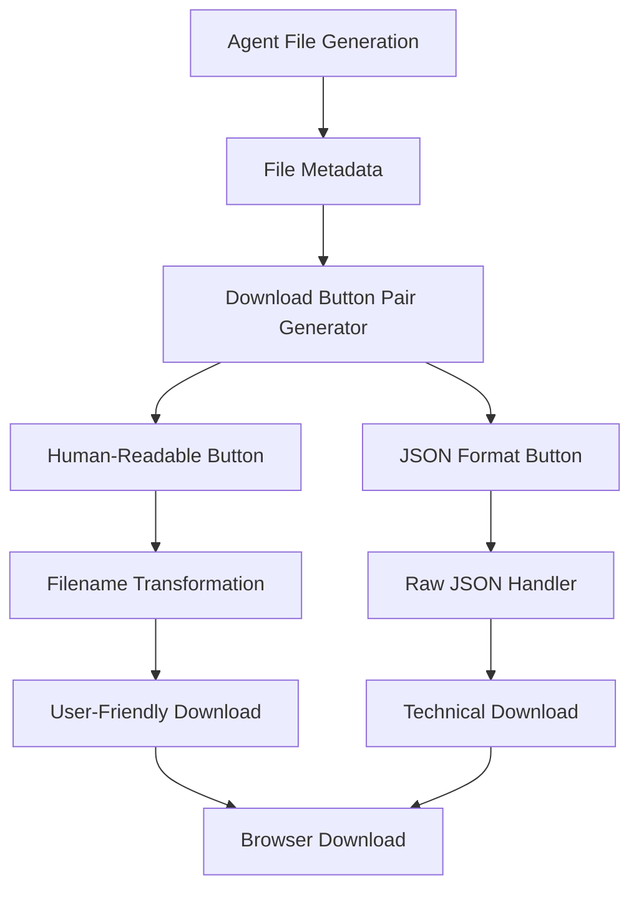

# Design Document

## Overview

This design addresses the simplification of download functionality in the chat interface, focusing on providing clean, simple download buttons with both human-readable and JSON format options. The solution removes complex URL parsing logic and instead provides a straightforward dual-button interface for each downloadable file.

## Architecture

The simplified chat download enhancement follows a clean, button-based architecture:



### Key Components

1. **File Metadata Handler**: Processes file information from agent responses
2. **Button Pair Generator**: Creates dual download buttons for each file
3. **Filename Transformation Service**: Converts technical filenames to human-readable descriptions
4. **Download Handler**: Manages file downloads in both formats
5. **Error Handler**: Provides user feedback for download operations

## Components and Interfaces

### Simple Download Button Component

The download interface consists of clean, paired buttons for each file generated by agents.

**Button Pair Interface:**
```typescript
interface DownloadButtonPair {
  fileId: string
  humanReadableLabel: string
  jsonLabel: string
  humanReadableUrl: string
  jsonUrl: string
  fileType: string
}
```

**Key Methods:**
- `generateButtonPair(fileMetadata: FileMetadata): DownloadButtonPair` - Creates button pair
- `getHumanReadableFilename(filename: string): string` - Filename transformation
- `handleDownload(url: string, filename: string): Promise<void>` - Download handler

### File Metadata Structure

```typescript
interface FileMetadata {
  originalFilename: string
  humanReadableName?: string
  fileType: string
  downloadUrls: {
    humanReadable: string
    json: string
  }
  description?: string
}
```

### Human-Readable Name Transformation

The transformation service converts technical filenames to user-friendly names:

**Transformation Rules:**
- `FR_2052A_Sample_[BankName]_[Timestamp].json` → `"FR 2052A Template - [Bank Name]"`
- `Data_Quality_Rules_Template_[OrgName]_[Timestamp].json` → `"Data Quality Rules - [Organization Name]"`
- `Compliance_Checklist_[OrgName]_[Timestamp].json` → `"Compliance Checklist - [Organization Name]"`
- `Sample_Customer_Data_[Count]records_[Timestamp].csv` → `"Customer Data Sample ([Count] records)"`

## Data Models

### DownloadButtonPair Interface

```typescript
interface DownloadButtonPair {
  fileId: string
  humanReadableLabel: string
  jsonLabel: string
  humanReadableUrl: string
  jsonUrl: string
  fileType: string
  isLoading?: boolean
  error?: string
}
```

### Button Styling Configuration

```typescript
interface ButtonStyle {
  variant: 'human-readable' | 'json'
  icon: string
  colorScheme: 'blue' | 'green'
  size: 'sm' | 'md'
}

const BUTTON_STYLES: Record<string, ButtonStyle> = {
  'human-readable': { 
    variant: 'human-readable', 
    icon: '📄', 
    colorScheme: 'blue', 
    size: 'sm' 
  },
  'json': { 
    variant: 'json', 
    icon: '🔧', 
    colorScheme: 'green', 
    size: 'sm' 
  }
}
```

## Correctness Properties

*A property is a characteristic or behavior that should hold true across all valid executions of a system-essentially, a formal statement about what the system should do. Properties serve as the bridge between human-readable specifications and machine-verifiable correctness guarantees.*

### Correctness Properties

**Property 1: Button Pair Generation**
*For any* file metadata provided by an agent, the system should generate exactly two download buttons: one for human-readable format and one for JSON format
**Validates: Requirements 1.1, 1.5**

**Property 2: Human-Readable Filename Transformation**
*For any* technical filename following supported patterns (FR_2052A, Data_Quality_Rules, Compliance_Checklist, Sample_Customer_Data), the transformation function should produce a consistent human-readable format that includes extracted organization/bank names and relevant metadata
**Validates: Requirements 2.1, 2.2, 2.3, 2.4, 2.5**

**Property 3: JSON Format Preservation**
*For any* file download in JSON format, the system should preserve the original technical filename and maintain complete data integrity without any transformations
**Validates: Requirements 3.1, 3.2, 3.3, 3.4, 3.5**

**Property 4: Button Visual Consistency**
*For any* download button pair displayed, both buttons should maintain consistent styling, appropriate icons, and clear visual distinction between human-readable and JSON options
**Validates: Requirements 4.1, 4.2, 4.3, 4.4, 4.5**

**Property 5: Download Error Handling**
*For any* download operation (successful or failed), the system should provide appropriate user feedback, handle loading states correctly, and manage multiple downloads independently
**Validates: Requirements 5.1, 5.2, 5.3, 5.4, 5.5**

**Property 6: Accessibility Compliance**
*For any* download button in the interface, it should be keyboard accessible, provide appropriate ARIA labels, maintain proper tab order, and announce status changes to screen readers
**Validates: Requirements 6.1, 6.2, 6.3, 6.4, 6.5**

**Property 7: Agent Integration Consistency**
*For any* file generated by an agent, the system should automatically display both download options, use provided metadata for human-readable names, and handle multiple files with separate button pairs
**Validates: Requirements 7.1, 7.2, 7.3, 7.4, 7.5**

## Error Handling

The simplified download system implements straightforward error handling:

### Download Error Scenarios

1. **Network Failures**: Display clear error messages when downloads fail due to connectivity issues
2. **File Not Found**: Show specific "file not available" messages for missing files
3. **Server Errors**: Handle server-side errors with appropriate user feedback
4. **Format Conversion Errors**: Handle cases where human-readable format conversion fails

### User Experience During Errors

1. **Loading States**: Show loading indicators on the specific button being clicked
2. **Error Messages**: Display clear, actionable error messages near the failed button
3. **Retry Mechanisms**: Allow users to retry failed downloads by clicking the button again
4. **Independent Operation**: Ensure one button's failure doesn't affect the other button's functionality

## Testing Strategy

### Dual Testing Approach

The testing strategy combines unit tests and property-based tests:

**Unit Tests:**
- Test specific filename transformation examples
- Verify button pair generation for known file types
- Test error handling for specific failure scenarios
- Validate accessibility features with concrete examples

**Property-Based Tests:**
- Test filename transformation across all possible inputs
- Verify button pair generation for any valid file metadata
- Test download functionality with generated test data
- Validate error handling across various failure conditions

### Property-Based Testing Configuration

- **Testing Library**: Fast-check for TypeScript/JavaScript property-based testing
- **Test Iterations**: Minimum 100 iterations per property test
- **Test Tagging**: Each property test tagged with format: **Feature: chat-upload-download-enhancement, Property {number}: {property_text}**

### Test Data Generation

**File Metadata Generators:**
- Generate realistic file metadata with various filename patterns
- Include edge cases like missing metadata, malformed filenames
- Test with different file types and organization names

**Button Interaction Generators:**
- Generate various user interaction scenarios (clicks, keyboard navigation)
- Test loading states and error conditions
- Validate accessibility interactions

### Integration Testing

**End-to-End Scenarios:**
- Test complete flow from agent file generation to successful download
- Verify both human-readable and JSON downloads work correctly
- Test error handling with real network conditions
- Validate accessibility with screen readers and keyboard navigation

<function_calls>
<invoke name="prework">
<parameter name="featureName">chat-upload-download-enhancement