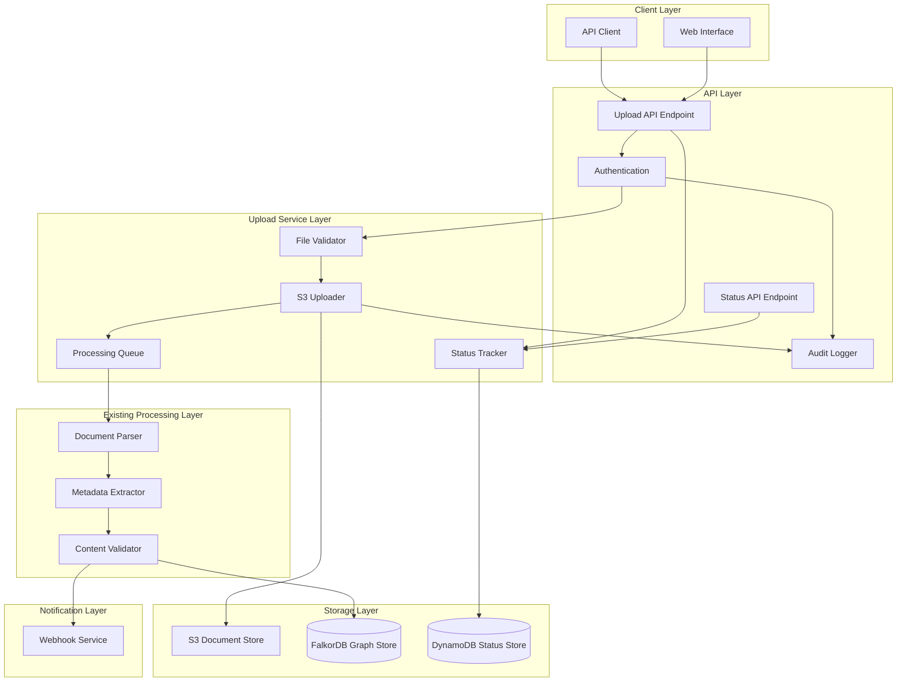

# Design Document: Document Upload Feature

## Overview

The Document Upload feature extends the Regulatory Knowledge Base by enabling users to manually upload regulatory documents. This complements the automated retrieval system by allowing users to add internal interpretations, proprietary guidance, historical documents, or regulatory materials from sources not covered by automated collection.

The feature integrates seamlessly with the existing processing pipeline, ensuring uploaded documents receive the same parsing, metadata extraction, validation, and graph storage treatment as automatically retrieved documents.

## Architecture

### Upload Flow Architecture



### Integration with Existing System

The upload feature connects to the existing regulatory knowledge base at these integration points:

1. **Processing Pipeline**: Uploaded documents enter the same parser → metadata extractor → validator pipeline
2. **Storage Layer**: Documents stored in the same S3 structure and FalkorDB graph
3. **API Layer**: New endpoints added to existing API Gateway
4. **Webhook Service**: Upload events trigger existing webhook notification system

## Components and Interfaces

### Upload API Endpoint

**Purpose**: Handles document upload requests with authentication and validation

**Endpoints**:
```
POST /api/v1/documents/upload
  - Single document upload with optional metadata
  - Returns: document_id, status

POST /api/v1/documents/upload/batch
  - Batch upload up to 20 documents
  - Returns: batch_id, document_ids[], status

GET /api/v1/documents/upload/{document_id}/status
  - Check upload processing status
  - Returns: status, error_details (if failed), kb_document_id (if completed)

GET /api/v1/documents/upload/batch/{batch_id}/status
  - Check batch upload status
  - Returns: batch_status, documents[]

PUT /api/v1/documents/{document_id}/replace
  - Replace existing document with new version
  - Returns: new_document_id, previous_version_id
```

**Technology**: AWS Lambda with API Gateway integration

### File Validator

**Purpose**: Validates uploaded files before processing

**Validation Rules**:
- File type: PDF or HTML only
- File size: PDF ≤ 50MB, HTML ≤ 10MB
- Content validation: Basic file integrity check
- Malware scanning: Integration with AWS security services

**Interface**:
```python
class FileValidator:
    def validate(self, file: UploadedFile) -> ValidationResult:
        """Validate uploaded file meets requirements."""
        
    def get_file_type(self, file: UploadedFile) -> FileType:
        """Determine file type from content, not just extension."""
```

### S3 Uploader

**Purpose**: Stores uploaded documents in S3 with proper organization

**S3 Structure**:
```
regulatory-docs/
├── uploads/
│   ├── pending/
│   │   └── {upload_id}/
│   │       ├── original.{ext}
│   │       └── metadata.json
│   ├── processing/
│   │   └── {upload_id}/
│   └── completed/
│       └── {document_id}/
└── versions/
    └── {document_id}/
        ├── v1/
        ├── v2/
        └── current -> v2/
```

**Interface**:
```python
class S3Uploader:
    def upload(self, file: UploadedFile, metadata: UploadMetadata) -> str:
        """Upload file to S3, return upload_id."""
        
    def move_to_processing(self, upload_id: str) -> None:
        """Move file from pending to processing."""
        
    def archive_version(self, document_id: str, version: int) -> str:
        """Archive current version before replacement."""
```

### Processing Queue

**Purpose**: Queues uploaded documents for asynchronous processing

**Technology**: AWS SQS with Lambda trigger

**Message Format**:
```json
{
  "upload_id": "uuid",
  "file_path": "s3://bucket/uploads/pending/{upload_id}/original.pdf",
  "file_type": "pdf",
  "user_metadata": {
    "title": "Optional user-provided title",
    "regulator": "Fed",
    "category": "capital-requirements"
  },
  "uploader_id": "user-123",
  "timestamp": "2024-01-15T10:30:00Z"
}
```

### Status Tracker

**Purpose**: Tracks upload processing status through the pipeline

**Technology**: DynamoDB for fast status lookups

**Status States**:
- `pending`: File uploaded, awaiting processing
- `processing`: Document being parsed/validated
- `completed`: Successfully added to knowledge base
- `failed`: Processing failed with error details

**Data Model**:
```json
{
  "upload_id": "uuid",
  "status": "processing",
  "created_at": "2024-01-15T10:30:00Z",
  "updated_at": "2024-01-15T10:35:00Z",
  "uploader_id": "user-123",
  "file_name": "guidance.pdf",
  "file_size": 1024000,
  "metadata_provided": true,
  "processing_stage": "metadata_extraction",
  "kb_document_id": null,
  "error_details": null,
  "batch_id": null
}
```

### Document Chunker

**Purpose**: Splits large documents into manageable chunks for processing and vector search

**Chunking Strategy**:
```
Document (100+ pages)
├── Structural Chunking (Primary)
│   ├── By Section Headers (H1, H2, H3)
│   ├── By Regulatory Sections (CFR parts, guideline sections)
│   └── By Form Schedules (for reporting instructions)
├── Size-Based Chunking (Secondary)
│   ├── Target: 1000-2000 tokens per chunk
│   ├── Max: 4000 tokens (embedding model limit)
│   └── Overlap: 200 tokens between chunks
└── Semantic Chunking (Tertiary)
    ├── Paragraph boundaries
    ├── List item boundaries
    └── Table boundaries (keep tables intact)
```

**Chunking Rules**:
1. **Preserve regulatory structure**: Never split mid-section or mid-requirement
2. **Maintain context**: Include section headers in each chunk
3. **Handle tables**: Keep tables as single chunks (up to 8000 tokens)
4. **Cross-references**: Track chunk relationships for navigation
5. **Metadata inheritance**: Each chunk inherits document-level metadata

**Chunk Metadata**:
```json
{
  "chunk_id": "doc_123_chunk_15",
  "document_id": "doc_123",
  "chunk_index": 15,
  "total_chunks": 47,
  "section_path": ["Part 249", "Subpart A", "§249.10"],
  "page_range": [23, 25],
  "token_count": 1450,
  "chunk_type": "section",
  "previous_chunk": "doc_123_chunk_14",
  "next_chunk": "doc_123_chunk_16",
  "embedding_vector": [...]
}
```

**Interface**:
```python
class DocumentChunker:
    def chunk_document(self, parsed_doc: ParsedDocument) -> List[DocumentChunk]:
        """Split document into chunks using hierarchical strategy."""
        
    def get_chunk_context(self, chunk: DocumentChunk) -> ChunkContext:
        """Get surrounding context for a chunk (headers, previous content)."""
        
    def merge_small_chunks(self, chunks: List[DocumentChunk]) -> List[DocumentChunk]:
        """Merge chunks that are too small while respecting boundaries."""
```

**Processing Flow for Large Documents**:


### Audit Logger

**Purpose**: Records all upload actions for compliance

**Logged Events**:
- Upload initiated
- Validation passed/failed
- Processing started/completed/failed
- Document replaced
- Status queries

**Log Format**:
```json
{
  "event_type": "document_uploaded",
  "timestamp": "2024-01-15T10:30:00Z",
  "uploader_id": "user-123",
  "upload_id": "uuid",
  "file_name": "guidance.pdf",
  "file_size": 1024000,
  "ip_address": "192.168.1.1",
  "user_agent": "Mozilla/5.0...",
  "metadata": {...}
}
```

**Retention**: 7 years (regulatory compliance requirement)

## Data Models

### Upload Request Model
```json
{
  "file": "<binary>",
  "metadata": {
    "title": "Optional document title",
    "regulator": "Fed|OCC|FDIC|FinCEN|OSFI|FINTRAC|Other",
    "category": "capital-requirements|liquidity-reporting|aml-compliance|stress-testing|resolution-planning|model-risk-management|other",
    "effective_date": "2024-01-01",
    "description": "Optional description",
    "tags": ["tag1", "tag2"]
  }
}
```

### Upload Response Model
```json
{
  "upload_id": "uuid",
  "status": "pending",
  "message": "Document uploaded successfully, processing queued",
  "estimated_processing_time": "2-5 minutes"
}
```

### Status Response Model
```json
{
  "upload_id": "uuid",
  "status": "completed",
  "created_at": "2024-01-15T10:30:00Z",
  "completed_at": "2024-01-15T10:35:00Z",
  "kb_document_id": "uploaded_doc_123",
  "metadata": {
    "title": "Extracted or provided title",
    "regulator": "Fed",
    "category": "capital-requirements",
    "auto_extracted": false
  }
}
```

### Batch Upload Response Model
```json
{
  "batch_id": "batch-uuid",
  "total_documents": 5,
  "accepted": 4,
  "rejected": 1,
  "documents": [
    {"upload_id": "uuid-1", "status": "pending", "file_name": "doc1.pdf"},
    {"upload_id": "uuid-2", "status": "pending", "file_name": "doc2.pdf"},
    {"upload_id": null, "status": "rejected", "file_name": "doc3.txt", "error": "Invalid file type"}
  ]
}
```

### Version Replacement Model
```json
{
  "new_document_id": "uploaded_doc_124",
  "previous_version_id": "uploaded_doc_123",
  "version_number": 2,
  "replaced_at": "2024-01-15T10:35:00Z",
  "relationships_preserved": true
}
```


## Correctness Properties

*A property is a characteristic or behavior that should hold true across all valid executions of a system—essentially, a formal statement about what the system should do. Properties serve as the bridge between human-readable specifications and machine-verifiable correctness guarantees.*

### Property 1: File validation consistency

*For any* uploaded file, the Upload_Service should accept the file if and only if it is a PDF ≤50MB or HTML ≤10MB, and reject all other files with appropriate error codes (400 for invalid type, 413 for oversized).

**Validates: Requirements 1.1, 1.2, 1.3, 1.4, 1.5**

### Property 2: Upload storage and queuing

*For any* valid uploaded document, the Upload_Service should store the original file in S3, return a unique document ID, and queue the document for processing.

**Validates: Requirements 1.6, 1.7**

### Property 3: Metadata validation

*For any* metadata provided with an upload, the Upload_Service should validate that regulator values match known regulators (Fed, OCC, FDIC, FinCEN, OSFI, FINTRAC, Other) and category values match known categories.

**Validates: Requirements 2.1, 2.2, 2.3**

### Property 4: Metadata extraction and precedence

*For any* uploaded document, if no metadata is provided the system should attempt auto-extraction, flag documents when extraction fails, and always prefer user-provided values over auto-extracted values when both exist.

**Validates: Requirements 2.4, 2.5, 2.6**

### Property 5: Processing pipeline integration

*For any* queued document, the Document_Processor should apply the same parsing, metadata extraction, validation, and graph storage pipeline as automatically retrieved documents.

**Validates: Requirements 3.1, 3.2, 3.3, 3.4**

### Property 6: Processing error handling

*For any* document that fails processing at any stage, the system should mark it as failed with error details and update status; for successful processing, the system should update status and trigger webhooks if configured.

**Validates: Requirements 3.5, 3.6**

### Property 7: Status tracking consistency

*For any* uploaded document, the status should always be one of (pending, processing, completed, failed), failed documents should include error details, completed documents should include KB ID and metadata, and non-existent IDs should return 404.

**Validates: Requirements 4.1, 4.2, 4.3, 4.4, 4.5**

### Property 8: Batch upload handling

*For any* batch upload request, the system should accept up to 20 documents, validate each independently, accept valid documents even when others fail, and return both batch ID and individual document IDs with their statuses.

**Validates: Requirements 5.1, 5.2, 5.3, 5.4, 5.5**

### Property 9: Version management

*For any* document replacement, the system should archive the previous version, preserve applicable relationships, return the latest version by default while allowing access to previous versions, and trigger webhook notifications.

**Validates: Requirements 6.1, 6.2, 6.3, 6.4, 6.5**

### Property 10: Authentication and audit logging

*For any* upload request, the system should require valid authentication, log uploader identity/timestamp/document details, log before/after states for modifications, and support filtering audit logs by uploader, date range, and document ID.

**Validates: Requirements 7.1, 7.2, 7.3, 7.4**

### Property 11: Document chunking consistency

*For any* large document (>10 pages), the chunking process should produce chunks that: (a) preserve regulatory structure boundaries, (b) fall within token limits (1000-4000 tokens), (c) maintain navigable relationships between chunks, and (d) when reassembled, produce content equivalent to the original document.

**Validates: Requirements 3.1, 3.4 (large document handling)**

## Error Handling

### Upload Errors

| Error Condition | HTTP Status | Response |
|----------------|-------------|----------|
| Invalid file type | 400 | `{"error": "Invalid file type. Only PDF and HTML files are accepted."}` |
| File too large (PDF) | 413 | `{"error": "File exceeds maximum size of 50MB for PDF files."}` |
| File too large (HTML) | 413 | `{"error": "File exceeds maximum size of 10MB for HTML files."}` |
| Invalid regulator value | 400 | `{"error": "Invalid regulator. Must be one of: Fed, OCC, FDIC, FinCEN, OSFI, FINTRAC, Other"}` |
| Invalid category value | 400 | `{"error": "Invalid category. Must be one of: capital-requirements, liquidity-reporting, ..."}` |
| Batch too large | 400 | `{"error": "Batch exceeds maximum of 20 documents."}` |
| Missing authentication | 401 | `{"error": "Authentication required."}` |
| Invalid authentication | 403 | `{"error": "Invalid or expired authentication token."}` |

### Processing Errors

| Error Condition | Status | Action |
|----------------|--------|--------|
| Parse failure | failed | Log error, store details, flag for manual review |
| Metadata extraction failure | failed | Log error, flag for manual metadata entry |
| Validation failure | failed | Log validation errors, quarantine document |
| Graph storage failure | failed | Rollback transaction, log error, retry once |
| S3 storage failure | failed | Retry with exponential backoff (max 3 attempts) |

### Status Query Errors

| Error Condition | HTTP Status | Response |
|----------------|-------------|----------|
| Document not found | 404 | `{"error": "Document not found with ID: {id}"}` |
| Batch not found | 404 | `{"error": "Batch not found with ID: {id}"}` |

## Testing Strategy

### Dual Testing Approach

The upload feature requires both unit testing and property-based testing:

**Unit Tests**: Focus on specific examples and edge cases
- File validation with known file types and sizes
- Metadata validation with specific valid/invalid values
- Status transitions through the processing pipeline
- Error response format verification
- Integration with existing parser and validator

**Property-Based Tests**: Verify universal properties across all inputs
- File validation properties with generated files of various types and sizes
- Metadata validation with generated regulator/category combinations
- Status tracking with generated upload sequences
- Batch handling with generated document sets
- Version management with generated replacement scenarios

### Property-Based Testing Configuration

**Testing Framework**: Hypothesis for Python
**Test Configuration**:
- Minimum 100 iterations per property test
- Each test tagged with: **Feature: document-upload, Property {number}: {property_text}**
- Custom generators for:
  - File content (PDF/HTML/invalid types)
  - File sizes (boundary testing around limits)
  - Metadata combinations (valid/invalid/partial)
  - Batch sizes (1-25 documents)
  - Upload sequences for status testing

### Test Data Generation

```python
# Example generators for property tests
from hypothesis import strategies as st

# File type generator
file_types = st.sampled_from(['pdf', 'html', 'txt', 'docx', 'xlsx', 'jpg'])

# File size generator (in bytes)
pdf_sizes = st.integers(min_value=1, max_value=60_000_000)  # Up to 60MB
html_sizes = st.integers(min_value=1, max_value=15_000_000)  # Up to 15MB

# Regulator generator
regulators = st.sampled_from(['Fed', 'OCC', 'FDIC', 'FinCEN', 'OSFI', 'FINTRAC', 'Other', 'Invalid'])

# Category generator
categories = st.sampled_from([
    'capital-requirements', 'liquidity-reporting', 'aml-compliance',
    'stress-testing', 'resolution-planning', 'model-risk-management', 'other', 'invalid'
])

# Batch size generator
batch_sizes = st.integers(min_value=1, max_value=25)
```

### Integration Testing

**End-to-End Workflows**:
- Complete upload → processing → graph storage flow
- Batch upload with mixed valid/invalid documents
- Document replacement with version history verification
- Status tracking through all states
- Webhook notification delivery

**Integration Points**:
- Existing document parser integration
- Existing metadata extractor integration
- Existing content validator integration
- FalkorDB graph storage integration
- S3 storage integration
- SQS queue integration
