# Design Document: Private AWS Deployment

## Overview

This design document outlines the architecture and implementation approach for deploying the Agentic Data Governance Platform to AWS as a private, invite-only application. The deployment leverages existing Bedrock AgentCore agents (8 agents already deployed to us-west-2, account 704845220642) and adds infrastructure for frontend hosting, API routing, authentication, and data persistence.

The architecture follows AWS Well-Architected Framework principles with emphasis on security, reliability, and cost optimization.

## Architecture

```mermaid
graph TB
    subgraph "Users"
        U[Invited Users]
    end

    subgraph "Edge Layer"
        CF[CloudFront Distribution]
        WAF[AWS WAF]
        R53[Route 53]
    end

    subgraph "Authentication"
        COG[Cognito User Pool]
        COGID[Cognito Identity Pool]
    end

    subgraph "API Layer"
        APIGW[API Gateway HTTP API]
        APIGW_WS[API Gateway WebSocket]
    end

    subgraph "Compute Layer"
        LF_USER[Lambda: User Management]
        LF_WORKFLOW[Lambda: Workflow Operations]
        LF_DATA[Lambda: Data Queries]
        LF_AGENT[Lambda: Agent Proxy]
    end

    subgraph "AgentCore Layer (Existing)"
        AC1[RegulatoryIntelligenceAgent]
        AC2[DataRequirementsAgent]
        AC3[CDEIdentificationAgent]
        AC4[DataQualityRuleAgent]
        AC5[LineageMappingAgent]
        AC6[IssueManagementAgent]
        AC7[DocumentationAgent]
        AC8[GovernanceOrchestrator]
    end

    subgraph "Data Layer"
        DDB_TENANT[DynamoDB: Tenants]
        DDB_USER[DynamoDB: Users]
        DDB_WORKFLOW[DynamoDB: Workflows]
        DDB_CDE[DynamoDB: CDEs]
        DDB_ISSUE[DynamoDB: Issues]
        DDB_AUDIT[DynamoDB: Audit Logs]
        S3_ASSETS[S3: Frontend Assets]
        S3_DATA[S3: Document Storage]
    end

    subgraph "Security & Monitoring"
        SM[Secrets Manager]
        KMS[AWS KMS]
        CW[CloudWatch]
        XRAY[X-Ray]
        CT[CloudTrail]
    end

    U --> R53
    R53 --> CF
    CF --> WAF
    WAF --> S3_ASSETS
    CF --> APIGW
    CF --> APIGW_WS

    APIGW --> COG
    APIGW_WS --> COG
    APIGW --> LF_USER
    APIGW --> LF_WORKFLOW
    APIGW --> LF_DATA
    APIGW --> LF_AGENT
    APIGW_WS --> LF_AGENT

    LF_AGENT --> AC1
    LF_AGENT --> AC2
    LF_AGENT --> AC3
    LF_AGENT --> AC4
    LF_AGENT --> AC5
    LF_AGENT --> AC6
    LF_AGENT --> AC7
    LF_AGENT --> AC8

    LF_USER --> DDB_TENANT
    LF_USER --> DDB_USER
    LF_WORKFLOW --> DDB_WORKFLOW
    LF_DATA --> DDB_CDE
    LF_DATA --> DDB_ISSUE
    LF_DATA --> DDB_AUDIT

    LF_USER --> SM
    LF_WORKFLOW --> SM
    LF_DATA --> SM
    LF_AGENT --> SM

    DDB_TENANT --> KMS
    DDB_USER --> KMS
    DDB_WORKFLOW --> KMS
    DDB_CDE --> KMS
    DDB_ISSUE --> KMS
    DDB_AUDIT --> KMS
    S3_DATA --> KMS

    LF_USER --> CW
    LF_WORKFLOW --> CW
    LF_DATA --> CW
    LF_AGENT --> CW
    APIGW --> XRAY
```



## Components and Interfaces

### 1. Frontend Hosting (S3 + CloudFront)

**S3 Bucket Configuration:**
```typescript
interface S3BucketConfig {
  bucketName: string;
  versioning: true;
  encryption: 'AES256' | 'aws:kms';
  blockPublicAccess: true;
  lifecycleRules: LifecycleRule[];
}
```

**CloudFront Distribution:**
```typescript
interface CloudFrontConfig {
  origins: [{
    domainName: string; // S3 bucket
    originAccessIdentity: string;
  }];
  defaultCacheBehavior: {
    viewerProtocolPolicy: 'redirect-to-https';
    allowedMethods: ['GET', 'HEAD', 'OPTIONS'];
    cachedMethods: ['GET', 'HEAD'];
    compress: true;
    ttl: { default: 86400, max: 31536000, min: 0 };
  };
  customErrorResponses: [{
    errorCode: 403 | 404;
    responseCode: 200;
    responsePagePath: '/index.html'; // SPA routing
  }];
  webAclId: string; // WAF association
}
```

### 2. API Gateway

**HTTP API Configuration:**
```typescript
interface ApiGatewayConfig {
  name: 'governance-api';
  protocolType: 'HTTP';
  corsConfiguration: {
    allowOrigins: [string]; // CloudFront domain
    allowMethods: ['GET', 'POST', 'PUT', 'DELETE', 'OPTIONS'];
    allowHeaders: ['Authorization', 'Content-Type', 'X-Correlation-Id'];
    maxAge: 86400;
  };
  routes: Route[];
  authorizer: CognitoAuthorizer;
}

interface Route {
  path: string;
  method: HttpMethod;
  integration: LambdaIntegration | AgentCoreIntegration;
  authorizationType: 'JWT';
}
```

**WebSocket API Configuration:**
```typescript
interface WebSocketApiConfig {
  name: 'governance-ws';
  routeSelectionExpression: '$request.body.action';
  routes: {
    $connect: LambdaIntegration;
    $disconnect: LambdaIntegration;
    $default: LambdaIntegration;
    agent: LambdaIntegration; // Agent streaming
  };
  idleTimeoutMinutes: 10;
}
```

### 3. Cognito User Pool

**User Pool Configuration:**
```typescript
interface CognitoConfig {
  userPoolName: 'governance-users';
  selfSignUpEnabled: false; // Invite-only
  adminCreateUserConfig: {
    allowAdminCreateUserOnly: true;
    inviteMessageTemplate: {
      emailSubject: string;
      emailMessage: string;
    };
  };
  passwordPolicy: {
    minimumLength: 12;
    requireUppercase: true;
    requireLowercase: true;
    requireNumbers: true;
    requireSymbols: true;
    temporaryPasswordValidityDays: 7;
  };
  mfaConfiguration: 'OPTIONAL';
  accountRecovery: 'EMAIL_ONLY';
  schema: UserAttribute[];
  groups: ['admin', 'compliance_officer', 'data_steward', 'viewer'];
}

interface UserAttribute {
  name: string;
  attributeDataType: 'String' | 'Number' | 'Boolean';
  required: boolean;
  mutable: boolean;
}
```

### 4. DynamoDB Tables

**Table Schema Design:**
```typescript
interface DynamoDBTableConfig {
  tableName: string;
  partitionKey: { name: string; type: 'S' | 'N' };
  sortKey?: { name: string; type: 'S' | 'N' };
  billingMode: 'PAY_PER_REQUEST';
  pointInTimeRecovery: true;
  encryption: { type: 'KMS'; kmsKeyId: string };
  globalSecondaryIndexes?: GSI[];
}

// Table definitions
const tables: DynamoDBTableConfig[] = [
  {
    tableName: 'governance-tenants',
    partitionKey: { name: 'PK', type: 'S' }, // TENANT#<tenant_id>
    sortKey: { name: 'SK', type: 'S' },
  },
  {
    tableName: 'governance-users',
    partitionKey: { name: 'PK', type: 'S' }, // TENANT#<tenant_id>
    sortKey: { name: 'SK', type: 'S' }, // USER#<user_id>
    globalSecondaryIndexes: [{
      indexName: 'email-index',
      partitionKey: { name: 'email', type: 'S' },
    }],
  },
  {
    tableName: 'governance-workflows',
    partitionKey: { name: 'PK', type: 'S' }, // TENANT#<tenant_id>
    sortKey: { name: 'SK', type: 'S' }, // WORKFLOW#<workflow_id>
  },
  {
    tableName: 'governance-cdes',
    partitionKey: { name: 'PK', type: 'S' }, // TENANT#<tenant_id>
    sortKey: { name: 'SK', type: 'S' }, // CDE#<cde_id>
  },
  {
    tableName: 'governance-issues',
    partitionKey: { name: 'PK', type: 'S' }, // TENANT#<tenant_id>
    sortKey: { name: 'SK', type: 'S' }, // ISSUE#<issue_id>
  },
  {
    tableName: 'governance-audit',
    partitionKey: { name: 'PK', type: 'S' }, // TENANT#<tenant_id>
    sortKey: { name: 'SK', type: 'S' }, // AUDIT#<timestamp>#<id>
  },
];
```

### 5. Lambda Functions

**Lambda Configuration:**
```typescript
interface LambdaConfig {
  functionName: string;
  runtime: 'nodejs20.x';
  handler: string;
  memorySize: 256 | 512 | 1024;
  timeout: 30 | 60 | 300;
  environment: Record<string, string>;
  vpc?: VpcConfig;
  layers: string[];
  tracing: 'Active';
}

const lambdaFunctions: LambdaConfig[] = [
  {
    functionName: 'governance-user-management',
    runtime: 'nodejs20.x',
    handler: 'user.handler',
    memorySize: 256,
    timeout: 30,
    environment: {
      USERS_TABLE: 'governance-users',
      TENANTS_TABLE: 'governance-tenants',
    },
    tracing: 'Active',
  },
  {
    functionName: 'governance-workflow-operations',
    runtime: 'nodejs20.x',
    handler: 'workflow.handler',
    memorySize: 512,
    timeout: 60,
    environment: {
      WORKFLOWS_TABLE: 'governance-workflows',
    },
    tracing: 'Active',
  },
  {
    functionName: 'governance-data-queries',
    runtime: 'nodejs20.x',
    handler: 'data.handler',
    memorySize: 512,
    timeout: 30,
    environment: {
      CDES_TABLE: 'governance-cdes',
      ISSUES_TABLE: 'governance-issues',
      AUDIT_TABLE: 'governance-audit',
    },
    tracing: 'Active',
  },
  {
    functionName: 'governance-agent-proxy',
    runtime: 'nodejs20.x',
    handler: 'agent.handler',
    memorySize: 1024,
    timeout: 300,
    environment: {
      AGENT_ARNS: JSON.stringify(agentArns),
    },
    tracing: 'Active',
  },
];
```

### 6. AgentCore Integration

**Agent ARN Mapping:**
```typescript
const agentArns: Record<string, string> = {
  regulatory: 'arn:aws:bedrock-agentcore:us-west-2:704845220642:runtime/RegulatoryIntelligenceAgent-oxA6yVGf5n',
  dataRequirements: 'arn:aws:bedrock-agentcore:us-west-2:704845220642:runtime/DataRequirementsAgent-1ePTeM3JxB',
  cdeIdentification: 'arn:aws:bedrock-agentcore:us-west-2:704845220642:runtime/CDEIdentificationAgent-oPSYioC3Ss',
  dataQuality: 'arn:aws:bedrock-agentcore:us-west-2:704845220642:runtime/DataQualityRuleAgent-LucC5S4pOx',
  lineageMapping: 'arn:aws:bedrock-agentcore:us-west-2:704845220642:runtime/LineageMappingAgent-ewg1PWHuWW',
  issueManagement: 'arn:aws:bedrock-agentcore:us-west-2:704845220642:runtime/IssueManagementAgent-d6F3KWDnFD',
  documentation: 'arn:aws:bedrock-agentcore:us-west-2:704845220642:runtime/DocumentationAgent-X6QaVI3zqB',
  orchestrator: 'arn:aws:bedrock-agentcore:us-west-2:704845220642:runtime/GovernanceOrchestrator-cdbjAaC5aj',
};
```

**Agent Invocation Interface:**
```typescript
interface AgentInvocationRequest {
  agentId: string;
  sessionId: string;
  inputText: string;
  context: {
    tenantId: string;
    userId: string;
    correlationId: string;
  };
}

interface AgentInvocationResponse {
  sessionId: string;
  outputText: string;
  citations?: Citation[];
  trace?: AgentTrace;
}
```

## Data Models

### Tenant Model
```typescript
interface Tenant {
  PK: string; // TENANT#<tenant_id>
  SK: string; // METADATA
  tenantId: string;
  name: string;
  slug: string;
  status: 'active' | 'suspended' | 'offboarded';
  tier: 'free' | 'starter' | 'professional' | 'enterprise';
  config: TenantConfig;
  createdAt: string;
  updatedAt: string;
}
```

### User Model
```typescript
interface User {
  PK: string; // TENANT#<tenant_id>
  SK: string; // USER#<user_id>
  userId: string;
  tenantId: string;
  email: string;
  name: string;
  role: 'admin' | 'compliance_officer' | 'data_steward' | 'viewer';
  status: 'invited' | 'active' | 'disabled';
  cognitoSub: string;
  createdAt: string;
  lastLoginAt?: string;
}
```

### Workflow Model
```typescript
interface Workflow {
  PK: string; // TENANT#<tenant_id>
  SK: string; // WORKFLOW#<workflow_id>
  workflowId: string;
  tenantId: string;
  name: string;
  type: string;
  status: 'draft' | 'in_progress' | 'completed' | 'cancelled';
  currentPhase: string;
  phases: WorkflowPhase[];
  createdBy: string;
  createdAt: string;
  updatedAt: string;
}
```

### Audit Entry Model
```typescript
interface AuditEntry {
  PK: string; // TENANT#<tenant_id>
  SK: string; // AUDIT#<timestamp>#<id>
  auditId: string;
  tenantId: string;
  timestamp: string;
  actor: string;
  actorType: 'human' | 'agent' | 'system';
  action: string;
  entityType: string;
  entityId: string;
  previousState?: Record<string, unknown>;
  newState?: Record<string, unknown>;
  correlationId: string;
}
```

## Correctness Properties

*A property is a characteristic or behavior that should hold true across all valid executions of a system-essentially, a formal statement about what the system should do. Properties serve as the bridge between human-readable specifications and machine-verifiable correctness guarantees.*

Based on the prework analysis, the following correctness properties have been identified:

### Property 1: Agent Routing Correctness
*For any* API request to `/api/agents/{agentType}`, the request SHALL be routed to the AgentCore agent ARN corresponding to that agent type.
**Validates: Requirements 2.2, 5.2**

### Property 2: Authentication Enforcement
*For any* API request without a valid Cognito JWT token, the API Gateway SHALL return a 401 Unauthorized response.
**Validates: Requirements 2.4, 2.5**

### Property 3: Invite-Only Registration
*For any* user signup attempt without a prior admin invitation, the Cognito User Pool SHALL reject the registration request.
**Validates: Requirements 3.4**

### Property 4: JWT Claims Completeness
*For any* successfully authenticated user, the issued JWT token SHALL contain tenant_id and roles claims.
**Validates: Requirements 3.5, 14.3**

### Property 5: Tenant Data Isolation
*For any* DynamoDB write operation, the partition key SHALL include the tenant_id to ensure data isolation.
**Validates: Requirements 4.2, 4.3**

### Property 6: Lambda Tenant Validation
*For any* Lambda function invocation, the function SHALL validate that the tenant_id in the request context matches the authenticated user's tenant.
**Validates: Requirements 6.2, 6.3**

### Property 7: Error Logging Completeness
*For any* Lambda function error, the error log entry SHALL include a correlation_id for request tracing.
**Validates: Requirements 6.5, 7.5**

### Property 8: Resource Tagging Completeness
*For any* AWS resource created by the CDK stack, the resource SHALL have environment, project, and cost-center tags.
**Validates: Requirements 8.3, 15.2**

### Property 9: WebSocket Authentication
*For any* WebSocket connection establishment, the connection handler SHALL validate the Cognito JWT token before accepting the connection.
**Validates: Requirements 11.5**

### Property 10: KMS Encryption Enforcement
*For any* sensitive data stored in DynamoDB or S3, the data SHALL be encrypted using AWS KMS customer-managed keys.
**Validates: Requirements 13.5**

### Property 11: RBAC Enforcement
*For any* API request, the API Gateway authorizer SHALL enforce role-based access control based on the JWT claims.
**Validates: Requirements 14.4, 14.5**

### Property 12: User Context Propagation
*For any* AgentCore agent invocation, the request SHALL include the user's tenant_id and user_id extracted from the JWT token.
**Validates: Requirements 5.4**

## Error Handling

### API Gateway Error Responses
```typescript
interface ApiErrorResponse {
  statusCode: number;
  body: {
    error: string;
    message: string;
    correlationId: string;
    timestamp: string;
  };
}

const errorResponses: Record<string, ApiErrorResponse> = {
  unauthorized: {
    statusCode: 401,
    body: {
      error: 'Unauthorized',
      message: 'Valid authentication token required',
      correlationId: '',
      timestamp: '',
    },
  },
  forbidden: {
    statusCode: 403,
    body: {
      error: 'Forbidden',
      message: 'Insufficient permissions for this action',
      correlationId: '',
      timestamp: '',
    },
  },
  notFound: {
    statusCode: 404,
    body: {
      error: 'NotFound',
      message: 'Resource not found',
      correlationId: '',
      timestamp: '',
    },
  },
  agentError: {
    statusCode: 502,
    body: {
      error: 'AgentError',
      message: 'Agent invocation failed. Please retry.',
      correlationId: '',
      timestamp: '',
    },
  },
};
```

### Lambda Error Handling Pattern
```typescript
async function handler(event: APIGatewayEvent): Promise<APIGatewayResponse> {
  const correlationId = event.headers['x-correlation-id'] || uuid();
  
  try {
    // Validate tenant context
    const tenantId = extractTenantId(event);
    if (!tenantId) {
      throw new TenantValidationError('Missing tenant context');
    }
    
    // Process request
    const result = await processRequest(event, tenantId);
    
    return {
      statusCode: 200,
      body: JSON.stringify(result),
      headers: { 'X-Correlation-Id': correlationId },
    };
  } catch (error) {
    // Log error with correlation ID
    console.error({
      correlationId,
      error: error.message,
      stack: error.stack,
      tenantId: extractTenantId(event),
    });
    
    return mapErrorToResponse(error, correlationId);
  }
}
```

## Testing Strategy

### Dual Testing Approach

The deployment infrastructure will be tested using both unit tests and property-based tests:

1. **Unit Tests**: Verify specific infrastructure configurations and Lambda function behaviors
2. **Property-Based Tests**: Verify universal properties that should hold across all inputs

### Property-Based Testing Library

For TypeScript/CDK infrastructure testing, we will use **fast-check** (already in the project dependencies).

For Lambda function testing, we will use **fast-check** with minimum 100 iterations per property.

### Test Categories

#### Infrastructure Tests (CDK)
- Verify S3 bucket configuration (versioning, encryption, public access block)
- Verify CloudFront distribution settings (HTTPS, caching, WAF)
- Verify API Gateway routes and authorizers
- Verify DynamoDB table schemas and encryption
- Verify IAM role permissions

#### Lambda Function Tests
- Tenant validation logic
- JWT token parsing and validation
- DynamoDB query scoping
- Error handling and logging
- Agent invocation routing

#### Integration Tests
- End-to-end authentication flow
- API Gateway to Lambda to DynamoDB flow
- Agent invocation and response streaming
- WebSocket connection lifecycle

### Property Test Annotations

Each property-based test must be annotated with:
```typescript
/**
 * **Feature: private-aws-deployment, Property 5: Tenant Data Isolation**
 * For any DynamoDB write operation, the partition key SHALL include the tenant_id.
 */
```

### Test Configuration
```typescript
// fast-check configuration
const fcConfig = {
  numRuns: 100,
  verbose: true,
  seed: Date.now(),
};
```
