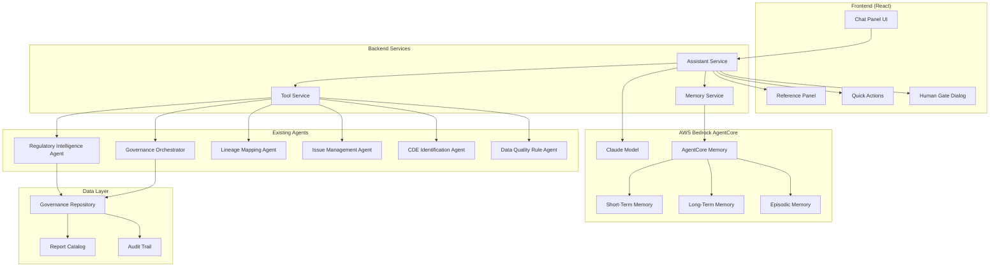

# Design Document: Regulatory AI Assistant

## Overview

The Regulatory AI Assistant is a conversational chatbot interface integrated into the Data Governance Portal that leverages the existing Regulatory Intelligence Agent and AWS Bedrock AgentCore Memory. It provides natural language interaction for regulatory compliance workflows, supporting queries about regulatory reports (CCAR, DFAST, FR Y-14, LCR, NSFR, etc.), data lineage, quality issues, and workflow automation with human-in-the-loop oversight.

The assistant uses a three-tier memory architecture:
- **Short-Term Memory**: Session-scoped conversation context
- **Long-Term Memory**: Persistent user preferences and learned knowledge
- **Episodic Memory**: Historical interaction records for audit trails

## Architecture



## Components and Interfaces

### 1. Chat Panel UI Component

The main conversational interface component.

```typescript
interface ChatPanelProps {
  sessionId: string;
  userId: string;
  tenantId: string;
  onToolCall?: (toolCall: ToolCallEvent) => void;
  onHumanGateRequired?: (action: HumanGateAction) => void;
}

interface Message {
  id: string;
  role: 'user' | 'assistant' | 'system';
  content: string;
  timestamp: Date;
  toolCalls?: ToolCall[];
  references?: Reference[];
  isStreaming?: boolean;
}

interface ToolCall {
  id: string;
  name: string;
  parameters: Record<string, unknown>;
  result?: unknown;
  status: 'pending' | 'executing' | 'completed' | 'failed';
  duration?: number;
}

interface Reference {
  type: 'report' | 'cde' | 'lineage' | 'issue' | 'audit';
  id: string;
  title: string;
  source: string;
  url?: string;
}
```

### 2. Memory Service

Manages the three-tier memory architecture using AWS Bedrock AgentCore Memory.

```typescript
interface MemoryService {
  // Short-term memory (session-scoped)
  getSessionContext(sessionId: string): Promise<SessionContext>;
  updateSessionContext(sessionId: string, messages: Message[]): Promise<void>;
  clearSession(sessionId: string): Promise<void>;
  
  // Long-term memory (user/tenant-scoped)
  getUserPreferences(userId: string, tenantId: string): Promise<UserPreferences>;
  updateUserPreferences(userId: string, tenantId: string, prefs: Partial<UserPreferences>): Promise<void>;
  getLearnedKnowledge(userId: string, tenantId: string): Promise<LearnedKnowledge[]>;
  storeLearnedKnowledge(userId: string, tenantId: string, knowledge: LearnedKnowledge): Promise<void>;
  
  // Episodic memory (historical interactions)
  recordEpisode(episode: Episode): Promise<void>;
  queryEpisodes(query: EpisodeQuery): Promise<Episode[]>;
  getDecisionHistory(userId: string, entityType: string, entityId: string): Promise<Decision[]>;
}

interface SessionContext {
  sessionId: string;
  messages: Message[];
  entities: Map<string, EntityReference>;  // For pronoun resolution
  lastActivity: Date;
  summary?: string;  // Summarized older context
}

interface UserPreferences {
  userId: string;
  tenantId: string;
  preferredReports: string[];
  notificationSettings: NotificationSettings;
  displayPreferences: DisplayPreferences;
}

interface Episode {
  id: string;
  sessionId: string;
  userId: string;
  tenantId: string;
  timestamp: Date;
  type: 'query' | 'decision' | 'recommendation' | 'action';
  content: string;
  context: Record<string, unknown>;
  outcome?: string;
  relatedEntities: EntityReference[];
}
```

### 3. Assistant Service

The core service that orchestrates AI interactions.

```typescript
interface AssistantService {
  // Main conversation method
  chat(request: ChatRequest): AsyncGenerator<ChatResponse>;
  
  // Tool execution
  executeTool(toolName: string, parameters: Record<string, unknown>, context: ExecutionContext): Promise<ToolResult>;
  
  // Human gate handling
  requestHumanApproval(action: HumanGateAction): Promise<HumanGateResult>;
  
  // Context management
  getConversationContext(sessionId: string): Promise<ConversationContext>;
  summarizeContext(messages: Message[]): Promise<string>;
}

interface ChatRequest {
  sessionId: string;
  userId: string;
  tenantId: string;
  message: string;
  pageContext?: PageContext;  // Current page for contextual suggestions
}

interface ChatResponse {
  type: 'text' | 'tool_start' | 'tool_result' | 'reference' | 'quick_action' | 'human_gate' | 'error';
  content: string | ToolCall | Reference | QuickAction | HumanGateAction;
  isComplete: boolean;
}

interface ExecutionContext {
  userId: string;
  tenantId: string;
  sessionId: string;
  accessToken: string;
  permissions: string[];
}
```

### 4. Tool Service

Bridges the assistant to existing agent tools.

```typescript
interface ToolService {
  // Regulatory Intelligence tools
  scanRegulatorySources(jurisdictions: string[]): Promise<ScanResult[]>;
  detectChanges(since: Date): Promise<RegulatoryChange[]>;
  getReportCatalog(): Promise<ReportCatalog>;
  approveCatalog(approver: string, rationale: string): Promise<ReportCatalog>;
  
  // Governance Orchestrator tools
  startReportCycle(reportId: string, period: string): Promise<Cycle>;
  getCycleStatus(cycleId: string): Promise<CycleStatus>;
  triggerAgent(cycleId: string, agentName: string): Promise<AgentResult>;
  createHumanTask(task: HumanTaskRequest): Promise<HumanTask>;
  completeHumanTask(taskId: string, decision: string, rationale: string): Promise<HumanTask>;
  
  // Lineage tools
  getLineageForReport(reportId: string): Promise<LineageGraph>;
  getLineageForCDE(cdeId: string): Promise<LineageGraph>;
  traceImpact(nodeId: string, direction: 'upstream' | 'downstream'): Promise<ImpactAnalysis>;
  
  // Issue tools
  getIssuesForReport(reportId: string, status?: string): Promise<Issue[]>;
  getIssuesForCDE(cdeId: string): Promise<Issue[]>;
  getIssueTrends(reportId: string, period: string): Promise<IssueTrends>;
  
  // CDE tools
  getCDEDetails(cdeId: string): Promise<CDE>;
  getCDEsForReport(reportId: string): Promise<CDE[]>;
  getCDEQualityScore(cdeId: string): Promise<QualityScore>;
}
```

### 5. Human Gate Component

UI component for critical action confirmations.

```typescript
interface HumanGateAction {
  id: string;
  type: 'approval' | 'sign_off' | 'mapping_change' | 'ownership_change';
  title: string;
  description: string;
  impact: string;
  requiredRole: string;
  entityType: string;
  entityId: string;
  proposedChanges?: Record<string, unknown>;
  aiRationale: string;
}

interface HumanGateResult {
  actionId: string;
  decision: 'approved' | 'rejected' | 'deferred';
  rationale: string;
  decidedBy: string;
  decidedAt: Date;
}
```

## Data Models

### Regulatory Knowledge Base

```typescript
interface RegulatoryReport {
  id: string;
  name: string;
  regulator: string;
  jurisdiction: 'US' | 'CA';
  description: string;
  purpose: string;
  regulatoryBasis: string;
  frequency: 'daily' | 'weekly' | 'monthly' | 'quarterly' | 'annual' | 'biennial';
  dueDate: DueDateRule;
  submissionFormat: string;
  submissionPlatform: string;
  dataElements: string[];
  lastUpdated: Date;
}

// Pre-populated regulatory reports
const US_FEDERAL_RESERVE_REPORTS = [
  { id: 'ccar', name: 'CCAR - Comprehensive Capital Analysis & Review', regulator: 'FRB', ... },
  { id: 'dfast', name: 'DFAST - Dodd-Frank Act Stress Test', regulator: 'FRB/OCC', ... },
  { id: 'fr-y-14a', name: 'FR Y-14A - Capital Assessments (Annual)', regulator: 'FRB', ... },
  { id: 'fr-y-14q', name: 'FR Y-14Q - Capital Assessments (Quarterly)', regulator: 'FRB', ... },
  { id: 'fr-y-14m', name: 'FR Y-14M - Capital Assessments (Monthly)', regulator: 'FRB', ... },
  { id: 'fr-y-9c', name: 'FR Y-9C - Consolidated Financial Statements', regulator: 'FRB', ... },
  { id: 'fr-y-15', name: 'FR Y-15 - Systemic Risk Report', regulator: 'FRB', ... },
  { id: 'fr-2052a', name: 'FR 2052a - Complex Institution Liquidity Monitoring', regulator: 'FRB', ... },
  { id: 'lcr', name: 'Liquidity Coverage Ratio', regulator: 'FRB/OCC/FDIC', ... },
  { id: 'nsfr', name: 'Net Stable Funding Ratio', regulator: 'FRB/OCC/FDIC', ... },
  { id: 'living-will', name: 'Resolution Plan (Living Will)', regulator: 'FRB/FDIC', ... },
];

const US_OCC_FDIC_REPORTS = [
  { id: 'call-report', name: 'Call Report (FFIEC 031/041)', regulator: 'OCC/FDIC/FRB', ... },
  { id: 'part-370', name: 'FDIC Part 370 Certification', regulator: 'FDIC', ... },
];

const US_AML_REPORTS = [
  { id: 'ctr', name: 'Currency Transaction Report', regulator: 'FinCEN', ... },
  { id: 'sar', name: 'Suspicious Activity Report', regulator: 'FinCEN', ... },
  { id: 'ofac', name: 'OFAC Blocking Reports', regulator: 'Treasury/OFAC', ... },
];

const CANADIAN_OSFI_REPORTS = [
  { id: 'bcar', name: 'Basel Capital Adequacy Reporting (BCAR)', regulator: 'OSFI', ... },
  { id: 'lrr', name: 'Leverage Requirements Return (LRR)', regulator: 'OSFI', ... },
  { id: 'osfi-lcr', name: 'LCR Return - Return LA', regulator: 'OSFI', ... },
  { id: 'osfi-nsfr', name: 'NSFR Return - Return DT1', regulator: 'OSFI', ... },
  { id: 'icaap', name: 'Internal Capital Adequacy Assessment Process', regulator: 'OSFI', ... },
];

const CANADIAN_FINTRAC_REPORTS = [
  { id: 'lctr', name: 'Large Cash Transaction Report', regulator: 'FINTRAC', ... },
  { id: 'eftr', name: 'Electronic Funds Transfer Report', regulator: 'FINTRAC', ... },
  { id: 'str', name: 'Suspicious Transaction Report', regulator: 'FINTRAC', ... },
  { id: 'tpr', name: 'Terrorist Property Report', regulator: 'FINTRAC', ... },
];
```

### Memory Data Models

```typescript
interface AgentCoreMemoryConfig {
  memoryId: string;
  sessionId: string;
  actorId: string;
  region: string;
}

interface MemoryEntry {
  id: string;
  memoryType: 'short_term' | 'long_term' | 'episodic';
  scope: MemoryScope;
  content: unknown;
  metadata: MemoryMetadata;
  createdAt: Date;
  expiresAt?: Date;
}

interface MemoryScope {
  tenantId: string;
  userId?: string;
  sessionId?: string;
}

interface MemoryMetadata {
  source: string;
  confidence: number;
  relatedEntities: string[];
  tags: string[];
}
```

## Correctness Properties

### Property 1: Memory Isolation (Requirements 3.5, 10.5)

**Invariant**: Memory data is strictly isolated by tenant and user scope.

```typescript
// Property: Memory queries never return data from other tenants
forAll(memoryQuery: MemoryQuery, result: MemoryEntry[]) {
  result.every(entry => entry.scope.tenantId === memoryQuery.tenantId)
}

// Property: Long-term memory is user-scoped within tenant
forAll(ltmQuery: LongTermMemoryQuery, result: MemoryEntry[]) {
  result.every(entry => 
    entry.scope.tenantId === ltmQuery.tenantId &&
    entry.scope.userId === ltmQuery.userId
  )
}
```

### Property 2: Human Gate Enforcement (Requirements 9.1, 9.5)

**Invariant**: Critical actions require explicit human confirmation before execution.

```typescript
// Property: Critical actions are never executed without human approval
forAll(action: Action) {
  isCriticalAction(action) implies (
    exists(humanGateResult: HumanGateResult) {
      humanGateResult.actionId === action.id &&
      humanGateResult.decision === 'approved' &&
      humanGateResult.decidedAt < action.executedAt
    }
  )
}

// Critical action types
const CRITICAL_ACTIONS = [
  'approve_catalog',
  'complete_human_task',
  'ownership_change',
  'source_mapping_change',
  'control_effectiveness_signoff'
];
```

### Property 3: Tool Execution Transparency (Requirements 11.1, 11.2, 11.3)

**Invariant**: All tool executions are visible to the user with parameters and results.

```typescript
// Property: Every tool execution is logged and displayed
forAll(toolExecution: ToolExecution) {
  exists(toolCallDisplay: ToolCallDisplay) {
    toolCallDisplay.toolName === toolExecution.toolName &&
    toolCallDisplay.parameters === toolExecution.parameters &&
    toolCallDisplay.status in ['pending', 'executing', 'completed', 'failed']
  }
}
```

### Property 4: Access Control Enforcement (Requirements 10.1, 10.2, 10.4)

**Invariant**: Data access respects user permissions and role-based access control.

```typescript
// Property: Query results are filtered by user permissions
forAll(query: DataQuery, user: User, result: QueryResult) {
  result.data.every(item => 
    userHasPermission(user, item.requiredPermission) &&
    item.tenantId === user.tenantId
  )
}

// Property: Unauthorized access attempts are logged without data exposure
forAll(unauthorizedQuery: Query) {
  !userHasPermission(query.user, query.requiredPermission) implies (
    query.result.data.length === 0 &&
    exists(auditEntry: AuditEntry) {
      auditEntry.action === 'unauthorized_access_attempt'
    }
  )
}
```

### Property 5: Conversation Context Consistency (Requirements 2.1, 2.3, 13.1)

**Invariant**: Conversation context is maintained consistently within a session.

```typescript
// Property: Follow-up questions resolve correctly using session context
forAll(session: Session, followUpQuery: Query) {
  containsPronounReference(followUpQuery) implies (
    resolvedEntity(followUpQuery) in session.entities
  )
}

// Property: Session restoration preserves message order
forAll(session: Session, restoredSession: Session) {
  session.id === restoredSession.id implies (
    session.messages.map(m => m.id) === restoredSession.messages.map(m => m.id)
  )
}
```

### Property 6: Episodic Memory Audit Completeness (Requirements 4.2, 4.5)

**Invariant**: All critical decisions are recorded in episodic memory with full attribution.

```typescript
// Property: Critical decisions have complete audit trail
forAll(decision: Decision) {
  isCriticalDecision(decision) implies (
    exists(episode: Episode) {
      episode.type === 'decision' &&
      episode.userId !== undefined &&
      episode.timestamp !== undefined &&
      episode.context.rationale !== undefined
    }
  )
}
```

## Error Handling

### Error Categories and Responses

```typescript
enum ErrorCategory {
  AI_SERVICE_UNAVAILABLE = 'AI_SERVICE_UNAVAILABLE',
  TOOL_EXECUTION_FAILED = 'TOOL_EXECUTION_FAILED',
  MEMORY_RETRIEVAL_FAILED = 'MEMORY_RETRIEVAL_FAILED',
  AUTHENTICATION_FAILED = 'AUTHENTICATION_FAILED',
  AUTHORIZATION_DENIED = 'AUTHORIZATION_DENIED',
  RATE_LIMIT_EXCEEDED = 'RATE_LIMIT_EXCEEDED',
  INVALID_INPUT = 'INVALID_INPUT',
  TIMEOUT = 'TIMEOUT'
}

interface ErrorResponse {
  category: ErrorCategory;
  userMessage: string;  // User-friendly message
  technicalDetails?: string;  // For logging only, not shown to user
  retryable: boolean;
  suggestedActions: string[];
}

const ERROR_HANDLERS: Record<ErrorCategory, ErrorResponse> = {
  [ErrorCategory.AI_SERVICE_UNAVAILABLE]: {
    category: ErrorCategory.AI_SERVICE_UNAVAILABLE,
    userMessage: "I'm having trouble connecting to my AI service. Please try again in a moment.",
    retryable: true,
    suggestedActions: ['Retry', 'Start new conversation']
  },
  [ErrorCategory.TOOL_EXECUTION_FAILED]: {
    category: ErrorCategory.TOOL_EXECUTION_FAILED,
    userMessage: "I couldn't complete that action. Let me try a different approach.",
    retryable: true,
    suggestedActions: ['Retry', 'Ask differently', 'Manual action']
  },
  [ErrorCategory.MEMORY_RETRIEVAL_FAILED]: {
    category: ErrorCategory.MEMORY_RETRIEVAL_FAILED,
    userMessage: "I'm having trouble accessing our conversation history, but I can still help with your current question.",
    retryable: false,
    suggestedActions: ['Continue without history', 'Start new conversation']
  },
  [ErrorCategory.AUTHENTICATION_FAILED]: {
    category: ErrorCategory.AUTHENTICATION_FAILED,
    userMessage: "Your session has expired. Please sign in again.",
    retryable: false,
    suggestedActions: ['Sign in']
  },
  [ErrorCategory.AUTHORIZATION_DENIED]: {
    category: ErrorCategory.AUTHORIZATION_DENIED,
    userMessage: "You don't have permission to access that information. Please contact your administrator if you need access.",
    retryable: false,
    suggestedActions: ['Request access', 'Ask about something else']
  },
  [ErrorCategory.RATE_LIMIT_EXCEEDED]: {
    category: ErrorCategory.RATE_LIMIT_EXCEEDED,
    userMessage: "You've sent too many messages. Please wait a moment before trying again.",
    retryable: true,
    suggestedActions: ['Wait and retry']
  },
  [ErrorCategory.INVALID_INPUT]: {
    category: ErrorCategory.INVALID_INPUT,
    userMessage: "I didn't understand that. Could you rephrase your question?",
    retryable: false,
    suggestedActions: ['Rephrase', 'Use quick actions']
  },
  [ErrorCategory.TIMEOUT]: {
    category: ErrorCategory.TIMEOUT,
    userMessage: "That request took too long. Let me try a simpler approach.",
    retryable: true,
    suggestedActions: ['Retry', 'Simplify question']
  }
};
```

### Retry Strategy

```typescript
interface RetryConfig {
  maxAttempts: number;
  baseDelayMs: number;
  maxDelayMs: number;
  backoffMultiplier: number;
}

const DEFAULT_RETRY_CONFIG: RetryConfig = {
  maxAttempts: 3,
  baseDelayMs: 1000,
  maxDelayMs: 10000,
  backoffMultiplier: 2
};

async function withRetry<T>(
  operation: () => Promise<T>,
  config: RetryConfig = DEFAULT_RETRY_CONFIG
): Promise<T> {
  let lastError: Error;
  let delay = config.baseDelayMs;
  
  for (let attempt = 1; attempt <= config.maxAttempts; attempt++) {
    try {
      return await operation();
    } catch (error) {
      lastError = error as Error;
      if (attempt < config.maxAttempts) {
        await sleep(delay);
        delay = Math.min(delay * config.backoffMultiplier, config.maxDelayMs);
      }
    }
  }
  
  throw lastError!;
}
```

### Graceful Degradation

```typescript
interface DegradationStrategy {
  condition: () => boolean;
  fallback: () => Promise<unknown>;
  notification: string;
}

const DEGRADATION_STRATEGIES: DegradationStrategy[] = [
  {
    // Memory service unavailable - continue with in-memory context
    condition: () => !memoryServiceAvailable(),
    fallback: async () => useLocalSessionStorage(),
    notification: "Using local storage for this session. Some features may be limited."
  },
  {
    // Long-term memory unavailable - continue without personalization
    condition: () => !longTermMemoryAvailable(),
    fallback: async () => useDefaultPreferences(),
    notification: "Personalization temporarily unavailable."
  },
  {
    // Tool service partially available - disable affected tools
    condition: () => !allToolsAvailable(),
    fallback: async () => disableUnavailableTools(),
    notification: "Some actions are temporarily unavailable."
  }
];
```

## Testing Strategy

### Unit Tests

```typescript
// Memory Service Tests
describe('MemoryService', () => {
  describe('Short-Term Memory', () => {
    it('should store and retrieve session context', async () => {
      const sessionId = 'test-session';
      const messages = [createTestMessage()];
      
      await memoryService.updateSessionContext(sessionId, messages);
      const context = await memoryService.getSessionContext(sessionId);
      
      expect(context.messages).toEqual(messages);
    });
    
    it('should clear session on explicit request', async () => {
      const sessionId = 'test-session';
      await memoryService.updateSessionContext(sessionId, [createTestMessage()]);
      await memoryService.clearSession(sessionId);
      
      const context = await memoryService.getSessionContext(sessionId);
      expect(context.messages).toHaveLength(0);
    });
    
    it('should summarize context when exceeding limit', async () => {
      const sessionId = 'test-session';
      const messages = createTestMessages(60); // Exceeds 50 message limit
      
      await memoryService.updateSessionContext(sessionId, messages);
      const context = await memoryService.getSessionContext(sessionId);
      
      expect(context.summary).toBeDefined();
      expect(context.messages.length).toBeLessThanOrEqual(50);
    });
  });
  
  describe('Long-Term Memory', () => {
    it('should persist user preferences across sessions', async () => {
      const userId = 'test-user';
      const tenantId = 'test-tenant';
      const prefs = { preferredReports: ['ccar', 'dfast'] };
      
      await memoryService.updateUserPreferences(userId, tenantId, prefs);
      const retrieved = await memoryService.getUserPreferences(userId, tenantId);
      
      expect(retrieved.preferredReports).toEqual(prefs.preferredReports);
    });
    
    it('should isolate preferences by tenant', async () => {
      const userId = 'test-user';
      await memoryService.updateUserPreferences(userId, 'tenant-a', { preferredReports: ['ccar'] });
      await memoryService.updateUserPreferences(userId, 'tenant-b', { preferredReports: ['dfast'] });
      
      const prefsA = await memoryService.getUserPreferences(userId, 'tenant-a');
      const prefsB = await memoryService.getUserPreferences(userId, 'tenant-b');
      
      expect(prefsA.preferredReports).not.toEqual(prefsB.preferredReports);
    });
  });
  
  describe('Episodic Memory', () => {
    it('should record and query episodes by date range', async () => {
      const episode = createTestEpisode({ timestamp: new Date('2024-01-15') });
      await memoryService.recordEpisode(episode);
      
      const results = await memoryService.queryEpisodes({
        userId: episode.userId,
        tenantId: episode.tenantId,
        startDate: new Date('2024-01-01'),
        endDate: new Date('2024-01-31')
      });
      
      expect(results).toContainEqual(expect.objectContaining({ id: episode.id }));
    });
  });
});

// Assistant Service Tests
describe('AssistantService', () => {
  describe('Tool Execution', () => {
    it('should execute regulatory tools with correct parameters', async () => {
      const result = await assistantService.executeTool(
        'get_report_catalog',
        {},
        createTestContext()
      );
      
      expect(result.status).toBe('completed');
      expect(result.data).toHaveProperty('reports');
    });
    
    it('should enforce access control on tool execution', async () => {
      const context = createTestContext({ permissions: [] });
      
      await expect(
        assistantService.executeTool('approve_catalog', { approver: 'test' }, context)
      ).rejects.toThrow('Authorization denied');
    });
  });
  
  describe('Human Gate', () => {
    it('should require approval for critical actions', async () => {
      const action = createCriticalAction('approve_catalog');
      const result = await assistantService.requestHumanApproval(action);
      
      expect(result.decision).toBeUndefined(); // Pending approval
      expect(result.actionId).toBe(action.id);
    });
  });
});
```

### Integration Tests

```typescript
describe('AI Assistant Integration', () => {
  describe('End-to-End Conversation Flow', () => {
    it('should handle multi-turn conversation with context', async () => {
      const session = await createTestSession();
      
      // First message
      const response1 = await sendMessage(session.id, 'What is FR Y-14M?');
      expect(response1.content).toContain('FR Y-14M');
      
      // Follow-up with pronoun
      const response2 = await sendMessage(session.id, 'What are its data elements?');
      expect(response2.content).toContain('data element');
      expect(response2.references).toContainEqual(
        expect.objectContaining({ type: 'report', id: 'fr-y-14m' })
      );
    });
    
    it('should execute tools and display results', async () => {
      const session = await createTestSession();
      
      const response = await sendMessage(session.id, 'Show me the report catalog');
      
      expect(response.toolCalls).toContainEqual(
        expect.objectContaining({ name: 'get_report_catalog', status: 'completed' })
      );
    });
    
    it('should trigger human gate for critical actions', async () => {
      const session = await createTestSession();
      
      const response = await sendMessage(session.id, 'Approve the report catalog');
      
      expect(response.type).toBe('human_gate');
      expect(response.content).toHaveProperty('type', 'approval');
    });
  });
  
  describe('Memory Persistence', () => {
    it('should restore conversation after browser refresh', async () => {
      const session = await createTestSession();
      await sendMessage(session.id, 'Tell me about CCAR');
      
      // Simulate browser refresh
      const restoredSession = await restoreSession(session.id);
      
      expect(restoredSession.messages).toHaveLength(2); // User + Assistant
      expect(restoredSession.messages[0].content).toContain('CCAR');
    });
    
    it('should recall episodic memory from previous sessions', async () => {
      const userId = 'test-user';
      const tenantId = 'test-tenant';
      
      // Previous session
      const session1 = await createTestSession({ userId, tenantId });
      await sendMessage(session1.id, 'What is the LCR filing deadline?');
      
      // New session
      const session2 = await createTestSession({ userId, tenantId });
      const response = await sendMessage(
        session2.id, 
        'What did we discuss about LCR last time?'
      );
      
      expect(response.content).toContain('filing deadline');
    });
  });
});
```

### Property-Based Tests

```typescript
import * as fc from 'fast-check';

describe('Memory Isolation Property Tests', () => {
  it('should never leak data across tenants', () => {
    fc.assert(
      fc.asyncProperty(
        fc.record({
          tenantId: fc.string({ minLength: 1 }),
          userId: fc.string({ minLength: 1 }),
          data: fc.string()
        }),
        fc.string({ minLength: 1 }), // Other tenant ID
        async (entry, otherTenantId) => {
          fc.pre(entry.tenantId !== otherTenantId);
          
          await memoryService.storeLearnedKnowledge(
            entry.userId,
            entry.tenantId,
            { content: entry.data }
          );
          
          const otherTenantResults = await memoryService.getLearnedKnowledge(
            entry.userId,
            otherTenantId
          );
          
          return !otherTenantResults.some(r => r.content === entry.data);
        }
      )
    );
  });
  
  it('should maintain message order in session context', () => {
    fc.assert(
      fc.asyncProperty(
        fc.array(fc.record({
          role: fc.constantFrom('user', 'assistant'),
          content: fc.string()
        }), { minLength: 1, maxLength: 20 }),
        async (messages) => {
          const sessionId = `test-${Date.now()}`;
          const messagesWithIds = messages.map((m, i) => ({
            ...m,
            id: `msg-${i}`,
            timestamp: new Date(Date.now() + i * 1000)
          }));
          
          await memoryService.updateSessionContext(sessionId, messagesWithIds);
          const context = await memoryService.getSessionContext(sessionId);
          
          // Verify order is preserved
          for (let i = 0; i < context.messages.length - 1; i++) {
            if (context.messages[i].timestamp >= context.messages[i + 1].timestamp) {
              return false;
            }
          }
          return true;
        }
      )
    );
  });
});

describe('Human Gate Enforcement Property Tests', () => {
  it('should always require approval for critical actions', () => {
    fc.assert(
      fc.asyncProperty(
        fc.constantFrom(...CRITICAL_ACTIONS),
        fc.record({
          userId: fc.string({ minLength: 1 }),
          tenantId: fc.string({ minLength: 1 })
        }),
        async (actionType, context) => {
          const action = createAction(actionType, context);
          
          // Attempt to execute without approval
          try {
            await assistantService.executeTool(actionType, action.parameters, context);
            return false; // Should have thrown
          } catch (error) {
            return error.message.includes('approval required');
          }
        }
      )
    );
  });
});
```

### Performance Tests

```typescript
describe('Performance Tests', () => {
  it('should respond within 3 seconds for simple queries', async () => {
    const session = await createTestSession();
    
    const start = Date.now();
    await sendMessage(session.id, 'What is CCAR?');
    const duration = Date.now() - start;
    
    expect(duration).toBeLessThan(3000);
  });
  
  it('should handle concurrent sessions without degradation', async () => {
    const sessions = await Promise.all(
      Array(10).fill(null).map(() => createTestSession())
    );
    
    const start = Date.now();
    await Promise.all(
      sessions.map(s => sendMessage(s.id, 'What is the report catalog?'))
    );
    const duration = Date.now() - start;
    
    // Should complete all 10 in under 10 seconds (allowing for some parallelism)
    expect(duration).toBeLessThan(10000);
  });
  
  it('should efficiently retrieve episodic memory', async () => {
    const userId = 'perf-test-user';
    const tenantId = 'perf-test-tenant';
    
    // Create 100 episodes
    await Promise.all(
      Array(100).fill(null).map((_, i) => 
        memoryService.recordEpisode(createTestEpisode({
          userId,
          tenantId,
          timestamp: new Date(Date.now() - i * 86400000) // One per day
        }))
      )
    );
    
    const start = Date.now();
    await memoryService.queryEpisodes({
      userId,
      tenantId,
      startDate: new Date(Date.now() - 30 * 86400000),
      endDate: new Date()
    });
    const duration = Date.now() - start;
    
    expect(duration).toBeLessThan(500); // Should be fast even with many episodes
  });
})
```
