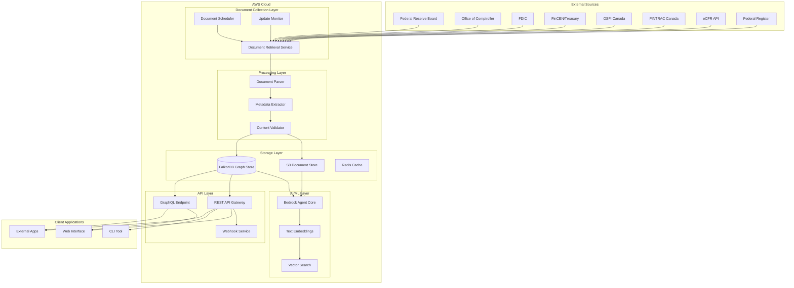

# Design Document: Regulatory Knowledge Base

## Overview

The Regulatory Knowledge Base is a comprehensive graph-based system that automatically collects, processes, and stores regulatory guidance documents for major U.S. and Canadian banks. The system leverages AWS Bedrock Agent Core for intelligent document processing and natural language querying, combined with FalkorDB as the underlying graph database for storing complex relationships between regulatory documents, requirements, and guidance.

The architecture follows a microservices pattern with distinct components for document retrieval, processing, storage, and querying. The system is designed to handle the complexity of regulatory relationships while providing fast, accurate access to regulatory information through both programmatic APIs and natural language interfaces.

## Architecture

### High-Level Architecture



### Component Architecture

The system is organized into six primary layers:

1. **Document Collection Layer**: Handles automated retrieval and monitoring of regulatory documents
2. **Processing Layer**: Parses, extracts metadata, and validates document content
3. **Storage Layer**: Manages document storage and graph relationships
4. **AI/ML Layer**: Provides intelligent querying and content understanding
5. **API Layer**: Exposes system functionality through various interfaces
6. **Client Layer**: User-facing applications and integrations

## Components and Interfaces

### Document Collection Layer

#### Document Scheduler
- **Purpose**: Orchestrates document collection based on regulatory update cycles
- **Key Features**:
  - Configurable schedules for different document types (quarterly Call Reports, annual CCAR instructions)
  - Priority-based queuing for critical regulatory updates
  - Retry logic with exponential backoff
- **Interfaces**:
  - Input: Schedule configurations, manual trigger requests
  - Output: Document retrieval tasks to queue

#### Document Retrieval Service
- **Purpose**: Downloads documents from official regulatory sources
- **Key Features**:
  - Multi-protocol support (HTTP/HTTPS, FTP, API calls)
  - Source-specific adapters for each regulator
  - Checksum validation and version detection
  - Rate limiting and respectful crawling
- **Technology**: Python with aiohttp for async operations
- **Interfaces**:
  - Input: Document URLs, retrieval parameters
  - Output: Raw document files to S3, metadata to processing queue

#### Update Monitor
- **Purpose**: Detects changes in regulatory documents
- **Key Features**:
  - Last-modified date tracking
  - Content hash comparison
  - RSS/Atom feed monitoring where available
  - Alert generation for critical updates
- **Interfaces**:
  - Input: Document URLs, monitoring schedules
  - Output: Change notifications, updated document tasks

### Processing Layer

#### Document Parser
- **Purpose**: Extracts structured text from various document formats
- **Key Features**:
  - PDF text extraction with layout preservation
  - HTML content extraction with navigation removal
  - CFR section parsing with regulatory structure preservation
  - Table and form field extraction
- **Technology**: Python with PyPDF2, BeautifulSoup4, and custom CFR parsers
- **Interfaces**:
  - Input: Raw document files from S3
  - Output: Structured text, extracted tables, parsing metadata

#### Metadata Extractor
- **Purpose**: Identifies and extracts regulatory metadata from documents
- **Key Features**:
  - Regex-based extraction for form numbers, dates, citations
  - NLP-based extraction for deadlines and requirements
  - Regulatory taxonomy classification
  - Cross-reference identification
- **Technology**: Python with spaCy NLP and custom regulatory patterns
- **Interfaces**:
  - Input: Parsed document text
  - Output: Structured metadata JSON

#### Content Validator
- **Purpose**: Ensures document completeness and accuracy
- **Key Features**:
  - Regulatory keyword validation
  - Structure completeness checks
  - Cross-reference validation
  - Quality scoring and flagging
- **Interfaces**:
  - Input: Parsed text and metadata
  - Output: Validation results, quality scores

### Storage Layer

#### S3 Document Store
- **Purpose**: Stores original documents and processed content
- **Organization**:
  ```
  regulatory-docs/
  ├── raw/
  │   ├── us/frb/
  │   ├── us/occ/
  │   ├── us/fdic/
  │   ├── us/fincen/
  │   ├── ca/osfi/
  │   └── ca/fintrac/
  ├── processed/
  │   ├── text/
  │   ├── metadata/
  │   └── tables/
  └── versions/
      └── [document-id]/
  ```

#### FalkorDB Graph Store
- **Purpose**: Stores documents and their relationships as a graph
- **Graph Schema**:
  ```cypher
  // Node Types
  (:Document {id, title, type, regulator, date, version})
  (:Regulator {name, country, type})
  (:Requirement {id, description, deadline, frequency})
  (:Form {number, name, type})
  (:Section {cfr_section, title, content})
  
  // Relationship Types
  (:Document)-[:ISSUED_BY]->(:Regulator)
  (:Document)-[:IMPLEMENTS]->(:Requirement)
  (:Document)-[:REFERENCES]->(:Document)
  (:Form)-[:DESCRIBED_IN]->(:Document)
  (:Section)-[:PART_OF]->(:Document)
  (:Requirement)-[:SUPERSEDES]->(:Requirement)
  ```
- **Technology**: FalkorDB (Redis-based graph database with GraphBLAS)
- **Key Features**:
  - OpenCypher query language support
  - Sparse matrix representation for efficient traversals
  - Vector similarity search integration
  - Real-time graph updates

#### Redis Cache
- **Purpose**: Caches frequently accessed data and query results
- **Key Features**:
  - Document metadata caching
  - Query result caching with TTL
  - Session state management
  - Rate limiting counters

### AI/ML Layer

#### Bedrock Agent Core
- **Purpose**: Provides intelligent document understanding and querying
- **Key Features**:
  - Multi-turn conversation support
  - Context-aware regulatory knowledge
  - Tool integration for graph queries
  - Session isolation and security
- **Configuration**:
  - Runtime: Serverless with 8-hour session support
  - Memory: Persistent across interactions
  - Tools: Custom graph query tools, document retrieval tools
- **Interfaces**:
  - Input: Natural language queries, conversation context
  - Output: Structured responses with citations

#### Text Embeddings
- **Purpose**: Generates vector representations of document content
- **Technology**: Amazon Bedrock Titan Embeddings
- **Key Features**:
  - Regulatory domain-specific embeddings
  - Chunk-based processing for large documents
  - Semantic similarity search
- **Interfaces**:
  - Input: Document text chunks
  - Output: Vector embeddings

#### Vector Search
- **Purpose**: Enables semantic search across document corpus
- **Technology**: FalkorDB vector similarity search
- **Key Features**:
  - Cosine similarity and Euclidean distance
  - Hybrid search (vector + keyword)
  - Real-time index updates
- **Interfaces**:
  - Input: Query vectors, similarity thresholds
  - Output: Ranked document chunks with scores

### API Layer

#### REST API Gateway
- **Purpose**: Provides RESTful access to system functionality
- **Endpoints**:
  ```
  GET /api/v1/documents
  GET /api/v1/documents/{id}
  GET /api/v1/regulators/{regulator}/documents
  GET /api/v1/search?q={query}&type={type}
  POST /api/v1/query/natural-language
  GET /api/v1/relationships/{document-id}
  ```
- **Technology**: AWS API Gateway with Lambda integration
- **Features**:
  - Authentication and authorization
  - Rate limiting
  - Request/response validation
  - Audit logging

#### GraphQL Endpoint
- **Purpose**: Enables complex relationship queries
- **Schema**:
  ```graphql
  type Document {
    id: ID!
    title: String!
    regulator: Regulator!
    requirements: [Requirement!]!
    references: [Document!]!
    sections: [Section!]!
  }
  
  type Query {
    document(id: ID!): Document
    searchDocuments(query: String!, filters: DocumentFilters): [Document!]!
    regulatoryPath(from: ID!, to: ID!): [Document!]!
  }
  ```

#### Webhook Service
- **Purpose**: Notifies external systems of document updates
- **Features**:
  - Configurable event subscriptions
  - Retry logic with dead letter queues
  - Payload signing for security
- **Events**:
  - Document added/updated
  - Regulatory deadline approaching
  - System health alerts

## Data Models

### Document Model
```json
{
  "id": "us_frb_fry14a_2024",
  "title": "Instructions for FR Y-14A Capital Assessments",
  "type": "instruction_manual",
  "regulator": {
    "name": "Federal Reserve Board",
    "country": "US",
    "type": "prudential"
  },
  "metadata": {
    "form_number": "FR Y-14A",
    "omb_control": "7100-0341",
    "effective_date": "2024-01-01",
    "filing_frequency": "annual",
    "filing_deadline": "April 5",
    "version": "2024.1"
  },
  "content": {
    "text": "...",
    "sections": [...],
    "tables": [...],
    "embeddings": [...]
  },
  "relationships": {
    "implements": ["ccar_requirement_2024"],
    "references": ["12_cfr_252", "basel_iii_capital"],
    "supersedes": ["us_frb_fry14a_2023"]
  }
}
```

### Regulatory Requirement Model
```json
{
  "id": "ccar_capital_plan_2024",
  "description": "Annual capital plan submission under CCAR",
  "regulator": "Federal Reserve Board",
  "applicable_institutions": ["large_bhc", "ibo"],
  "deadline": {
    "frequency": "annual",
    "due_date": "April 5",
    "submission_window": "January 1 - April 5"
  },
  "implementing_documents": [
    "us_frb_fry14a_2024",
    "12_cfr_252_subpart_f"
  ],
  "related_requirements": [
    "dfast_stress_test",
    "resolution_plan_living_will"
  ]
}
```

### Graph Relationship Model
```json
{
  "source_node": "us_frb_fry14a_2024",
  "target_node": "12_cfr_252",
  "relationship_type": "IMPLEMENTS",
  "properties": {
    "section": "252.44",
    "description": "Capital plan requirements",
    "strength": 0.95
  },
  "created_at": "2024-01-15T10:30:00Z",
  "validated": true
}
```

## Correctness Properties

*A property is a characteristic or behavior that should hold true across all valid executions of a system—essentially, a formal statement about what the system should do. Properties serve as the bridge between human-readable specifications and machine-verifiable correctness guarantees.*

<function_calls>
<invoke name="prework">
<parameter name="featureName">regulatory-knowledge-base

Based on the prework analysis, I can see that all acceptance criteria are testable as properties. After reviewing for redundancy, I can consolidate some related properties while maintaining comprehensive coverage.

### Property Reflection

After reviewing all properties identified in the prework, several can be consolidated:
- Document retrieval properties (1.1-6.6) can be grouped by regulator while maintaining source-specific validation
- Parsing properties (7.1-7.7) can be consolidated by document type while preserving format-specific requirements
- Metadata extraction properties (8.1-8.8) can be grouped by regulator while maintaining field-specific validation
- Graph storage properties (9.1-9.8) can be consolidated around relationship creation and maintenance
- Bedrock agent properties (10.1-10.7) can be grouped around query accuracy and context management

### Document Retrieval Properties

Property 1: Regulator-specific document retrieval
*For any* document retrieval request, the system should download documents from the correct regulatory source based on document type and regulator
**Validates: Requirements 1.1-6.6**

Property 2: Multi-document retrieval completeness
*For any* complex regulatory topic (like resolution planning), the system should retrieve all related documents from multiple sources as specified
**Validates: Requirements 1.7, 2.3, 3.2**

Property 3: Retry and error handling consistency
*For any* failed document download, the system should log the error and retry up to 3 times with exponential backoff
**Validates: Requirements 6.6**

### Document Processing Properties

Property 4: Format-specific parsing preservation
*For any* document format (PDF, HTML, CFR), the parser should preserve the document's regulatory structure and key elements
**Validates: Requirements 7.1-7.5**

Property 5: Parsing error handling and validation
*For any* document that fails parsing or lacks expected regulatory content, the system should log errors and flag for manual review
**Validates: Requirements 7.6, 7.7**

### Metadata Extraction Properties

Property 6: Regulator-specific metadata extraction
*For any* regulatory document, the metadata extractor should identify and extract the regulatory elements specific to that regulator and document type
**Validates: Requirements 8.1-8.6, 8.8**

Property 7: Document categorization consistency
*For any* processed document, the system should assign appropriate category tags based on regulatory content
**Validates: Requirements 8.7**

### Graph Storage Properties

Property 8: Regulatory relationship creation
*For any* stored regulatory document, the graph store should create appropriate relationships based on document type and regulatory connections
**Validates: Requirements 9.1-9.6**

Property 9: Graph data integrity and search
*For any* graph operation (search, update, relationship traversal), the system should maintain data integrity and provide accurate results
**Validates: Requirements 9.7, 9.8**

### AI Agent Properties

Property 10: Regulatory query accuracy
*For any* natural language query about regulatory requirements, the Bedrock agent should provide accurate information with proper source citations
**Validates: Requirements 10.1-10.5**

Property 11: Conversation context and uncertainty handling
*For any* multi-turn conversation or uncertain query, the Bedrock agent should maintain context and appropriately indicate uncertainty
**Validates: Requirements 10.6, 10.7**

### System Monitoring Properties

Property 12: Update monitoring and processing
*For any* regulatory document with update cycles, the system should monitor for changes and process updates according to the document's schedule
**Validates: Requirements 11.1-11.5**

Property 13: Reporting and alerting consistency
*For any* system monitoring period, the system should generate accurate reports and send alerts when critical thresholds are exceeded
**Validates: Requirements 11.6, 11.7**

### Data Quality Properties

Property 14: Document-specific validation
*For any* regulatory document type, the parser should validate that document-specific elements are properly extracted and complete
**Validates: Requirements 12.1-12.5**

Property 15: Quality control and integrity maintenance
*For any* document processing operation, the system should flag quality issues and maintain referential integrity
**Validates: Requirements 12.6, 12.7**

### API Properties

Property 16: API endpoint functionality and filtering
*For any* API request with regulatory filters (regulator, category, form type), the system should return correctly filtered and structured responses
**Validates: Requirements 13.1-13.4**

Property 17: API security and advanced features
*For any* API access, the system should enforce security controls and support advanced querying capabilities
**Validates: Requirements 13.5-13.7**

## Error Handling

### Document Retrieval Errors
- **Network failures**: Implement exponential backoff with jitter, maximum 3 retries
- **Source unavailable**: Log error, mark document as temporarily unavailable, schedule retry
- **Authentication failures**: Alert administrators, attempt credential refresh
- **Rate limiting**: Respect source rate limits, implement adaptive delays

### Processing Errors
- **Parse failures**: Log detailed error information, flag document for manual review
- **Metadata extraction failures**: Use fallback extraction methods, flag incomplete metadata
- **Validation failures**: Quarantine document, generate quality report
- **Graph storage failures**: Implement transaction rollback, maintain data consistency

### AI/ML Errors
- **Bedrock service errors**: Implement fallback responses, log service issues
- **Embedding generation failures**: Retry with different chunk sizes, flag problematic content
- **Vector search errors**: Fall back to keyword search, log performance issues
- **Context management errors**: Reset conversation state, preserve user session

### API Errors
- **Rate limit exceeded**: Return 429 status with retry-after header
- **Authentication failures**: Return 401 with clear error message
- **Malformed requests**: Return 400 with validation details
- **Internal errors**: Return 500, log detailed error information, alert operations team

## Testing Strategy

### Dual Testing Approach

The system requires both unit testing and property-based testing to ensure comprehensive coverage:

**Unit Tests**: Focus on specific examples, edge cases, and integration points
- Document parser tests with known regulatory documents
- Metadata extraction tests with sample documents from each regulator
- API endpoint tests with specific request/response pairs
- Error condition tests with simulated failures

**Property-Based Tests**: Verify universal properties across all inputs
- Document retrieval properties tested with generated regulatory document requests
- Parsing properties tested with various document formats and structures
- Graph relationship properties tested with different document combinations
- AI agent properties tested with diverse regulatory queries

### Property-Based Testing Configuration

**Testing Framework**: Use Hypothesis for Python components, fast-check for any JavaScript components
**Test Configuration**:
- Minimum 100 iterations per property test
- Each test tagged with: **Feature: regulatory-knowledge-base, Property {number}: {property_text}**
- Custom generators for regulatory document types, queries, and metadata
- Shrinking enabled to find minimal failing examples

**Test Data Generation**:
- Regulatory document generators that create realistic document structures
- Query generators that produce valid regulatory questions
- Metadata generators that create appropriate regulatory metadata
- Error condition generators for testing resilience

### Integration Testing

**End-to-End Workflows**:
- Complete document ingestion pipeline from retrieval to graph storage
- Natural language query processing from input to response
- Update monitoring and processing workflows
- API request/response cycles with authentication

**Performance Testing**:
- Document processing throughput under load
- Graph query performance with large datasets
- Concurrent user handling for API endpoints
- Memory usage during large document processing

### Regulatory Compliance Testing

**Accuracy Validation**:
- Cross-reference extracted metadata with official sources
- Validate regulatory deadlines and thresholds against published guidance
- Test relationship accuracy between related documents
- Verify AI agent responses against regulatory experts

**Completeness Testing**:
- Ensure all required documents are retrieved and processed
- Validate that no critical regulatory information is lost during processing
- Test that all regulatory relationships are properly captured
- Verify comprehensive coverage of regulatory categories

This comprehensive testing strategy ensures that the regulatory knowledge base maintains high accuracy and reliability while handling the complexity of regulatory document relationships and requirements.