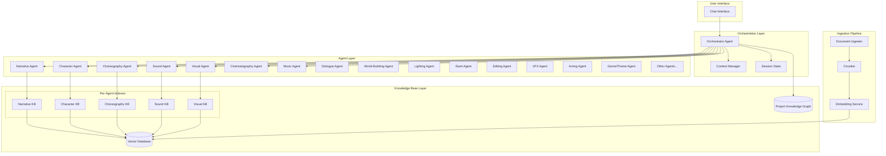

# Design Document: Multi-Agent Storytelling Knowledge Base System

## Overview

This system implements a collaborative storytelling platform with 18 specialized creative AI agents, each backed by vector database knowledge bases. The architecture follows a multi-agent pattern with a central orchestrator managing agent coordination, knowledge retrieval, and context sharing. Each agent operates autonomously within its domain using Retrieval-Augmented Generation (RAG) to ground responses in curated reference material.

The key architectural principles are:
- **Domain Specialization**: Each agent has its own vector-indexed KB with domain-specific content
- **Knowledge Separation**: Core (foundational) and Project (user-specific) knowledge are isolated via metadata filtering
- **Semantic Retrieval**: Natural language queries retrieve relevant chunks via embedding similarity
- **Orchestrated Collaboration**: Central coordinator routes queries and aggregates multi-agent outputs

## Architecture



## Components and Interfaces

### 1. Vector Database Service

The foundation of the knowledge base system, providing storage and retrieval of embedded content.

```python
from dataclasses import dataclass
from typing import Optional, List, Dict, Any
from enum import Enum

class AgentDomain(Enum):
    NARRATIVE = "narrative"
    CHARACTER = "character"
    CHOREOGRAPHY = "choreography"
    SOUND = "sound"
    VISUAL = "visual"
    CINEMATOGRAPHY = "cinematography"
    MUSIC = "music"
    DIALOGUE = "dialogue"
    WORLD_BUILDING = "world_building"
    LIGHTING = "lighting"
    STUNT = "stunt"
    EDITING = "editing"
    VFX = "vfx"
    ACTING = "acting"
    GENRE_THEME = "genre_theme"
    # Additional domains...

class KnowledgeType(Enum):
    FOUNDATIONAL = "foundational"
    PROJECT = "project"
    USER_DEFINED = "user_defined"

@dataclass
class ChunkMetadata:
    agent_domain: AgentDomain
    knowledge_type: KnowledgeType
    project_id: Optional[str]  # None for core knowledge
    source_ref: str
    chunk_id: str
    doc_id: str
    topic: Optional[str] = None
    version: str = "1.0"

@dataclass
class KnowledgeChunk:
    id: str
    text: str
    embedding: List[float]
    metadata: ChunkMetadata

@dataclass
class SearchResult:
    chunk: KnowledgeChunk
    similarity_score: float

@dataclass
class SearchFilter:
    agent_domain: Optional[AgentDomain] = None
    project_id: Optional[str] = None
    knowledge_type: Optional[KnowledgeType] = None
    
class VectorDatabaseService:
    """Interface for vector database operations."""
    
    def upsert(self, chunks: List[KnowledgeChunk]) -> None:
        """Insert or update chunks in the vector database."""
        pass
    
    def search(
        self,
        query_embedding: List[float],
        filter: SearchFilter,
        top_k: int = 5
    ) -> List[SearchResult]:
        """Search for similar chunks with metadata filtering."""
        pass
    
    def delete(self, chunk_ids: List[str]) -> None:
        """Delete chunks by ID."""
        pass
    
    def get_by_doc_id(self, doc_id: str) -> List[KnowledgeChunk]:
        """Retrieve all chunks belonging to a document."""
        pass
```

### 2. Embedding Service

Converts text to vector embeddings using a consistent model across all KBs.

```python
@dataclass
class EmbeddingConfig:
    model_name: str  # e.g., "text-embedding-ada-002"
    dimensions: int  # e.g., 1536
    normalize: bool = True  # Unit-length normalization for cosine similarity

class EmbeddingService:
    """Generates embeddings for text content."""
    
    def __init__(self, config: EmbeddingConfig):
        self.config = config
    
    def embed(self, text: str) -> List[float]:
        """Generate embedding for a single text."""
        pass
    
    def embed_batch(self, texts: List[str]) -> List[List[float]]:
        """Generate embeddings for multiple texts efficiently."""
        pass
    
    def get_model_version(self) -> str:
        """Return the current embedding model version."""
        pass
```

### 3. Document Ingestion Pipeline

Processes reference documents into chunked, embedded knowledge entries.

```python
@dataclass
class ChunkingConfig:
    max_tokens: int = 512
    overlap_percent: float = 0.15  # 15% overlap
    respect_boundaries: bool = True  # Respect paragraph/section boundaries

@dataclass
class IngestionRequest:
    document_id: str
    content: str
    agent_domain: AgentDomain
    source_ref: str
    knowledge_type: KnowledgeType = KnowledgeType.FOUNDATIONAL
    project_id: Optional[str] = None

class DocumentIngestionPipeline:
    """Processes documents into vector database entries."""
    
    def __init__(
        self,
        chunker: 'DocumentChunker',
        embedding_service: EmbeddingService,
        vector_db: VectorDatabaseService
    ):
        self.chunker = chunker
        self.embedding_service = embedding_service
        self.vector_db = vector_db
    
    def ingest(self, request: IngestionRequest) -> List[str]:
        """
        Ingest a document: chunk, embed, and store.
        Returns list of created chunk IDs.
        """
        pass
    
    def ingest_batch(self, requests: List[IngestionRequest]) -> Dict[str, List[str]]:
        """Batch ingest multiple documents."""
        pass
    
    def reingest(self, document_id: str, request: IngestionRequest) -> List[str]:
        """Re-ingest a document, replacing existing chunks."""
        pass

class DocumentChunker:
    """Splits documents into semantically coherent chunks."""
    
    def __init__(self, config: ChunkingConfig):
        self.config = config
    
    def chunk(self, content: str) -> List[str]:
        """Split content into overlapping chunks."""
        pass
    
    def _calculate_overlap_tokens(self) -> int:
        """Calculate number of overlap tokens based on config."""
        return int(self.config.max_tokens * self.config.overlap_percent)
```

### 4. Knowledge Base Manager

Manages core and project knowledge bases with versioning support.

```python
@dataclass
class KBVersion:
    version_id: str
    agent_domain: AgentDomain
    embedding_model: str
    created_at: str
    chunk_count: int
    is_active: bool

class CoreKBManager:
    """Manages versioned core knowledge bases."""
    
    def __init__(self, vector_db: VectorDatabaseService):
        self.vector_db = vector_db
    
    def create_version(
        self,
        agent_domain: AgentDomain,
        embedding_model: str
    ) -> KBVersion:
        """Create a new KB version."""
        pass
    
    def activate_version(self, version_id: str) -> None:
        """Set a version as the active one for queries."""
        pass
    
    def rollback(self, agent_domain: AgentDomain, version_id: str) -> None:
        """Rollback to a previous KB version."""
        pass
    
    def get_active_version(self, agent_domain: AgentDomain) -> KBVersion:
        """Get the currently active version for an agent domain."""
        pass
    
    def list_versions(self, agent_domain: AgentDomain) -> List[KBVersion]:
        """List all versions for an agent domain."""
        pass

class ProjectKBManager:
    """Manages project-specific knowledge."""
    
    def __init__(
        self,
        vector_db: VectorDatabaseService,
        embedding_service: EmbeddingService
    ):
        self.vector_db = vector_db
        self.embedding_service = embedding_service
    
    def add_fact(
        self,
        project_id: str,
        agent_domain: AgentDomain,
        fact_text: str,
        source: str = "user_input"
    ) -> str:
        """Add a project-specific fact. Returns chunk ID."""
        pass
    
    def update_fact(self, chunk_id: str, new_text: str) -> None:
        """Update an existing project fact."""
        pass
    
    def delete_fact(self, chunk_id: str) -> None:
        """Delete a project fact."""
        pass
    
    def get_project_facts(
        self,
        project_id: str,
        agent_domain: Optional[AgentDomain] = None
    ) -> List[KnowledgeChunk]:
        """Retrieve all facts for a project, optionally filtered by domain."""
        pass
    
    def export_project(self, project_id: str) -> Dict[str, Any]:
        """Export all project knowledge for backup."""
        pass
    
    def import_project(self, project_id: str, data: Dict[str, Any]) -> None:
        """Import project knowledge from backup."""
        pass
```

### 5. Semantic Search Interface

Provides the query interface for agents to retrieve knowledge.

```python
@dataclass
class SearchRequest:
    query: str
    agent_domain: AgentDomain
    project_id: Optional[str] = None
    top_k: int = 5
    include_core: bool = True
    include_project: bool = True
    prefer_project: bool = True  # Prioritize project results

@dataclass
class EnrichedSearchResult:
    text: str
    source: str
    knowledge_type: KnowledgeType
    similarity_score: float
    metadata: ChunkMetadata

class SemanticSearchInterface:
    """High-level search interface for agents."""
    
    def __init__(
        self,
        vector_db: VectorDatabaseService,
        embedding_service: EmbeddingService
    ):
        self.vector_db = vector_db
        self.embedding_service = embedding_service
    
    def search(self, request: SearchRequest) -> List[EnrichedSearchResult]:
        """
        Execute semantic search with project prioritization.
        
        If prefer_project is True:
        1. First search project KB
        2. If insufficient results, search core KB
        3. Merge and rank results
        """
        pass
    
    def hybrid_search(
        self,
        request: SearchRequest,
        keywords: List[str]
    ) -> List[EnrichedSearchResult]:
        """Combine vector similarity with keyword matching."""
        pass
```

### 6. Orchestrator

Central coordinator for multi-agent collaboration.

```python
@dataclass
class SessionContext:
    session_id: str
    project_id: Optional[str]
    active_agents: List[AgentDomain]
    conversation_history: List[Dict[str, str]]

@dataclass
class AgentResponse:
    agent_domain: AgentDomain
    content: str
    sources: List[str]  # KB sources used
    confidence: float

@dataclass
class OrchestratorResponse:
    responses: List[AgentResponse]
    aggregated_content: Optional[str]
    requires_user_choice: bool
    conflict_description: Optional[str]

class Orchestrator:
    """Coordinates multi-agent collaboration."""
    
    def __init__(self, agents: Dict[AgentDomain, 'CreativeAgent']):
        self.agents = agents
        self.sessions: Dict[str, SessionContext] = {}
    
    def classify_intent(self, query: str) -> List[AgentDomain]:
        """Identify which agent domains are relevant to the query."""
        pass
    
    def route_query(
        self,
        session_id: str,
        query: str
    ) -> OrchestratorResponse:
        """
        Route query to appropriate agents and aggregate responses.
        
        1. Classify intent to identify relevant domains
        2. Invoke agents in parallel or sequence as needed
        3. Aggregate and reconcile outputs
        4. Return unified response or present conflicts
        """
        pass
    
    def create_session(self, project_id: Optional[str] = None) -> str:
        """Create a new session, returns session_id."""
        pass
    
    def set_project(self, session_id: str, project_id: str) -> None:
        """Set the active project for a session."""
        pass
    
    def propagate_fact(
        self,
        project_id: str,
        fact: str,
        source_domain: AgentDomain,
        target_domains: List[AgentDomain]
    ) -> None:
        """Propagate a cross-domain fact to multiple agent KBs."""
        pass
```

### 7. Creative Agent Base

Base class for all 18 specialized creative agents.

```python
@dataclass
class AgentConfig:
    domain: AgentDomain
    system_prompt: str
    kb_search_top_k: int = 5
    prefer_project_knowledge: bool = True

class CreativeAgent:
    """Base class for specialized creative agents."""
    
    def __init__(
        self,
        config: AgentConfig,
        search_interface: SemanticSearchInterface,
        llm_client: Any  # LLM client interface
    ):
        self.config = config
        self.search = search_interface
        self.llm = llm_client
    
    def process(
        self,
        query: str,
        project_id: Optional[str],
        context: Optional[str] = None
    ) -> AgentResponse:
        """
        Process a query using RAG workflow:
        1. Search KB for relevant context
        2. Construct prompt with retrieved knowledge
        3. Generate response via LLM
        4. Return response with source attribution
        """
        pass
    
    def _retrieve_context(
        self,
        query: str,
        project_id: Optional[str]
    ) -> List[EnrichedSearchResult]:
        """Retrieve relevant KB context for the query."""
        pass
    
    def _construct_prompt(
        self,
        query: str,
        kb_context: List[EnrichedSearchResult],
        additional_context: Optional[str]
    ) -> str:
        """Build the LLM prompt with KB knowledge."""
        pass
```

## Data Models

### Knowledge Chunk Schema

```json
{
  "id": "uuid-1234-5678",
  "text": "In film, low-frequency rumbles can foreshadow an upcoming dramatic event...",
  "embedding": [0.123, -0.456, ...],
  "metadata": {
    "agent_domain": "sound",
    "knowledge_type": "foundational",
    "project_id": null,
    "source_ref": "SoundDesignGuideChapter5",
    "chunk_id": "chunk-001",
    "doc_id": "doc-sound-001",
    "topic": "emotional_effects",
    "version": "1.0"
  }
}
```

### Project Knowledge Entry

```json
{
  "id": "uuid-9999-0000",
  "text": "In Project X, Theme of the Ancients is a recurring melody associated with the ancient forest.",
  "embedding": [0.789, -0.012, ...],
  "metadata": {
    "agent_domain": "music",
    "knowledge_type": "project",
    "project_id": "project-x",
    "source_ref": "user_input",
    "chunk_id": "proj-chunk-001",
    "doc_id": "project-x-music",
    "topic": "motif",
    "version": "1.0"
  }
}
```

### Session Context

```json
{
  "session_id": "sess-abc123",
  "project_id": "project-x",
  "active_agents": ["narrative", "character", "choreography"],
  "conversation_history": [
    {"role": "user", "content": "How should the hero fight the villain?"},
    {"role": "assistant", "content": "Based on the hero's dancer-like style..."}
  ]
}
```


## Correctness Properties

*A property is a characteristic or behavior that should hold true across all valid executions of a system—essentially, a formal statement about what the system should do. Properties serve as the bridge between human-readable specifications and machine-verifiable correctness guarantees.*

### Property 1: Embedding Dimension Validity

*For any* embedding stored in the vector database, its dimension count SHALL be between 768 and 1536 inclusive.

**Validates: Requirements 1.1**

### Property 2: Metadata Filtering Correctness

*For any* search query with metadata filters (agent_domain, project_id, type), all returned results SHALL have metadata values matching the specified filters.

**Validates: Requirements 1.3, 5.3**

### Property 3: Metadata Storage Round-Trip

*For any* valid metadata JSON attached to a vector during upsert, retrieving that vector SHALL return the identical metadata.

**Validates: Requirements 1.5**

### Property 4: Chunk Token Count Bounds

*For any* document ingested through the pipeline, all resulting chunks SHALL have token counts between 200 and 500 inclusive.

**Validates: Requirements 2.1**

### Property 5: Chunk Overlap Consistency

*For any* document producing multiple chunks, adjacent chunks SHALL share between 10% and 20% of their content (measured by token overlap).

**Validates: Requirements 2.2**

### Property 6: Chunk Embedding Completeness

*For any* chunk created by the ingestion pipeline, it SHALL have a non-null embedding with dimensions matching the configured model.

**Validates: Requirements 2.3**

### Property 7: Required Metadata Fields Presence

*For any* chunk stored in the knowledge base, the metadata SHALL contain non-null values for agent_domain, knowledge_type, source_ref, and chunk_id.

**Validates: Requirements 2.4, 17.1**

### Property 8: Batch Ingestion Completeness

*For any* batch of N documents submitted for ingestion, the pipeline SHALL produce chunks for all N documents (no documents silently dropped).

**Validates: Requirements 2.5**

### Property 9: Document Re-ingestion Idempotence

*For any* document ingested twice with the same doc_id, the total chunk count for that doc_id SHALL equal the chunk count from a single ingestion (no duplicates).

**Validates: Requirements 2.6**

### Property 10: Agent Domain Isolation

*For any* two different agent domains, a query filtered to one domain SHALL never return chunks belonging to the other domain.

**Validates: Requirements 3.1**

### Property 11: Version Increment on Update

*For any* update operation on a Core_KB, the resulting version number SHALL be strictly greater than the previous version number.

**Validates: Requirements 3.2, 16.1**

### Property 12: Rollback State Restoration

*For any* KB version V1 followed by update to V2 followed by rollback to V1, the KB state SHALL be equivalent to the original V1 state.

**Validates: Requirements 3.3, 16.3**

### Property 13: Core KB Immutability During Queries

*For any* agent query operation, the Core_KB content (chunk count and content) SHALL remain unchanged before and after the query.

**Validates: Requirements 3.5**

### Property 14: Embedding Model Version Tracking

*For any* KB version, the associated embedding model version SHALL be recorded and retrievable via get_active_version.

**Validates: Requirements 3.6**

### Property 15: Project Fact Storage with Project ID

*For any* fact added via Project_KB_Manager.add_fact with a project_id, retrieving that fact SHALL return the same project_id in metadata.

**Validates: Requirements 4.1**

### Property 16: Project Data Isolation

*For any* two distinct project IDs, a query filtered to one project SHALL never return facts belonging to the other project.

**Validates: Requirements 4.2, 4.3**

### Property 17: Project Fact Modification Consistency

*For any* project fact modified via update_fact, subsequent queries SHALL return the new value and NOT the old value.

**Validates: Requirements 4.4**

### Property 18: Project Fact Deletion Completeness

*For any* project fact deleted via delete_fact, subsequent queries SHALL NOT return that fact.

**Validates: Requirements 4.5**

### Property 19: Project Export-Import Round-Trip

*For any* project, exporting via export_project then importing via import_project SHALL preserve all project facts with identical content and metadata.

**Validates: Requirements 4.6**

### Property 20: Search Result Count Bound

*For any* search with top_k parameter, the number of returned results SHALL be at most top_k.

**Validates: Requirements 5.2**

### Property 21: Search Result Completeness

*For any* search result, it SHALL include non-null values for text, metadata, and similarity_score.

**Validates: Requirements 5.4**

### Property 22: Project Knowledge Priority

*For any* search where both project and core knowledge exist for the same semantic query, project-specific results SHALL rank higher (appear earlier) than equivalent core results when prefer_project is true.

**Validates: Requirements 5.6, 7.6**

### Property 23: Intent Classification Non-Empty

*For any* user query submitted to the Orchestrator, intent classification SHALL return at least one relevant agent domain.

**Validates: Requirements 6.1**

### Property 24: Multi-Domain Response Aggregation

*For any* query classified as relevant to N agent domains (N > 1), the orchestrator response SHALL contain contributions from all N agents.

**Validates: Requirements 6.2**

### Property 25: Session Project Context Persistence

*For any* session with a set project_id, subsequent queries in that session SHALL use the same project_id for KB filtering.

**Validates: Requirements 6.3, 6.4**

### Property 26: Conflict Detection and Flagging

*For any* orchestrator response where agents produce conflicting outputs, the response SHALL have requires_user_choice set to true.

**Validates: Requirements 6.6**

### Property 27: KB Context Incorporation in Prompt

*For any* agent processing with non-empty KB results, the constructed LLM prompt SHALL contain the text from at least one retrieved chunk.

**Validates: Requirements 7.2**

### Property 28: Source Attribution Completeness

*For any* agent response using KB context, the sources list SHALL contain the source_ref from at least one retrieved chunk.

**Validates: Requirements 7.3**

### Property 29: Graceful Empty KB Handling

*For any* agent query returning zero KB results, the agent SHALL still produce a valid response (not error or null).

**Validates: Requirements 7.4**

### Property 30: Dual KB Query Inclusion

*For any* agent search request with default settings, both include_core and include_project SHALL be true.

**Validates: Requirements 7.5**

### Property 31: Cross-Domain Context Sharing

*For any* multi-agent workflow where agent A produces output relevant to agent B, agent B SHALL receive agent A's output as additional context.

**Validates: Requirements 15.1**

### Property 32: Consistent Project Reference

*For any* session invoking multiple agents, all agents SHALL use the same project_id from the session context.

**Validates: Requirements 15.2**

### Property 33: Cross-Domain Fact Propagation

*For any* fact propagated to N target domains via propagate_fact, the fact SHALL be retrievable from all N target domain KBs.

**Validates: Requirements 15.3**

### Property 34: Parallel Agent Output Merging

*For any* orchestrator invocation of N agents in parallel, the aggregated response SHALL contain outputs from all N agents.

**Validates: Requirements 15.5**

### Property 35: Parallel Version Queryability

*For any* KB with versions V1 (old) and V2 (new) during transition, both versions SHALL be independently queryable.

**Validates: Requirements 16.2**

### Property 36: Metadata Schema Consistency Across Domains

*For any* two chunks from different agent domains, their metadata structures SHALL have identical field names and types.

**Validates: Requirements 17.2**

### Property 37: Core Knowledge Null Project ID

*For any* chunk stored as core knowledge (knowledge_type = FOUNDATIONAL), the project_id SHALL be null.

**Validates: Requirements 17.3**

### Property 38: Project Knowledge Non-Null Project ID

*For any* chunk stored as project knowledge (knowledge_type = PROJECT), the project_id SHALL be non-null and match the active project.

**Validates: Requirements 17.4**

### Property 39: Invalid Metadata Rejection

*For any* chunk with metadata missing required fields or containing invalid values, the storage operation SHALL reject it with an error.

**Validates: Requirements 17.5**

## Error Handling

### Vector Database Errors

| Error Condition | Handling Strategy |
|----------------|-------------------|
| Connection failure | Retry with exponential backoff (3 attempts), then fail gracefully with cached results if available |
| Query timeout | Return partial results if available, log timeout for monitoring |
| Invalid embedding dimensions | Reject with validation error before storage attempt |
| Metadata validation failure | Return detailed error indicating which fields are invalid |

### Ingestion Pipeline Errors

| Error Condition | Handling Strategy |
|----------------|-------------------|
| Document too large | Split into sub-documents before chunking |
| Embedding service unavailable | Queue document for retry, notify operator |
| Chunk token count out of bounds | Adjust chunking parameters and re-chunk |
| Duplicate doc_id conflict | Upsert (replace) existing chunks |

### Agent Processing Errors

| Error Condition | Handling Strategy |
|----------------|-------------------|
| KB search returns no results | Proceed with LLM-only generation, note in response |
| LLM service unavailable | Return error to orchestrator for retry or fallback |
| Context too large for LLM | Truncate oldest/lowest-relevance chunks |
| Agent timeout | Return partial response if available |

### Orchestrator Errors

| Error Condition | Handling Strategy |
|----------------|-------------------|
| Intent classification failure | Default to narrative agent as fallback |
| Agent conflict unresolvable | Present all options to user with conflict description |
| Session not found | Create new session automatically |
| Project not found | Return error prompting user to create or select project |

## Testing Strategy

### Unit Tests

Unit tests verify specific examples and edge cases:

- Chunker correctly splits documents at paragraph boundaries
- Metadata validation rejects missing required fields
- Search filter correctly excludes non-matching results
- Version increment produces expected version string
- Project isolation prevents cross-project data access

### Property-Based Tests

Property-based tests verify universal properties across generated inputs using Hypothesis (Python):

```python
from hypothesis import given, strategies as st, settings

# Property 9: Document Re-ingestion Idempotence
@given(
    doc_content=st.text(min_size=500, max_size=5000),
    doc_id=st.uuids().map(str),
    agent_domain=st.sampled_from(list(AgentDomain))
)
@settings(max_examples=100)
def test_reingestion_idempotence(doc_content, doc_id, agent_domain):
    """
    Feature: storytelling-knowledge-base, Property 9: Document Re-ingestion Idempotence
    For any document ingested twice with the same doc_id, 
    the total chunk count SHALL equal the chunk count from a single ingestion.
    """
    pipeline = DocumentIngestionPipeline(...)
    
    # First ingestion
    request = IngestionRequest(doc_id, doc_content, agent_domain, "test")
    chunks_1 = pipeline.ingest(request)
    count_after_first = len(pipeline.vector_db.get_by_doc_id(doc_id))
    
    # Second ingestion (same doc_id)
    chunks_2 = pipeline.reingest(doc_id, request)
    count_after_second = len(pipeline.vector_db.get_by_doc_id(doc_id))
    
    assert count_after_first == count_after_second
```

### Test Configuration

- Property tests: Minimum 100 iterations per property
- Testing framework: pytest with hypothesis for property-based testing
- Each property test tagged with: `Feature: storytelling-knowledge-base, Property N: {property_text}`

### Integration Tests

- End-to-end RAG workflow: query → search → prompt construction → LLM → response
- Multi-agent orchestration with real agent instances
- Project lifecycle: create → add facts → query → export → import → verify
- Version management: create → update → rollback → verify state
