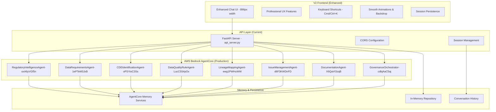
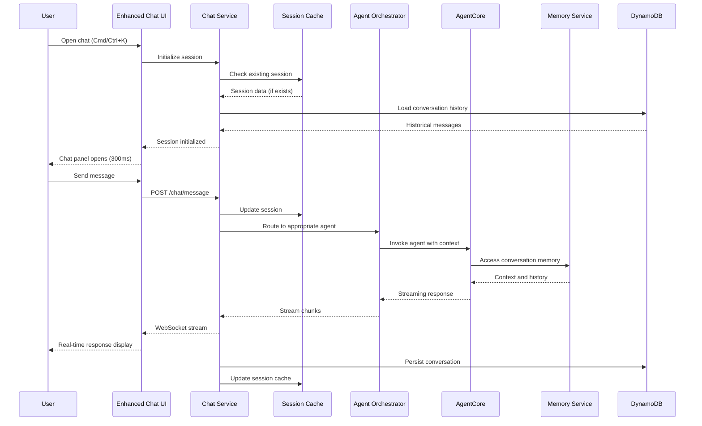
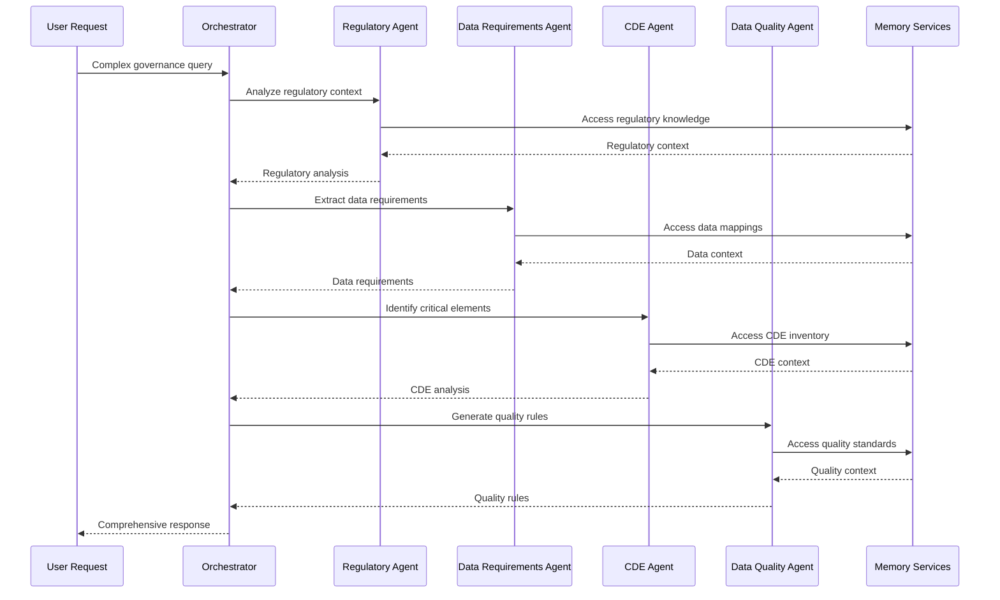
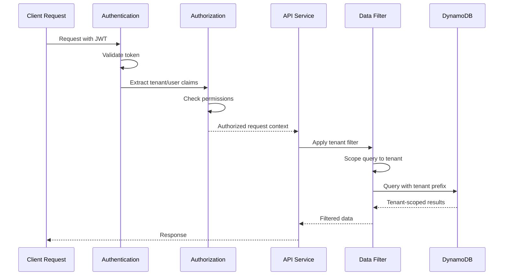

# Design Document: V2 Production Deployment and Enhancement

## Overview

This design document outlines the architecture and implementation approach for the V2 production deployment of the Agentic Data Governance Platform. Building upon the successful V2 implementation with enhanced chat UI and real AWS Bedrock agent integration, this design focuses on production readiness, scalability, multi-tenancy, and advanced governance capabilities.

The architecture leverages the existing V2 foundation while adding enterprise-grade features for security, monitoring, disaster recovery, and multi-tenant support.

## Current V2 Architecture

### Existing Components (Successfully Implemented)



## Enhanced V2 Production Architecture

### Target Production Architecture

```mermaid
graph TB
    subgraph "Global Edge Layer"
        CF[CloudFront Global Distribution]
        WAF[AWS WAF + Shield Advanced]
        R53[Route 53 DNS + Health Checks]
    end

    subgraph "Multi-Region Load Balancing"
        ALB_US[ALB - US East]
        ALB_CA[ALB - Canada Central]
        ALB_EU[ALB - EU West (DR)]
    end

    subgraph "Authentication & Authorization"
        COG[Cognito User Pool]
        COGID[Cognito Identity Pool]
        RBAC[Role-Based Access Control]
        MFA[Multi-Factor Authentication]
    end

    subgraph "API Gateway Layer"
        APIGW_REST[API Gateway REST - v1]
        APIGW_HTTP[API Gateway HTTP - v2]
        APIGW_WS[API Gateway WebSocket]
        APIGW_GQL[AppSync GraphQL (Future)]
    end

    subgraph "Enhanced Frontend Hosting"
        S3_PROD[S3 - Production Assets]
        S3_STAGE[S3 - Staging Assets]
        S3_DEV[S3 - Development Assets]
        CACHE[ElastiCache - Session Cache]
    end

    subgraph "Compute Layer - Microservices"
        ECS_CHAT[ECS - Enhanced Chat Service]
        ECS_AGENT[ECS - Agent Orchestration Service]
        ECS_TENANT[ECS - Tenant Management Service]
        ECS_ANALYTICS[ECS - Analytics Service]
        LAMBDA_EDGE[Lambda@Edge - Personalization]
    end

    subgraph "AWS Bedrock AgentCore (Enhanced)"
        subgraph "Regulatory Domain"
            AC1[RegulatoryIntelligenceAgent]
            AC1_MEM[Regulatory Memory Service]
        end
        subgraph "Data Management Domain"
            AC2[DataRequirementsAgent]
            AC3[CDEIdentificationAgent]
            AC4[DataQualityRuleAgent]
            AC2_MEM[Data Management Memory]
        end
        subgraph "Lineage & Issues Domain"
            AC5[LineageMappingAgent]
            AC6[IssueManagementAgent]
            AC5_MEM[Lineage Memory Service]
        end
        subgraph "Documentation & Orchestration"
            AC7[DocumentationAgent]
            AC8[GovernanceOrchestrator]
            AC7_MEM[Documentation Memory]
        end
    end

    subgraph "Data Layer - Multi-Tenant"
        subgraph "Primary Data Stores"
            DDB_TENANT[DynamoDB - Tenant Data]
            DDB_USER[DynamoDB - User Profiles]
            DDB_CONV[DynamoDB - Conversations]
            DDB_WORKFLOW[DynamoDB - Workflows]
            DDB_AUDIT[DynamoDB - Audit Logs]
        end
        subgraph "Analytics & Reporting"
            REDSHIFT[Redshift - Analytics]
            OPENSEARCH[OpenSearch - Search & Logs]
            TIMESTREAM[Timestream - Metrics]
        end
        subgraph "Document Storage"
            S3_DOCS[S3 - Document Storage]
            S3_BACKUP[S3 - Backup & Archive]
            GLACIER[Glacier - Long-term Archive]
        end
    end

    subgraph "Monitoring & Observability"
        CW[CloudWatch - Metrics & Logs]
        XRAY[X-Ray - Distributed Tracing]
        GRAFANA[Grafana - Custom Dashboards]
        PAGER[PagerDuty - Alerting]
    end

    subgraph "Security & Compliance"
        KMS[AWS KMS - Encryption]
        SECRETS[Secrets Manager]
        GUARD[GuardDuty - Threat Detection]
        CONFIG[AWS Config - Compliance]
        CLOUDTRAIL[CloudTrail - Audit Logs]
    end

    CF --> ALB_US
    CF --> ALB_CA
    CF --> ALB_EU
    
    ALB_US --> APIGW_REST
    ALB_US --> APIGW_HTTP
    ALB_US --> APIGW_WS
    
    APIGW_REST --> COG
    APIGW_HTTP --> COG
    APIGW_WS --> COG
    
    APIGW_REST --> ECS_CHAT
    APIGW_HTTP --> ECS_AGENT
    APIGW_REST --> ECS_TENANT
    APIGW_HTTP --> ECS_ANALYTICS
    
    ECS_AGENT --> AC1
    ECS_AGENT --> AC2
    ECS_AGENT --> AC3
    ECS_AGENT --> AC4
    ECS_AGENT --> AC5
    ECS_AGENT --> AC6
    ECS_AGENT --> AC7
    ECS_AGENT --> AC8
    
    AC1 --> AC1_MEM
    AC2 --> AC2_MEM
    AC3 --> AC2_MEM
    AC4 --> AC2_MEM
    AC5 --> AC5_MEM
    AC6 --> AC5_MEM
    AC7 --> AC7_MEM
    AC8 --> AC7_MEM
    
    ECS_CHAT --> DDB_CONV
    ECS_TENANT --> DDB_TENANT
    ECS_TENANT --> DDB_USER
    ECS_AGENT --> DDB_WORKFLOW
    ECS_ANALYTICS --> REDSHIFT
    
    CF --> S3_PROD
    ECS_CHAT --> CACHE
    
    DDB_TENANT --> KMS
    DDB_USER --> KMS
    DDB_CONV --> KMS
    S3_DOCS --> KMS
    
    ECS_CHAT --> CW
    ECS_AGENT --> CW
    ECS_TENANT --> CW
    ECS_ANALYTICS --> CW
    
    APIGW_REST --> XRAY
    APIGW_HTTP --> XRAY
    ECS_CHAT --> XRAY
    ECS_AGENT --> XRAY
```

## Component Design Specifications

### 1. Enhanced Chat Service (ECS)

**Service Architecture:**
```typescript
interface EnhancedChatService {
  // Core chat functionality
  chatEngine: {
    sessionManager: SessionManager;
    messageProcessor: MessageProcessor;
    agentOrchestrator: AgentOrchestrator;
    responseStreamer: ResponseStreamer;
  };
  
  // Professional UX features
  uiEnhancements: {
    keyboardShortcuts: KeyboardShortcutManager;
    animationEngine: AnimationEngine;
    responsiveLayout: ResponsiveLayoutManager;
    accessibilityFeatures: AccessibilityManager;
  };
  
  // Performance optimizations
  performance: {
    messageCache: MessageCache;
    sessionCache: SessionCache;
    responseCompression: CompressionManager;
    loadBalancer: LoadBalancer;
  };
  
  // Multi-tenant support
  tenancy: {
    tenantIsolation: TenantIsolationManager;
    tenantConfiguration: TenantConfigManager;
    tenantMetrics: TenantMetricsCollector;
  };
}
```

**Session Management:**
```typescript
interface SessionManager {
  createSession(tenantId: string, userId: string): Promise<ChatSession>;
  restoreSession(sessionId: string): Promise<ChatSession>;
  persistSession(session: ChatSession): Promise<void>;
  cleanupExpiredSessions(): Promise<void>;
}

interface ChatSession {
  sessionId: string;
  tenantId: string;
  userId: string;
  messages: Message[];
  context: ConversationContext;
  agentStates: Map<string, AgentState>;
  metadata: SessionMetadata;
  createdAt: Date;
  lastAccessedAt: Date;
  expiresAt: Date;
}
```

### 2. Agent Orchestration Service

**Orchestration Engine:**
```typescript
interface AgentOrchestrationService {
  // Agent coordination
  orchestrator: {
    workflowEngine: WorkflowEngine;
    agentRouter: AgentRouter;
    dependencyManager: DependencyManager;
    failureHandler: FailureHandler;
  };
  
  // Performance management
  performance: {
    circuitBreaker: CircuitBreaker;
    rateLimiter: RateLimiter;
    loadBalancer: AgentLoadBalancer;
    cacheManager: AgentCacheManager;
  };
  
  // Monitoring and observability
  observability: {
    metricsCollector: AgentMetricsCollector;
    traceManager: DistributedTraceManager;
    healthChecker: AgentHealthChecker;
    alertManager: AlertManager;
  };
}
```

**Agent Router Configuration:**
```typescript
interface AgentRouterConfig {
  agents: {
    regulatory: {
      arn: 'arn:aws:bedrock-agentcore:us-west-2:704845220642:runtime/RegulatoryIntelligenceAgent-oxA6yVGf5n';
      memoryId: 'governance_regulatory-JiCr1P7uqj';
      maxConcurrency: 10;
      timeout: 30000;
      retryPolicy: ExponentialBackoff;
    };
    dataRequirements: {
      arn: 'arn:aws:bedrock-agentcore:us-west-2:704845220642:runtime/DataRequirementsAgent-1ePTeM3JxB';
      memoryId: 'governance_data_req-yo8f9Q7u88';
      maxConcurrency: 8;
      timeout: 45000;
      retryPolicy: ExponentialBackoff;
    };
    // ... other agents
  };
  
  routing: {
    defaultAgent: 'regulatory';
    routingRules: RoutingRule[];
    fallbackStrategy: 'graceful_degradation';
  };
  
  circuitBreaker: {
    failureThreshold: 5;
    recoveryTimeout: 30000;
    halfOpenMaxCalls: 3;
  };
}
```

### 3. Multi-Tenant Data Architecture

**Tenant Isolation Strategy:**
```typescript
interface TenantDataArchitecture {
  // Isolation levels
  isolation: {
    level: 'row_level_security' | 'schema_per_tenant' | 'database_per_tenant';
    implementation: 'dynamodb_partition_key' | 'rds_rls' | 'separate_instances';
  };
  
  // Data partitioning
  partitioning: {
    strategy: 'tenant_id_prefix';
    keyPattern: 'TENANT#{tenantId}#{entityType}#{entityId}';
    globalSecondaryIndexes: GSIConfig[];
  };
  
  // Access control
  accessControl: {
    tenantValidation: TenantValidator;
    dataFiltering: DataFilter;
    queryScoping: QueryScoper;
  };
}
```

**DynamoDB Schema Design:**
```typescript
interface MultiTenantDynamoDBSchema {
  tables: {
    // Tenant management
    tenants: {
      partitionKey: 'PK'; // TENANT#{tenantId}
      sortKey: 'SK';      // METADATA | CONFIG | BILLING
      attributes: TenantAttributes;
      gsi: [
        {
          name: 'tenant-status-index';
          partitionKey: 'status';
          sortKey: 'createdAt';
        }
      ];
    };
    
    // User management
    users: {
      partitionKey: 'PK'; // TENANT#{tenantId}
      sortKey: 'SK';      // USER#{userId}
      attributes: UserAttributes;
      gsi: [
        {
          name: 'email-index';
          partitionKey: 'email';
          sortKey: 'tenantId';
        }
      ];
    };
    
    // Conversation storage
    conversations: {
      partitionKey: 'PK'; // TENANT#{tenantId}
      sortKey: 'SK';      // CONV#{sessionId}#{messageId}
      attributes: ConversationAttributes;
      ttl: 'expiresAt';   // Auto-cleanup old conversations
    };
    
    // Workflow management
    workflows: {
      partitionKey: 'PK'; // TENANT#{tenantId}
      sortKey: 'SK';      // WORKFLOW#{workflowId}
      attributes: WorkflowAttributes;
      gsi: [
        {
          name: 'status-index';
          partitionKey: 'status';
          sortKey: 'updatedAt';
        }
      ];
    };
  };
}
```

### 4. Enhanced Security Architecture

**Security Layers:**
```typescript
interface SecurityArchitecture {
  // Authentication
  authentication: {
    cognito: {
      userPool: CognitoUserPoolConfig;
      identityPool: CognitoIdentityPoolConfig;
      mfa: MFAConfiguration;
      passwordPolicy: PasswordPolicyConfig;
    };
    
    jwt: {
      issuer: string;
      audience: string[];
      algorithm: 'RS256';
      keyRotation: KeyRotationConfig;
    };
  };
  
  // Authorization
  authorization: {
    rbac: {
      roles: ['admin', 'compliance_officer', 'data_steward', 'viewer'];
      permissions: PermissionMatrix;
      inheritance: RoleInheritanceConfig;
    };
    
    abac: {
      attributes: AttributeConfig;
      policies: PolicyConfig;
      evaluation: PolicyEvaluationEngine;
    };
  };
  
  // Data protection
  dataProtection: {
    encryption: {
      atRest: KMSEncryptionConfig;
      inTransit: TLSConfig;
      clientSide: ClientSideEncryptionConfig;
    };
    
    tokenization: {
      piiFields: string[];
      tokenizationService: TokenizationServiceConfig;
      detokenizationRules: DetokenizationRuleConfig;
    };
  };
  
  // Network security
  networkSecurity: {
    waf: WAFConfiguration;
    vpc: VPCConfiguration;
    privateEndpoints: PrivateEndpointConfig;
    networkACLs: NetworkACLConfig;
  };
}
```

### 5. Monitoring and Observability

**Observability Stack:**
```typescript
interface ObservabilityArchitecture {
  // Metrics collection
  metrics: {
    application: {
      chatMetrics: ChatMetrics;
      agentMetrics: AgentMetrics;
      userMetrics: UserMetrics;
      businessMetrics: BusinessMetrics;
    };
    
    infrastructure: {
      systemMetrics: SystemMetrics;
      networkMetrics: NetworkMetrics;
      databaseMetrics: DatabaseMetrics;
      cacheMetrics: CacheMetrics;
    };
    
    custom: {
      governanceMetrics: GovernanceMetrics;
      complianceMetrics: ComplianceMetrics;
      qualityMetrics: QualityMetrics;
    };
  };
  
  // Distributed tracing
  tracing: {
    xray: {
      enabled: true;
      samplingRate: 0.1;
      annotations: TraceAnnotationConfig;
      segments: TraceSegmentConfig;
    };
    
    correlation: {
      correlationIdHeader: 'X-Correlation-ID';
      propagation: TracePropagationConfig;
      context: TraceContextConfig;
    };
  };
  
  // Logging
  logging: {
    structured: {
      format: 'json';
      fields: LogFieldConfig;
      levels: LogLevelConfig;
    };
    
    aggregation: {
      cloudWatch: CloudWatchLogsConfig;
      openSearch: OpenSearchConfig;
      retention: LogRetentionConfig;
    };
  };
  
  // Alerting
  alerting: {
    rules: AlertRuleConfig[];
    channels: AlertChannelConfig[];
    escalation: EscalationPolicyConfig;
    suppression: AlertSuppressionConfig;
  };
}
```

### 6. Performance Optimization

**Performance Architecture:**
```typescript
interface PerformanceArchitecture {
  // Caching strategy
  caching: {
    layers: {
      cdn: CloudFrontCacheConfig;
      application: ApplicationCacheConfig;
      database: DatabaseCacheConfig;
      session: SessionCacheConfig;
    };
    
    policies: {
      ttl: TTLPolicyConfig;
      invalidation: InvalidationPolicyConfig;
      warming: CacheWarmingConfig;
    };
  };
  
  // Auto-scaling
  autoScaling: {
    compute: {
      ecs: ECSAutoScalingConfig;
      lambda: LambdaScalingConfig;
      fargate: FargateScalingConfig;
    };
    
    storage: {
      dynamodb: DynamoDBScalingConfig;
      elasticache: ElastiCacheScalingConfig;
      rds: RDSScalingConfig;
    };
    
    triggers: {
      metrics: ScalingMetricConfig[];
      schedules: ScalingScheduleConfig[];
      predictive: PredictiveScalingConfig;
    };
  };
  
  // Load balancing
  loadBalancing: {
    application: ALBConfig;
    network: NLBConfig;
    global: GlobalLoadBalancerConfig;
    sticky: StickySessionConfig;
  };
  
  // Connection pooling
  connectionPooling: {
    database: DatabasePoolConfig;
    cache: CachePoolConfig;
    external: ExternalServicePoolConfig;
  };
}
```

## Data Flow and Integration Patterns

### 1. Enhanced Chat Flow



### 2. Multi-Agent Orchestration Flow



### 3. Multi-Tenant Data Access Pattern



## Deployment Strategy

### 1. Blue-Green Deployment

```typescript
interface BlueGreenDeployment {
  environments: {
    blue: {
      version: string;
      traffic: number; // 0-100
      healthStatus: 'healthy' | 'unhealthy' | 'unknown';
    };
    green: {
      version: string;
      traffic: number; // 0-100
      healthStatus: 'healthy' | 'unhealthy' | 'unknown';
    };
  };
  
  deployment: {
    strategy: 'blue_green';
    trafficShifting: {
      initial: 0;
      increment: 10;
      interval: 300; // seconds
      rollbackThreshold: 5; // error percentage
    };
    
    healthChecks: {
      endpoint: '/health';
      timeout: 30;
      interval: 10;
      healthyThreshold: 3;
      unhealthyThreshold: 2;
    };
  };
  
  rollback: {
    automatic: true;
    triggers: ['high_error_rate', 'health_check_failure', 'performance_degradation'];
    maxRollbackTime: 300; // seconds
  };
}
```

### 2. Infrastructure as Code

```typescript
interface InfrastructureAsCode {
  tools: {
    primary: 'aws_cdk';
    configuration: 'typescript';
    testing: 'jest';
    validation: 'cfn_lint';
  };
  
  environments: {
    development: DevEnvironmentConfig;
    staging: StagingEnvironmentConfig;
    production: ProductionEnvironmentConfig;
  };
  
  deployment: {
    pipeline: 'aws_codepipeline';
    stages: ['build', 'test', 'deploy', 'validate'];
    approvals: ['staging_to_production'];
  };
  
  monitoring: {
    drift: 'aws_config';
    compliance: 'aws_config_rules';
    cost: 'aws_budgets';
  };
}
```

## Testing Strategy

### 1. Comprehensive Testing Approach

```typescript
interface TestingStrategy {
  // Unit testing
  unit: {
    framework: 'jest';
    coverage: 90;
    mocking: 'jest_mocks';
    testTypes: ['component', 'service', 'utility'];
  };
  
  // Integration testing
  integration: {
    framework: 'jest';
    testContainers: 'testcontainers';
    testTypes: ['api', 'database', 'agent_integration'];
  };
  
  // End-to-end testing
  e2e: {
    framework: 'playwright';
    browsers: ['chromium', 'firefox', 'webkit'];
    testTypes: ['user_flows', 'chat_interactions', 'multi_tenant'];
  };
  
  // Performance testing
  performance: {
    framework: 'k6';
    testTypes: ['load', 'stress', 'spike', 'volume'];
    metrics: ['response_time', 'throughput', 'error_rate'];
  };
  
  // Security testing
  security: {
    tools: ['owasp_zap', 'snyk', 'semgrep'];
    testTypes: ['vulnerability_scan', 'dependency_check', 'code_analysis'];
  };
  
  // Property-based testing
  property: {
    framework: 'fast_check';
    properties: PropertyTestConfig[];
    iterations: 1000;
  };
}
```

### 2. Property-Based Testing for V2 Features

```typescript
/**
 * **Feature: v2-production-deployment, Property 1: Enhanced Chat Performance**
 * For any chat interaction, the Enhanced Chat UI SHALL respond within 2 seconds
 * under normal load conditions.
 */
const chatPerformanceProperty = fc.property(
  fc.record({
    sessionId: fc.string(),
    message: fc.string({ minLength: 1, maxLength: 1000 }),
    tenantId: fc.string(),
    userId: fc.string(),
  }),
  async (input) => {
    const startTime = Date.now();
    const response = await chatService.sendMessage(input);
    const endTime = Date.now();
    
    expect(endTime - startTime).toBeLessThan(2000);
    expect(response).toBeDefined();
    expect(response.sessionId).toBe(input.sessionId);
  }
);

/**
 * **Feature: v2-production-deployment, Property 2: Multi-Tenant Isolation**
 * For any data access request, the system SHALL only return data belonging
 * to the authenticated user's tenant.
 */
const tenantIsolationProperty = fc.property(
  fc.record({
    tenantId: fc.string(),
    userId: fc.string(),
    dataType: fc.constantFrom('conversations', 'workflows', 'users'),
  }),
  async (input) => {
    const data = await dataService.getData(input.dataType, input.tenantId, input.userId);
    
    // All returned data must belong to the specified tenant
    data.forEach(item => {
      expect(item.tenantId).toBe(input.tenantId);
    });
  }
);

/**
 * **Feature: v2-production-deployment, Property 3: Agent Orchestration Reliability**
 * For any agent invocation, the system SHALL handle failures gracefully
 * and provide appropriate fallback responses.
 */
const agentReliabilityProperty = fc.property(
  fc.record({
    agentType: fc.constantFrom('regulatory', 'dataRequirements', 'cdeIdentification'),
    message: fc.string({ minLength: 1, maxLength: 500 }),
    sessionId: fc.string(),
  }),
  async (input) => {
    const response = await agentOrchestrator.invokeAgent(input);
    
    // Response should always be defined, even if agent fails
    expect(response).toBeDefined();
    expect(response.sessionId).toBe(input.sessionId);
    
    // Should have either success response or error with fallback
    expect(
      response.success === true || 
      (response.success === false && response.fallbackResponse)
    ).toBe(true);
  }
);
```

## Migration and Rollout Plan

### Phase 1: Infrastructure Setup (Weeks 1-2)
- Deploy enhanced AWS infrastructure
- Set up multi-region capabilities
- Configure monitoring and alerting
- Implement security controls

### Phase 2: Service Migration (Weeks 3-4)
- Migrate from FastAPI to ECS services
- Implement multi-tenant data architecture
- Set up enhanced caching and performance optimizations
- Deploy enhanced chat service

### Phase 3: Feature Enhancement (Weeks 5-6)
- Implement advanced chat features
- Add mobile responsiveness
- Integrate analytics and reporting
- Enhance agent orchestration

### Phase 4: Testing and Validation (Weeks 7-8)
- Comprehensive testing across all environments
- Performance and load testing
- Security testing and validation
- User acceptance testing

### Phase 5: Production Rollout (Weeks 9-10)
- Blue-green deployment to production
- Gradual traffic shifting
- Monitor performance and stability
- Full production cutover

## Success Metrics and KPIs

### Technical Metrics
- **System Uptime**: 99.9% availability
- **Response Time**: < 2 seconds for 95% of requests
- **Agent Performance**: < 30 seconds for 99% of agent invocations
- **Error Rate**: < 0.1% for all API calls

### User Experience Metrics
- **Chat Load Time**: < 300ms for chat panel opening
- **Feature Adoption**: 80% of users using keyboard shortcuts
- **Session Persistence**: 99% successful session restoration
- **Mobile Usage**: 30% of interactions from mobile devices

### Business Metrics
- **User Adoption**: 90% of invited users active within 30 days
- **Governance Efficiency**: 50% reduction in task completion time
- **Multi-Tenant Growth**: Support for 100+ tenants
- **Cost Optimization**: 30% reduction in operational costs per user

## Risk Mitigation

### Technical Risks
1. **Agent Performance**: Circuit breakers and fallback mechanisms
2. **Data Consistency**: ACID transactions and eventual consistency patterns
3. **Security Vulnerabilities**: Multi-layered security and regular audits
4. **Scalability Limits**: Auto-scaling and performance monitoring

### Business Risks
1. **User Adoption**: Comprehensive training and change management
2. **Regulatory Compliance**: Regular compliance audits and updates
3. **Competitive Pressure**: Continuous innovation and feature development
4. **Cost Overruns**: Detailed cost monitoring and optimization

## Conclusion

The V2 Production Deployment and Enhancement design builds upon the successful V2 implementation to create an enterprise-grade, multi-tenant platform capable of serving multiple organizations with advanced governance capabilities. The architecture emphasizes scalability, security, performance, and user experience while maintaining the innovative AI-powered governance features that define the platform.

This design provides a clear roadmap for transforming the current V2 implementation into a production-ready platform that can scale to serve the enterprise data governance market effectively.