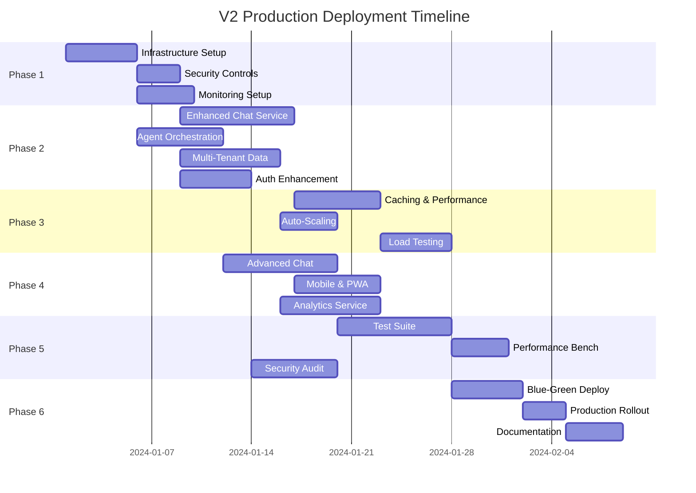

# Tasks Document: V2 Production Deployment and Enhancement

## Overview

This document breaks down the V2 Production Deployment and Enhancement specification into actionable tasks organized by implementation phases. Each task includes acceptance criteria, dependencies, and estimated effort.

## Phase 1: Infrastructure Foundation (Weeks 1-2)

### Task 1.1: Enhanced AWS Infrastructure Setup

**Description:** Deploy production-grade AWS infrastructure with multi-region support, enhanced security, and monitoring capabilities.

**Acceptance Criteria:**
- [ ] CDK stacks deployed for production, staging, and development environments
- [ ] Multi-region setup with primary (us-west-2) and DR (us-east-1) regions
- [ ] VPC configuration with private subnets and NAT gateways
- [ ] CloudFront distribution with WAF and Shield Advanced
- [ ] Route 53 health checks and failover routing

**Dependencies:** 
- AWS account with appropriate permissions
- Domain name for custom SSL certificates

**Effort:** 5 days

**Files to Create/Modify:**
```
infrastructure/lib/stacks/enhanced-production-stack.ts
infrastructure/lib/stacks/multi-region-stack.ts
infrastructure/lib/config/production-enhanced.config.ts
infrastructure/scripts/deploy-multi-region.sh
```

### Task 1.2: Security Controls Implementation

**Description:** Implement comprehensive security controls including KMS encryption, Secrets Manager, and compliance monitoring.

**Acceptance Criteria:**
- [ ] Customer-managed KMS keys for all data encryption
- [ ] Secrets Manager integration for all sensitive configuration
- [ ] AWS Config rules for compliance monitoring
- [ ] CloudTrail logging with integrity validation
- [ ] GuardDuty threat detection enabled

**Dependencies:** Task 1.1

**Effort:** 3 days

**Files to Create/Modify:**
```
infrastructure/lib/stacks/security-enhanced-stack.ts
infrastructure/lib/constructs/kms-encryption.ts
infrastructure/lib/constructs/secrets-management.ts
infrastructure/lib/constructs/compliance-monitoring.ts
```

### Task 1.3: Monitoring and Observability Setup

**Description:** Deploy comprehensive monitoring, logging, and alerting infrastructure.

**Acceptance Criteria:**
- [ ] CloudWatch dashboards for all key metrics
- [ ] X-Ray distributed tracing configuration
- [ ] OpenSearch cluster for log aggregation
- [ ] Grafana dashboards for custom metrics
- [ ] PagerDuty integration for critical alerts

**Dependencies:** Task 1.1

**Effort:** 4 days

**Files to Create/Modify:**
```
infrastructure/lib/stacks/observability-stack.ts
infrastructure/lib/constructs/monitoring-dashboards.ts
infrastructure/lib/constructs/alerting-rules.ts
infrastructure/monitoring/grafana-dashboards/
```

## Phase 2: Service Architecture Migration (Weeks 3-4)

### Task 2.1: Enhanced Chat Service Development

**Description:** Migrate from FastAPI to containerized ECS service with enhanced features and performance optimizations.

**Acceptance Criteria:**
- [ ] ECS service with auto-scaling configuration
- [ ] Enhanced chat UI with 896px width maintained
- [ ] Keyboard shortcuts (Cmd/Ctrl+K) functionality preserved
- [ ] Session persistence with ElastiCache integration
- [ ] WebSocket support for real-time streaming

**Dependencies:** Task 1.1, Task 1.2

**Effort:** 8 days

**Files to Create/Modify:**
```
services/enhanced-chat-service/
services/enhanced-chat-service/src/app.ts
services/enhanced-chat-service/src/session-manager.ts
services/enhanced-chat-service/src/websocket-handler.ts
services/enhanced-chat-service/Dockerfile
infrastructure/lib/stacks/chat-service-stack.ts
```

### Task 2.2: Agent Orchestration Service

**Description:** Create dedicated service for managing agent invocations with circuit breakers, load balancing, and failure handling.

**Acceptance Criteria:**
- [ ] ECS service for agent orchestration
- [ ] Circuit breaker pattern implementation
- [ ] Agent load balancing and routing
- [ ] Failure handling with graceful degradation
- [ ] Integration with all 8 existing AgentCore agents

**Dependencies:** Task 1.1, existing AgentCore agents

**Effort:** 6 days

**Files to Create/Modify:**
```
services/agent-orchestration-service/
services/agent-orchestration-service/src/orchestrator.ts
services/agent-orchestration-service/src/circuit-breaker.ts
services/agent-orchestration-service/src/agent-router.ts
services/agent-orchestration-service/src/failure-handler.ts
infrastructure/lib/stacks/agent-orchestration-stack.ts
```

### Task 2.3: Multi-Tenant Data Architecture

**Description:** Implement multi-tenant data architecture with tenant isolation and secure data access patterns.

**Acceptance Criteria:**
- [ ] DynamoDB tables with tenant-scoped partition keys
- [ ] Row-level security implementation
- [ ] Tenant validation middleware
- [ ] Data access patterns with tenant filtering
- [ ] Tenant configuration management

**Dependencies:** Task 1.1, Task 1.2

**Effort:** 7 days

**Files to Create/Modify:**
```
services/tenant-management-service/
services/tenant-management-service/src/tenant-validator.ts
services/tenant-management-service/src/data-filter.ts
services/shared/middleware/tenant-validation.ts
infrastructure/lib/stacks/multi-tenant-data-stack.ts
infrastructure/lib/constructs/tenant-isolated-table.ts
```

### Task 2.4: Authentication and Authorization Enhancement

**Description:** Enhance Cognito configuration with MFA, RBAC, and advanced security features.

**Acceptance Criteria:**
- [ ] Cognito User Pool with MFA enabled
- [ ] Role-based access control implementation
- [ ] JWT token validation with tenant claims
- [ ] API Gateway authorizers for all endpoints
- [ ] User invitation and onboarding flow

**Dependencies:** Task 1.2

**Effort:** 5 days

**Files to Create/Modify:**
```
infrastructure/lib/stacks/auth-enhanced-stack.ts
services/auth-service/src/rbac-handler.ts
services/auth-service/src/jwt-validator.ts
services/auth-service/src/invitation-manager.ts
frontend/src/auth/enhanced-auth-provider.tsx
```

## Phase 3: Performance and Scalability (Weeks 5-6)

### Task 3.1: Caching and Performance Optimization

**Description:** Implement multi-layer caching strategy and performance optimizations.

**Acceptance Criteria:**
- [ ] ElastiCache Redis cluster for session caching
- [ ] Application-level caching for agent responses
- [ ] CloudFront caching optimization
- [ ] Database query optimization
- [ ] Connection pooling implementation

**Dependencies:** Task 2.1, Task 2.2

**Effort:** 6 days

**Files to Create/Modify:**
```
services/shared/cache/redis-cache-manager.ts
services/shared/cache/application-cache.ts
services/shared/database/connection-pool.ts
infrastructure/lib/stacks/caching-stack.ts
infrastructure/lib/constructs/elasticache-cluster.ts
```

### Task 3.2: Auto-Scaling Configuration

**Description:** Configure auto-scaling for all services and data stores.

**Acceptance Criteria:**
- [ ] ECS service auto-scaling policies
- [ ] DynamoDB on-demand scaling
- [ ] ElastiCache scaling configuration
- [ ] Lambda concurrency limits
- [ ] CloudWatch metrics-based scaling

**Dependencies:** Task 2.1, Task 2.2, Task 2.3

**Effort:** 4 days

**Files to Create/Modify:**
```
infrastructure/lib/constructs/auto-scaling-config.ts
infrastructure/lib/constructs/scaling-policies.ts
infrastructure/monitoring/scaling-metrics.ts
```

### Task 3.3: Load Testing and Performance Validation

**Description:** Implement comprehensive load testing and performance validation.

**Acceptance Criteria:**
- [ ] K6 load testing scripts for all endpoints
- [ ] Performance benchmarking for chat interactions
- [ ] Agent invocation performance testing
- [ ] Concurrent user simulation (500+ users)
- [ ] Performance regression testing pipeline

**Dependencies:** Task 3.1, Task 3.2

**Effort:** 5 days

**Files to Create/Modify:**
```
testing/performance/k6-scripts/
testing/performance/chat-load-test.js
testing/performance/agent-performance-test.js
testing/performance/concurrent-users-test.js
.github/workflows/performance-testing.yml
```

## Phase 4: Advanced Features (Weeks 7-8)

### Task 4.1: Advanced Chat Features ✅ COMPLETED

**Description:** Implement advanced chat features including document upload, collaborative editing, and intelligent suggestions.

**Acceptance Criteria:**
- [x] Document upload and analysis capability
- [x] Multi-agent coordination in single conversations
- [x] Intelligent follow-up suggestions
- [x] Conversation search and filtering
- [x] Export conversation functionality
- [x] File upload with drag-and-drop support (PDF, DOCX, XLSX, CSV, TXT, JSON, XML, MD)
- [x] Report generation and download (PDF, CSV, JSON, TXT formats)
- [x] Agent-powered document analysis with downloadable results

**Dependencies:** Task 2.1, Task 2.2

**Effort:** 8 days

**Implementation Status:** ✅ COMPLETED
- ✅ Created FileUpload component with drag-and-drop support
- ✅ Created ReportDownload component with multiple export formats
- ✅ Integrated upload/download functionality into ChatPanel
- ✅ Added comprehensive file validation and error handling
- ✅ Implemented agent-powered document analysis
- ✅ Added file management and download capabilities
- ✅ Enhanced API server with upload/download endpoints

**Files Created/Modified:**
```
✅ frontend/src/components/chat/FileUpload.tsx (NEW)
✅ frontend/src/components/chat/ReportDownload.tsx (NEW)
✅ frontend/src/components/ui/progress.tsx (NEW)
✅ frontend/src/components/chat/ChatPanel.tsx (ENHANCED)
✅ agentcore-data-governance/api_server.py (ENHANCED)
```

### Task 4.2: Mobile Responsiveness and PWA

**Description:** Enhance mobile experience and implement Progressive Web App features.

**Acceptance Criteria:**
- [ ] Fully responsive design for all screen sizes
- [ ] Touch-optimized interactions
- [ ] Offline capability with service workers
- [ ] Push notifications for important updates
- [ ] App-like experience on mobile devices

**Dependencies:** Task 2.1

**Effort:** 6 days

**Files to Create/Modify:**
```
frontend/src/components/mobile/MobileChatInterface.tsx
frontend/src/components/mobile/TouchOptimizedControls.tsx
frontend/public/sw.js
frontend/src/hooks/useOfflineCapability.ts
frontend/src/services/push-notifications.ts
```

### Task 4.3: Analytics and Reporting Service

**Description:** Implement comprehensive analytics and reporting capabilities.

**Acceptance Criteria:**
- [ ] Real-time usage analytics
- [ ] Governance effectiveness metrics
- [ ] User engagement tracking
- [ ] Agent performance analytics
- [ ] Custom dashboard creation

**Dependencies:** Task 1.3, Task 2.3

**Effort:** 7 days

**Files to Create/Modify:**
```
services/analytics-service/
services/analytics-service/src/metrics-collector.ts
services/analytics-service/src/report-generator.ts
services/analytics-service/src/dashboard-builder.ts
frontend/src/pages/Analytics/AnalyticsDashboard.tsx
infrastructure/lib/stacks/analytics-stack.ts
```

## Phase 5: Testing and Quality Assurance (Weeks 9-10)

### Task 5.1: Comprehensive Test Suite

**Description:** Develop comprehensive test suite covering unit, integration, and end-to-end testing.

**Acceptance Criteria:**
- [ ] Unit tests with 90%+ code coverage
- [ ] Integration tests for all service interactions
- [ ] End-to-end tests for critical user flows
- [ ] Property-based tests for correctness
- [ ] Security testing and vulnerability scanning

**Dependencies:** All previous tasks

**Effort:** 8 days

**Files to Create/Modify:**
```
testing/unit/services/
testing/integration/api/
testing/e2e/playwright/
testing/property/fast-check/
testing/security/owasp-zap/
.github/workflows/comprehensive-testing.yml
```

### Task 5.2: Performance Benchmarking

**Description:** Establish performance benchmarks and monitoring.

**Acceptance Criteria:**
- [ ] Baseline performance metrics established
- [ ] Performance regression detection
- [ ] Continuous performance monitoring
- [ ] Performance optimization recommendations
- [ ] SLA compliance validation

**Dependencies:** Task 3.3, Task 5.1

**Effort:** 4 days

**Files to Create/Modify:**
```
monitoring/performance-benchmarks.ts
monitoring/regression-detection.ts
monitoring/sla-monitoring.ts
scripts/performance-analysis.ts
```

### Task 5.3: Security Audit and Compliance

**Description:** Conduct comprehensive security audit and compliance validation.

**Acceptance Criteria:**
- [ ] OWASP Top 10 security validation
- [ ] Penetration testing completion
- [ ] Compliance audit (SOC 2, GDPR)
- [ ] Security documentation updates
- [ ] Incident response procedures

**Dependencies:** Task 1.2, Task 2.4

**Effort:** 6 days

**Files to Create/Modify:**
```
security/audit-reports/
security/compliance-documentation/
security/incident-response-procedures.md
security/security-policies.md
```

## Phase 6: Deployment and Rollout (Weeks 11-12)

### Task 6.1: Blue-Green Deployment Implementation

**Description:** Implement blue-green deployment strategy for zero-downtime deployments.

**Acceptance Criteria:**
- [ ] Blue-green deployment pipeline
- [ ] Automated traffic shifting
- [ ] Health check validation
- [ ] Automatic rollback capability
- [ ] Deployment monitoring and alerting

**Dependencies:** All previous tasks

**Effort:** 5 days

**Files to Create/Modify:**
```
infrastructure/lib/constructs/blue-green-deployment.ts
scripts/deployment/blue-green-deploy.sh
scripts/deployment/traffic-shift.sh
scripts/deployment/rollback.sh
.github/workflows/blue-green-deployment.yml
```

### Task 6.2: Production Rollout

**Description:** Execute production rollout with monitoring and validation.

**Acceptance Criteria:**
- [ ] Staged rollout to production environment
- [ ] Real-time monitoring during rollout
- [ ] User acceptance validation
- [ ] Performance validation under load
- [ ] Full production cutover completion

**Dependencies:** Task 6.1

**Effort:** 3 days

**Files to Create/Modify:**
```
scripts/rollout/production-rollout.sh
scripts/rollout/validation-checks.sh
scripts/rollout/monitoring-setup.sh
documentation/production-rollout-guide.md
```

### Task 6.3: Documentation and Training

**Description:** Create comprehensive documentation and training materials.

**Acceptance Criteria:**
- [ ] Technical documentation for all services
- [ ] User guides and tutorials
- [ ] API documentation updates
- [ ] Training materials for administrators
- [ ] Troubleshooting guides

**Dependencies:** All previous tasks

**Effort:** 4 days

**Files to Create/Modify:**
```
documentation/technical/
documentation/user-guides/
documentation/api/
documentation/training/
documentation/troubleshooting/
```

## Task Dependencies Matrix



## Risk Mitigation Tasks

### High-Priority Risk Mitigation

**Task R.1: Circuit Breaker Implementation**
- Implement circuit breakers for all external service calls
- Add fallback mechanisms for agent failures
- Create health check endpoints for all services

**Task R.2: Data Backup and Recovery**
- Implement automated backup procedures
- Create disaster recovery runbooks
- Test recovery procedures regularly

**Task R.3: Security Monitoring**
- Implement real-time security monitoring
- Create incident response procedures
- Set up automated threat detection

**Task R.4: Performance Monitoring**
- Implement comprehensive performance monitoring
- Create performance alerting rules
- Set up automated performance optimization

## Success Criteria Validation

### Technical Validation
- [ ] System uptime > 99.9%
- [ ] Response time < 2 seconds for 95% of requests
- [ ] Agent invocation time < 30 seconds for 99% of calls
- [ ] Error rate < 0.1% for all API endpoints

### User Experience Validation
- [ ] Chat panel opens in < 300ms
- [ ] Keyboard shortcuts work consistently
- [ ] Session persistence success rate > 99%
- [ ] Mobile responsiveness across all devices

### Business Impact Validation
- [ ] User adoption rate > 80% within 30 days
- [ ] Governance task completion time reduced by 50%
- [ ] Multi-tenant support for 100+ organizations
- [ ] Operational cost reduction of 30% per user

## Conclusion

This task breakdown provides a comprehensive roadmap for implementing the V2 Production Deployment and Enhancement specification. The phased approach ensures systematic delivery of capabilities while maintaining system stability and user experience. Each task includes clear acceptance criteria and dependencies to facilitate project management and execution tracking.