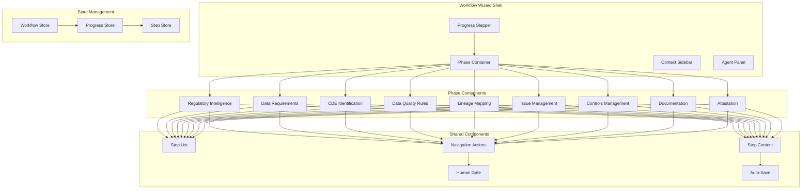

# Design Document: Step-by-Step Workflow Wizard UI

## Overview

The Workflow Wizard UI provides a guided, step-by-step experience for completing regulatory reporting cycles. It transforms the complex 9-phase governance workflow into a linear, focused journey that guides users through each phase while maintaining visibility of overall progress. The wizard integrates with AI agents at each step, handles human checkpoints, and ensures all required actions are completed before submission.

### Workflow Phases and Steps

The wizard follows this exact sequence:

```
1. REGULATORY INTELLIGENCE
   └─> Scan regulatory sources → Detect changes → Update report catalog
       └─> Human approval gate (stakeholder review)

2. DATA REQUIREMENTS  
   └─> Parse regulatory templates → Map to internal sources → Identify gaps
       └─> Generate requirements document

3. CDE IDENTIFICATION
   └─> Score data elements → Generate CDE inventory → Suggest owners
       └─> Human approval gate (ownership validation)

4. DATA QUALITY RULES
   └─> Generate rules per CDE (7 dimensions) → Set thresholds
       └─> Execute rules → Create issues for failures

5. LINEAGE MAPPING
   └─> Scan pipelines → Link to business concepts → Impact analysis
       └─> Generate lineage diagrams

6. ISSUE MANAGEMENT
   └─> Auto-create from DQ failures → Assign by domain → Escalate critical
       └─> Human resolution gate (four-eyes confirmation)

7. CONTROLS MANAGEMENT
   └─> Categorize controls → Log evidence → Track compensating controls
       └─> Schedule effectiveness reviews

8. DOCUMENTATION
   └─> Generate data dictionary, lineage docs, QA reports
       └─> Compile compliance package

9. ATTESTATION
   └─> Human approval gate (final sign-off)
       └─> Submit to regulator
```

### Human Checkpoints

The workflow includes 4 mandatory human approval gates:
1. **Phase 1 (Regulatory Intelligence)**: Stakeholder review of catalog changes
2. **Phase 3 (CDE Identification)**: Ownership validation and CDE approval
3. **Phase 6 (Issue Management)**: Four-eyes confirmation for issue resolution
4. **Phase 9 (Attestation)**: Executive sign-off before submission

### Blocking Conditions

The workflow enforces these blocking conditions:
- **Critical Issues**: Phase 6 → Phase 7 blocked if unresolved critical issues exist
- **Missing Owners**: Phase 3 → Phase 4 blocked if any CDE lacks an assigned owner
- **Unresolved Annotations**: Phase 8 → Phase 9 blocked if document annotations are unresolved

## Architecture



## Components and Interfaces

### WorkflowWizard (Main Container)

```typescript
interface WorkflowWizardProps {
  cycleId: string;
  reportId: string;
  initialPhase?: Phase;
}

interface WorkflowState {
  currentPhase: Phase;
  currentStep: number;
  phases: PhaseState[];
  isLoading: boolean;
  error: Error | null;
}

interface PhaseState {
  id: Phase;
  name: string;
  description: string;
  estimatedMinutes: number;
  status: 'pending' | 'in_progress' | 'completed' | 'blocked';
  blockingReason?: string;
  steps: StepState[];
  completedAt?: Date;
  completedBy?: string;
}

interface StepState {
  id: string;
  name: string;
  status: 'pending' | 'in_progress' | 'completed' | 'skipped';
  isRequired: boolean;
  validationErrors: string[];
  data: Record<string, unknown>;
}

type Phase = 
  | 'regulatory_intelligence'
  | 'data_requirements'
  | 'cde_identification'
  | 'data_quality_rules'
  | 'lineage_mapping'
  | 'issue_management'
  | 'controls_management'
  | 'documentation'
  | 'attestation';
```

### ProgressStepper Component

```typescript
interface ProgressStepperProps {
  phases: PhaseState[];
  currentPhase: Phase;
  onPhaseClick: (phase: Phase) => void;
  isMobile?: boolean;
}

interface StepperItem {
  phase: Phase;
  label: string;
  icon: ReactNode;
  status: 'pending' | 'current' | 'completed' | 'blocked';
  tooltip?: string;
}
```

### PhaseContainer Component

```typescript
interface PhaseContainerProps {
  phase: PhaseState;
  onStepComplete: (stepId: string, data: Record<string, unknown>) => void;
  onPhaseComplete: () => void;
  onNavigateBack: () => void;
}

interface PhaseConfig {
  phase: Phase;
  title: string;
  description: string;
  steps: StepConfig[];
  validationRules: ValidationRule[];
  humanGate?: HumanGateConfig;
}

interface StepConfig {
  id: string;
  name: string;
  component: React.ComponentType<StepProps>;
  isRequired: boolean;
  dependencies?: string[];
}
```

### HumanGate Component

```typescript
interface HumanGateProps {
  gateType: 'approval' | 'attestation' | 'signature';
  title: string;
  description: string;
  items: GateItem[];
  onApprove: (rationale: string, signature?: string) => void;
  onReject: (reason: string) => void;
  requiresSignature: boolean;
  minimumRationaleLength: number;
}

interface GateItem {
  id: string;
  label: string;
  value: string | ReactNode;
  isAIGenerated: boolean;
  confidenceScore?: number;
}
```

### AgentPanel Component

```typescript
interface AgentPanelProps {
  agentId: string;
  agentName: string;
  status: 'idle' | 'running' | 'completed' | 'error';
  currentAction?: string;
  progress?: number;
  activityLog: AgentActivity[];
  onRetry?: () => void;
  onManualOverride?: () => void;
}

interface AgentActivity {
  timestamp: Date;
  action: string;
  status: 'started' | 'completed' | 'failed';
  details?: string;
  confidenceScore?: number;
}
```

### ContextSidebar Component

```typescript
interface ContextSidebarProps {
  reportName: string;
  cycleDeadline: Date;
  overallProgress: number;
  quickLinks: QuickLink[];
  currentPhaseInfo: PhaseInfo;
}

interface QuickLink {
  label: string;
  href: string;
  icon: ReactNode;
}

interface PhaseInfo {
  name: string;
  stepsCompleted: number;
  totalSteps: number;
  estimatedTimeRemaining: number;
}
```

## Data Models

### Workflow Cycle Model

```typescript
interface WorkflowCycle {
  id: string;
  reportId: string;
  reportName: string;
  periodEndDate: Date;
  deadline: Date;
  status: CycleStatus;
  currentPhase: Phase;
  phases: PhaseRecord[];
  createdAt: Date;
  createdBy: string;
  lastModifiedAt: Date;
  lastModifiedBy: string;
  submittedAt?: Date;
  submittedBy?: string;
}

type CycleStatus = 
  | 'draft'
  | 'in_progress'
  | 'pending_approval'
  | 'approved'
  | 'submitted'
  | 'rejected';

interface PhaseRecord {
  phase: Phase;
  status: PhaseStatus;
  startedAt?: Date;
  completedAt?: Date;
  completedBy?: string;
  approvalRationale?: string;
  signatureData?: string;
  steps: StepRecord[];
}

type PhaseStatus = 'pending' | 'in_progress' | 'completed' | 'blocked' | 'skipped';

interface StepRecord {
  stepId: string;
  status: StepStatus;
  completedAt?: Date;
  completedBy?: string;
  data: Record<string, unknown>;
  validationErrors: string[];
}

type StepStatus = 'pending' | 'in_progress' | 'completed' | 'skipped';
```

### Progress Tracking Model

```typescript
interface ProgressSnapshot {
  cycleId: string;
  timestamp: Date;
  overallProgress: number;
  phaseProgress: Record<Phase, number>;
  blockers: Blocker[];
  estimatedCompletion: Date;
}

interface Blocker {
  type: 'critical_issue' | 'missing_owner' | 'pending_approval' | 'validation_error';
  description: string;
  phase: Phase;
  stepId?: string;
  linkedEntityId?: string;
  linkedEntityType?: string;
}
```

### Collaboration Model

```typescript
interface CollaborationState {
  cycleId: string;
  activeUsers: ActiveUser[];
  locks: StepLock[];
  pendingChanges: PendingChange[];
}

interface ActiveUser {
  userId: string;
  userName: string;
  avatarUrl?: string;
  currentPhase: Phase;
  currentStep?: string;
  lastActivity: Date;
}

interface StepLock {
  stepId: string;
  lockedBy: string;
  lockedAt: Date;
  expiresAt: Date;
}

interface PendingChange {
  id: string;
  stepId: string;
  userId: string;
  changeType: 'update' | 'complete' | 'revert';
  data: Record<string, unknown>;
  timestamp: Date;
  synced: boolean;
}
```

## Correctness Properties

*A property is a characteristic or behavior that should hold true across all valid executions of a system-essentially, a formal statement about what the system should do. Properties serve as the bridge between human-readable specifications and machine-verifiable correctness guarantees.*

### Property 1: Phase Progression Invariant
*For any* workflow cycle, a phase can only transition to 'completed' status if all required steps within that phase have status 'completed' and all validation rules pass.
**Validates: Requirements 2.1, 2.2**

### Property 2: Blocking Condition Enforcement
*For any* workflow cycle with critical issues in the Issue Management phase, the system shall prevent progression to the Controls Management phase until all critical issues are resolved or escalated.
**Validates: Requirements 8.5**

### Property 3: Human Gate Requirement
*For any* phase that requires human approval (Regulatory Intelligence, CDE Identification, Documentation, Attestation), the phase cannot complete without a valid rationale (minimum 20 characters) and digital signature capture.
**Validates: Requirements 3.5, 11.4**

### Property 4: Progress Calculation Accuracy
*For any* workflow cycle, the overall progress percentage shall equal the weighted sum of completed steps divided by total steps across all phases, where each phase has equal weight.
**Validates: Requirements 1.5, 4.5**

### Property 5: State Persistence Round Trip
*For any* workflow state saved to the server, loading that state shall restore the exact same phase, step, and data values.
**Validates: Requirements 13.1, 13.2**

### Property 6: Navigation State Preservation
*For any* navigation from a later phase back to an earlier completed phase, all progress in the later phase shall be preserved and accessible when returning.
**Validates: Requirements 2.4**

### Property 7: Ownership Gate Enforcement
*For any* CDE in the CDE Identification phase without an assigned owner, the system shall block progression to the Data Quality Rules phase.
**Validates: Requirements 5.3**

### Property 8: Artifact Lock Immutability
*For any* workflow cycle that has been submitted (Attestation phase completed), all associated artifacts shall be locked and reject any modification attempts.
**Validates: Requirements 11.5**

### Property 9: AI Content Distinction
*For any* content displayed in the wizard that was generated by an AI agent, the content shall be visually marked with an AI indicator and include a confidence score where applicable.
**Validates: Requirements 12.4**

### Property 10: Validation Error Completeness
*For any* phase transition attempt that fails validation, the error modal shall contain exactly the set of incomplete required items, with no false positives or false negatives.
**Validates: Requirements 2.3**

## Error Handling

### Network Errors
- Auto-retry with exponential backoff (3 attempts)
- Display offline indicator when disconnected
- Queue changes locally for sync when reconnected
- Show sync status indicator

### Validation Errors
- Display inline validation messages immediately
- Aggregate errors in modal when attempting phase transition
- Provide direct links to error locations
- Clear errors when corrected

### Agent Errors
- Display error message with context
- Provide retry option
- Offer manual override for non-critical operations
- Log error for support investigation

### Conflict Resolution
- Detect concurrent edits via version checking
- Display side-by-side comparison
- Allow user to choose version or merge
- Notify other users of resolution

## Testing Strategy

### Unit Testing
- Test each phase component in isolation
- Test step validation logic
- Test progress calculation
- Test state transitions

### Property-Based Testing
Using fast-check library:
- Test phase progression invariant with random step completion sequences
- Test progress calculation with random phase/step configurations
- Test state persistence round trip with random workflow states
- Test navigation preservation with random navigation sequences

### Integration Testing
- Test full workflow completion flow
- Test human gate approval flow
- Test agent integration
- Test collaboration features

### E2E Testing
- Test complete regulatory reporting cycle
- Test mobile responsive behavior
- Test offline/online transitions
- Test multi-user collaboration
